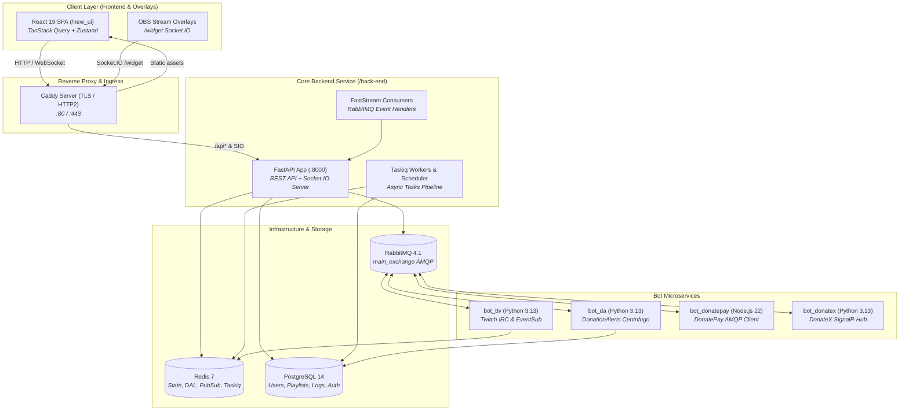

# 🎵 OpenPlaylist Monorepo

**High-performance, event-driven streaming interactive jukebox and donation queue platform.**

---

> [!NOTE]
> **Portfolio & Skills Showcase:** This repository is published strictly for technical demonstration and portfolio evaluation. It showcases modern distributed system architecture, real-time WebSocket synchronization, microservices orchestration, and production-grade full-stack engineering.

---

## 🌟 Architectural Highlights & Core Capabilities

- **👑 Single Leader Playback Architecture:** The stream owner acts as the single source of truth for playback state. Real-time track progress, seeks, and pauses synchronize across all viewers and OBS overlays with minimal network overhead via **Redis DAL** (`PlaybackRepository`).
- **⚡ Event-Driven Microservices Bus:** The core FastAPI backend and autonomous bot microservices communicate asynchronously over **RabbitMQ (AMQP 0-9-1)** and **FastStream**, guaranteeing resilient delivery for orders, state changes, and management commands.
- **🤖 Multi-Platform Streaming & Donation Bots:**
  - **Twitch (`bot_ttv`):** Chat orders and Channel Points rewards processing, role-based priority queues, and Redis caching.
  - **DonationAlerts (`bot_da`):** Centrifugo WebSocket connection (`$alerts:donation_{id}`) with proactive OAuth2 token refreshing.
  - **DonatePay (`bot_donatepay`):** High-throughput **Node.js 22 / TypeScript** microservice with AMQP RPC and Centrifuge WS listeners.
  - **DonateX (`bot_donatex`):** SignalR Core WebSocket integration (`/public-donations-hub`) with automatic 401 interception and token refresh.
- **🔐 TokenVault & Automated Token Management:** Centralized encrypted storage for streamer OAuth2 tokens, performing preemptive background refreshes before TTL expiration.
- **📡 Multi-Namespace Realtime Engine:** Multi-room **Socket.IO** server (`/`, `/plst_upds`, `/widget`) delivering instant playlist queue updates, live audit logs, and OBS overlays.
- **🎨 Modern Web Client (`new_ui`):** Built with **React 19, TypeScript, Vite, TanStack Router & Query, Zustand, and TailwindCSS**, featuring multi-theme support (Dark/Light), internationalization (EN/RU/UA), and an audio player with loopback echo filtering (*Anti-Echo Filter*).

---

## 🏗️ System Architecture

---

## 📦 Monorepo Subsystems Matrix

| Subsystem | Tech Stack | Responsibility & Architecture |
| :--- | :--- | :--- |
| [`back-end/`](./back-end) | Python 3.13, FastAPI, SQLAlchemy 2.0 Async, Taskiq, Socket.IO, Pydantic | Core API gateway, Argon2id/JWT auth, playlist lifecycle, Redis DAL, async workers |
| [`new_ui/`](./new_ui) | React 19, TypeScript, Vite, TanStack Router/Query, Zustand, TailwindCSS | Modern reactive client interface, operator dashboard, audio player, streamer analytics |
| [`bot_ttv/`](./bot_ttv) | Python 3.13, FastStream, TwitchIO, Redis | Twitch microservice: chat commands, channel points redemption, tier priority queue |
| [`bot_da/`](./bot_da) | Python 3.13, FastStream, Centrifugo WS, HTTPX | DonationAlerts donation listener microservice with token management |
| [`bot_donatepay/`](./bot_donatepay) | TypeScript, Node.js 22, amqplib, centrifuge-js | DonatePay donation intake microservice with AMQP RPC bridge |
| [`bot_donatex/`](./bot_donatex) | Python 3.13, FastStream, SignalR Core, Aiohttp | DonateX donation stream listener microservice via SignalR WebSocket hub |
| [`docs/`](./docs) | Markdown, Mermaid | Comprehensive system architecture and domain design specifications |

---

## 📚 Architecture Documentation Index

Deep-dive architecture specifications and diagrams are available in [`docs/`](./docs):
- [🗺️ System Architecture Index (docs/README.md)](./docs/README.md)
- [🎵 Single Leader Playback Pipeline (docs/core/playback.md)](./docs/core/playback.md)
- [📋 Playlists, Modes & Permissions (docs/core/playlists.md)](./docs/core/playlists.md)
- [💳 Order Processing & Donation Pipelines (docs/core/orders.md)](./docs/core/orders.md)
- [📡 Realtime Engine & Socket.IO (docs/core/realtime.md)](./docs/core/realtime.md)
- [🤖 Bots Architecture & TokenVault (docs/bots/integrations.md)](./docs/bots/integrations.md)
- [🎮 UserPlayer V2 & Moderation Controls (docs/player/player_and_moderation_v2_concept.md)](./docs/player/player_and_moderation_v2_concept.md)
- [🔍 System Architecture Flow Audit (docs/architecture/system_audit.md)](./docs/architecture/system_audit.md)

---

## 📄 License & Intellectual Property

This project is proprietary software. All rights reserved.  
Unauthorized copying, modification, distribution, or commercial deployment of this codebase or any part of it is strictly prohibited.  
For full terms, see the [LICENSE](./LICENSE) file.
