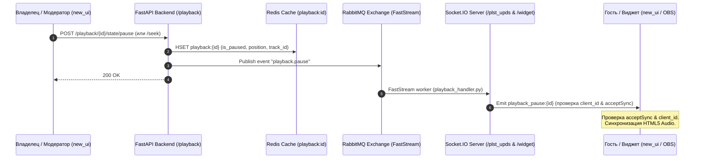

# Архитектура управления и синхронизации проигрыванием (Playback Pipeline)

Документ описывает единые механизмы и архитектурные решения синхронизации воспроизведения аудио/видео треков между компонентами `/backend` и `/new_ui`.

---

## 1. Действующие лица и их роли (Actors & Roles)

В системе выделены 4 ключевых действующих лица, в основе взаимодействия которых лежит модель **Единственного Лидера**:

1. **Владелец плейлиста (Playlist Owner) — Единственный Лидер**
   - **Роль**: Единственный главный источник правды (Source of Truth) для трансляции активного проигрывания плейлиста.
   - **Права**: Полные права управления воспроизведением (`canActInSlot('setNowPlaying')`).
   - **Поведение в `/new_ui`**:
     - Отправляет фоновый **heartbeat позиции** каждые 5 секунд через REST API `POST /playback/{playlist_id}/state/position`.
     - При действиях (пауза/резюм, скролл/перемотка) отправляет командные запросы `POST /playback/{playlist_id}/state/pause` и `POST /playback/{playlist_id}/state/seek`.
     - Периодически (каждые 10 сек и при закрытии вкладки `beforeunload`) сохраняет локальную позицию в хранилище плейбека (`savePositionNow`).
   - **Поведение в `/backend`**: Проверяются права владения, состояние обновляется в Redis-кеше.

2. **Модератор / Оператор (Moderator / Assistant Operator)**
   - **Роль**: Помощник владельца плейлиста с правами управления воспроизведением (`can_manage_playback: True`).
   - **Режимы работы**:
     - **Удаленное управление (`isRemoteControlMode`)**: Модератор выступает в роли ассистента/диджея, управляя воспроизведением *за владельца* со своей страницы. Запросы отправляются на REST API с параметром `skip_owner_check=True`, обновляя общий статус проигрывания.
     - **Локальное прослушивание (`acceptSync: false`)**: Модератор выключает синхронизацию и слушает треки плейлиста независимо.
   - **Поведение в `/backend`**: Авторизация через `MODERATOR_ACCESS` с проверкой пермишена `can_manage_playback`.

3. **Виджет (Widget / Stream Overlay)**
   - **Роль**: Внешний оверлей для стриминговых платформ (OBS, Twitch, YouTube).
   - **Канал связи**: Socket.IO отдельный неймспейс `/widget`.
   - **Поведение**:
     - Подписывается на комнаты владельца (`widget:users:{user_id}`).
     - Получает пуш-уведомления через обработчики событий единого Event-Driven пайплайна backend (`sio_widget_service.pause`, `sio_widget_service.seek`).
     - Не выполняет тяжелую логику — только отображает текущий трек, статус паузы и прогресс.

4. **Гость / Слушатель (Guest / Viewer)**
   - **Роль**: Слушатель публичного или расшаренного плейлиста.
   - **Права**: Отсутствуют права на трансляцию своей позиции или изменение глобального состояния (`role === 'viewer'`).
   - **Поведение в `/new_ui`**:
     - **Режим синхронизации (`acceptSync: true`)**: Слушает входящие WebSocket-события (`playback_pause`, `playback_seek`, `playnow`) и повторяет действия владельца.
     - **Автономный режим (`acceptSync: false`)**: Отключает синхронизацию и слушает треки плейлиста полностью автономно.

---

## 2. Единый Event-Driven пайплайн управления (Playback Actions)

Все события плейбека интегрированы в единую событийно-ориентированную шину RabbitMQ / FastStream (`src/adapters/_rabbit/`), аналогично событиям изменения плейлиста (`add_track`, `playnow`, `settings_changed`).

### 2.1. Пауза / Продолжение (Pause / Resume)
- **Инициатор**: Владелец или Модератор (в режиме Remote Control).
- **Поток данных**:
  1. Frontend отправляет `POST /playback/{playlist_id}/state/pause` с аргументами: `is_paused`, `position`, `track_id`, `client_id`.
  2. Backend (`playback_service.pause`):
     - Обновляет состояние в Redis по ключу `playback:{playlist_id}` (`is_paused`, `position`, `track_id`).
     - Публикует событие `playback.pause` в шину RabbitMQ (`topic_exchange` / FastStream).
  3. FastStream воркер (`playback_handler.py`):
     - Излучает Socket.IO событие `playback_pause:{playlist_id}` в неймспейс `/plst_upds`.
     - Излучает Socket.IO событие `pause` в неймспейс `/widget`.
  4. Подписанные клиенты `/new_ui` (у которых `acceptSync: true`):
     - Фильтруют событие по `client_id` (игнорируют собственные действия).
     - Синхронизируют плеер: ставят на паузу или запускают воспроизведение.

### 2.2. Перемотка (Seek)
- **Инициатор**: Владелец или Модератор.
- **Поток данных**:
  1. Frontend отправляет `POST /playback/{playlist_id}/state/seek` с аргументами: `position`, `track_id`, `client_id`.
  2. Backend (`playback_service.seek`):
     - Сохраняет новую позицию в Redis `playback:{playlist_id}`.
     - Публикует событие `playback.seek` в шину RabbitMQ.
  3. FastStream воркер эмитит события:
     - `playback_seek:{playlist_id}` в `/plst_upds`.
     - `seek` в `/widget`.
  4. Клиенты с `acceptSync: true` смещают указатель проигрывания на заданную секунду.

### 2.3. Смена трека (PlayNow / Next)
- **Инициатор**: Владелец, Модератор или автопереход по окончанию трека (`onEnded`).
- **Поток данных**:
  1. При переключении отправляется событие смены трека через RabbitMQ (`playlist.track.playnow`).
  2. WebSocket броадкастит `playnow:{playlist_id}`.
  3. Клиенты сбрасывают локальный `seekSignal`, переключают `currentTrackId` и подтягивают сохраненную позицию.

---

## 3. Архитектура взаимодействия компонентов

### Хранение состояния и консолидация на фронтенде
- **Redis DAL Repository**: Все операции работы с Redis вынесены в отдельный класс доступа к данным `src/dal/_redis/playback_repository.py` (хранение хэша `playback:{playlist_id}`, TTL: 3 дня / 259200 сек).
- **Поля Redis Hash**: `is_paused`, `position`, `track_id`, `owner_id`.
- **Фронтенд стор (`playlistStore` & `usePlaybackFeed.ts`)**:
  - Единым механизмом воспроизведения в UI является хук `usePlaybackFeed.ts`.
  - Единая точка подписки на `playback_pause` и `playback_seek` эвенты находится в `createPlaylistCacheSlice.ts`.
  - Устаревшие дублирующиеся слушатели в `viewerPlaylistStote.ts` и `socketSlice.ts` полностью удалены.
  - Фильтрация эхо: если `incoming.client_id === CLIENT_ID`, событие игнорируется инициатором.

---

## 4. Оценка и анализ целевой архитектуры

### Сильные стороны:
1. **Единый Event-Driven пайплайн**:
   - События воспроизведения обрабатываются через ту же RabbitMQ/FastStream шину, что и остальной функционал приложения (`src/adapters/_rabbit/`). Нет инженерного расщепления с TaskIQ.
2. **Прозрачная модель ролей и управления**:
   - Владелец всегда один (Лидер). Модераторы помогают в режиме Remote Control. Гости и модераторы могут свободно отключать `acceptSync` для автономного прослушивания.
3. **Единый стор подписок на фронтенде**:
   - Ликвидировано дублирование обработчиков Socket.IO по разным файлам слайсов.
4. **Низкая нагрузка на PostgreSQL**:
   - Высокочастотные сигналы позиционирования и фоновые heartbeat обрабатываются исключительно в Redis.

---

## 5. Выделенные компромиссы (Trade-offs)

1. **Задержка распространения событий (Решено в целевой архитектуре)**:
   - Переход с TaskIQ на RabbitMQ/FastStream снижает накладные расходы очереди и объединяет мониторинг и логирование событий в единый стек.

2. **Точность синхронизации сети (Clock Drift)**:
   - Фиксированная точка `position` без NTP-серверных меток времени может давать небольшой сдвиг в 0.5–1.5 сек на задержках сети. Принято как некритичное допущение системы.

3. **Интервал Heartbeat (5 секунд)**:
   - 5-секундный фоновый интервал отправки позиции оптимален по балансу между точностью восстановления позиции и сетевой нагрузкой.

