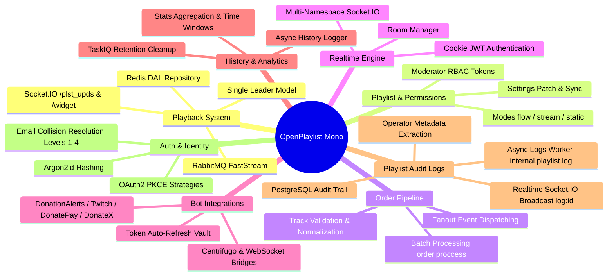

# Архитектурная документация OpenPlaylist (System Architecture Index)

Добро пожаловать в главную архитектурную карту подсистем монорепозитория **OpenPlaylist**!

Данный раздел содержит исчерпывающие описания принципов работы, структур данных, алгоритмов и схем взаимодействия компонентов проекта (`/backend`, `/new_ui`, `/bot_*`).

---

## 1. Карта подсистем и разделы документации

---

## 2. Разделы документации

| Раздел | Файл документации | Описание и основные графики |
| :--- | :--- | :--- |
| **Playback** | [`docs/playback.md`](file:///e:/vs-code-projects/openplaylist-mono/docs/playback.md) | Система воспроизведения, Модель Единственного Лидера, Redis DAL `PlaybackRepository`, синхронизация плееров и оверлеев OBS. |
| **Player V2 Quick Ref** | [`docs/quick_reference_player_v2.md`](file:///e:/vs-code-projects/openplaylist-mono/docs/quick_reference_player_v2.md) | Быстрая шпаргалка по UserPlayer V2, режимам `listen`/`control`, фильтрации эха и особенностям ReactPlayer 3.4. |
| **Playlists & Permissions** | [`docs/playlists.md`](file:///e:/vs-code-projects/openplaylist-mono/docs/playlists.md) | Управление плейлистами, режимы работы (`flow`, `stream`, `static`), токены модераторов и разграничение прав (`MODERATOR_ACCESS`). |
| **Orders Pipeline** | [`docs/orders.md`](file:///e:/vs-code-projects/openplaylist-mono/docs/orders.md) | Прием и обработка музыкальных заказов, валидация черных списков, батч-воркер `order.proccess`, сфера доменных событий. |
| **Realtime Engine** | [`docs/realtime.md`](file:///e:/vs-code-projects/openplaylist-mono/docs/realtime.md) | Мультинеймспейсный Socket.IO сервер (`/`, `/plst_upds`, `/widget`), авторизация по кукам и динамическое управление комнатами. |
| **Integrations & Bots** | [`docs/integrations.md`](file:///e:/vs-code-projects/openplaylist-mono/docs/integrations.md) | Микросервисы ботов (Twitch, DA, DonatePay, DonateX), трансфер донат-треков и автообновление OAuth-токенов в `TokenVault`. |
| **Twitch Bot (`bot_ttv`)** | [`docs/bot_ttv.md`](file:///e:/vs-code-projects/openplaylist-mono/docs/bot_ttv.md) | Архитектура Twitch-бота: прием треков через чат и Channel Points, расчет приоритетов ролей, FastStream RabbitMQ шина и кэш Redis. |
| **Playlist Audit Logs** | [`docs/playlist_logs.md`](file:///e:/vs-code-projects/openplaylist-mono/docs/playlist_logs.md) | Журнал аудита действий операторов/модераторов, асинхронный воркер `logs_handler.py`, хранение в PostgreSQL и живое вещание `log:{playlist_id}`. |
| **History & Analytics** | [`docs/history_stats.md`](file:///e:/vs-code-projects/openplaylist-mono/docs/history_stats.md) | Логирование истории воспроизведения через `history_handler.py`, агрегация статистики по временным окнам и очистка устаревших данных. |
| **Auth & Identity** | [`docs/auth.md`](file:///e:/vs-code-projects/openplaylist-mono/docs/auth.md) | Классическая аутентификация (Argon2id), стратегии OAuth2 PKCE, разрешение коллизий учетных записей (Levels 1–4) и JWT-сессии. |

---

## 3. Общий стек технологий

- **Backend**: Python 3.13, FastAPI, FastStream (RabbitMQ), TaskIQ, SQLAlchemy 2.0 Async, Redis, Argon2id, PyJWT.
- **Frontend**: React 19, TypeScript, Vite, Zustand, Socket.IO Client, TailwindCSS, i18next.
- **Microservices & Messaging**: RabbitMQ, Centrifugo, Socket.IO, PostgreSQL.
