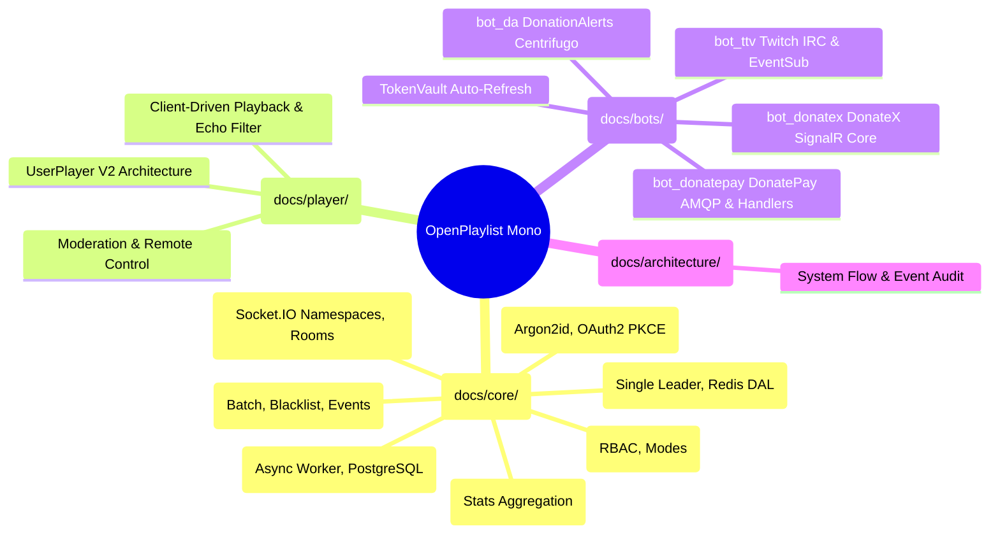

# Архитектурная документация OpenPlaylist (System Architecture Index)

Добро пожаловать в главную архитектурную карту подсистем монорепозитория **OpenPlaylist**!

Данный раздел содержит исчерпывающие описания принципов работы, структур данных, алгоритмов и схем взаимодействия компонентов проекта (`/back-end`, `/new_ui`, `/bot_*`).

---

## 1. Карта подсистем монорепозитория

---

## 2. Структурированный каталог документации

### 2.1. Ядро бэкенда (`docs/core/`)

| Раздел | Файл документации | Описание и ключевые компоненты |
| :--- | :--- | :--- |
| **Playback** | [`docs/core/playback.md`](./core/playback.md) | Система воспроизведения, Модель Единственного Лидера, Redis DAL `PlaybackRepository`, синхронизация плееров и оверлеев OBS. |
| **Playlists & Permissions** | [`docs/core/playlists.md`](./core/playlists.md) | Управление плейлистами, режимы работы (`flow`, `stream`, `static`), токены модераторов и разграничение прав (`MODERATOR_ACCESS`). |
| **Orders Pipeline** | [`docs/core/orders.md`](./core/orders.md) | Прием и обработка музыкальных заказов, валидация черных списков, батч-воркер `order.proccess`, сфера доменных событий. |
| **Realtime Engine** | [`docs/core/realtime.md`](./core/realtime.md) | Мультинеймспейсный Socket.IO сервер (`/`, `/plst_upds`, `/widget`), авторизация по кукам и динамическое управление комнатами. |
| **Playlist Audit Logs** | [`docs/core/playlist_logs.md`](./core/playlist_logs.md) | Журнал аудита действий операторов/модераторов, асинхронный воркер `logs_handler.py`, хранение в PostgreSQL и живое вещание `log:{playlist_id}`. |
| **History & Analytics** | [`docs/core/history_stats.md`](./core/history_stats.md) | Логирование истории воспроизведения через `history_handler.py`, агрегация статистики по временным окнам и очистка устаревших данных. |
| **Auth & Identity** | [`docs/core/auth.md`](./core/auth.md) | Классическая аутентификация (Argon2id), стратегии OAuth2 PKCE, разрешение коллизий учетных записей (Levels 1–4) и JWT-сессии. |

### 2.2. Плеер и интерфейс (`docs/player/`)

| Раздел | Файл документации | Описание и ключевые компоненты |
| :--- | :--- | :--- |
| **Player V2 Quick Ref** | [`docs/player/quick_reference_player_v2.md`](./player/quick_reference_player_v2.md) | Быстрая шпаргалка по UserPlayer V2, режимам `listen`/`control`, фильтрации эха и особенностям ReactPlayer 3.4. |
| **Player & Moderation V2 Concept** | [`docs/player/player_and_moderation_v2_concept.md`](./player/player_and_moderation_v2_concept.md) | Архитектурная концепция User Player V2, удаление `show_in_widget`, клиентский выбор треков и модерация. |

### 2.3. Интеграции и боты (`docs/bots/`)

| Раздел | Файл документации | Описание и ключевые компоненты |
| :--- | :--- | :--- |
| **Integrations & Bots Overview** | [`docs/bots/integrations.md`](./bots/integrations.md) | Общий обзор интеграций донат-платформ и ботов, схема `TokenVault`, шина RabbitMQ, жизненный цикл токенов и обработка отключений. |
| **Twitch Bot (`bot_ttv`)** | [`docs/bots/bot_ttv.md`](./bots/bot_ttv.md) | Микросервис Twitch: прием треков через чат и баллы канала (Channel Points), расчет приоритетов ролей, кэширование в Redis. |
| **DonationAlerts Bot (`bot_da`)** | [`docs/bots/integrations.md#donationalerts`](./bots/integrations.md#donationalerts) | Микросервис DonationAlerts: протокол Centrifugo WebSocket, HTTP API клиент, автообновление OAuth2 и отправка заказов. |
| **DonatePay Bot (`bot_donatepay`)** | [`docs/bots/bot_donatepay/messaging_guide.md`](./bots/bot_donatepay/messaging_guide.md) | Микросервис DonatePay (TypeScript): модульная архитектура, WebSocket Centrifuge, AMQP клиент, RPC запросы и Command Handlers. |
| **DonateX Bot (`bot_donatex`)** | [`docs/bots/integrations.md#donatex`](./bots/integrations.md#donatex) | Микросервис DonateX: интеграция через SignalR Core WebSocket (`/public-donations-hub`), перехват 401, auto-refresh токенов. |

### 2.4. Архитектурный аудит и системные срезы (`docs/architecture/`)

| Раздел | Файл документации | Описание и ключевые компоненты |
| :--- | :--- | :--- |
| **System Architecture Audit** | [`docs/architecture/system_audit.md`](./architecture/system_audit.md) | Комплексный аудит связей, потоков событий, очередей RabbitMQ и потенциальных узких мест системы. |

---

## 3. Обзор микросервисов ботов (Bot Microservices Overview)

Все боты платформы вынесены в отдельные независимые микросервисы и взаимодействуют с центральным ядром бэкенда через RabbitMQ (`main_exchange`):

| Бот | Директория | Стек / Библиотеки | Протокол внешнего стрима | Основные очереди RabbitMQ |
| :--- | :--- | :--- | :--- | :--- |
| **Twitch Bot** | [`bot_ttv/`](../bot_ttv) | Python 3.13, FastStream, TwitchIO, Redis | IRC WebSocket / EventSub | `bot.ttv.order.new` `bot.ttv.connect.request` `bot.ttv.disconnect` |
| **DonationAlerts Bot** | [`bot_da/`](../bot_da) | Python 3.13, FastStream, websockets, httpx | Centrifugo WebSocket (`$alerts:donation_{id}`) | `bot.da.order.new` `bot.da.connect.request` `bot.da.disconnect` `da.user.token.died` |
| **DonatePay Bot** | [`bot_donatepay/`](../bot_donatepay) | TypeScript, Node.js 22, amqplib, centrifuge-js | Centrifuge WebSocket (`$donations:{id}`) | `bot.donatepay.order.new` `bot.donatepay.connect.request` `bot.donatepay.disconnect` |
| **DonateX Bot** | [`bot_donatex/`](../bot_donatex) | Python 3.13, FastStream, signalrcore, aiohttp | SignalR Core Hub (`/public-donations-hub`) | `bot.donatex.order.new` `bot.donatex.connect.request` `bot.donatex.disconnect` `donatex.user.token.died` |

### Общий жизненный цикл интеграции

1. **Запуск и синхронизация (RPC):** При старте каждый бот запрашивает актуальный список подключенных стримеров у бэкенда через соответствующую RPC-очередь (`auth.user.<platform>.all.request`).
2. **Динамическое управление:** Бэкенд отправляет команды подключения (`bot.<platform>.connect.request`) и отключения (`bot.<platform>.disconnect`) при привязке/отвязке аккаунтов пользователем в UI.
3. **Обработка доната:** При получении доната из сокета бот валидирует payload, парсит ссылку на трек (YouTube / YouTube Music / Shorts) и публикует стандартизированное сообщение `OrderNew` в очередь `bot.<platform>.order.new`.
4. **Обновление токенов (Token Refresh):** При истечении времени жизни или получении ошибки 401 Unauthorized бот выполняет refresh токена, публикует обновленные ключи в `auth.user.<platform>.tokens.refreshed` или отправляет событие об отзыве авторизации `<platform>.user.token.died`.

---

## 4. Общий стек технологий монорепозитория

- **Backend**: Python 3.13, FastAPI, FastStream (RabbitMQ), TaskIQ, SQLAlchemy 2.0 Async, Redis, Argon2id, PyJWT, Alembic.
- **Frontend**: React 19, TypeScript, Vite, TanStack Query, Zustand, Socket.IO Client, TailwindCSS, i18next, Lucide Icons.
- **Microservices & Bots**: Python 3.13 (`bot_ttv`, `bot_da`, `bot_donatex`), Node.js 22 (`bot_donatepay`), Centrifugo, SignalR Core, TwitchIO.
- **Infrastructure & Messaging**: RabbitMQ (AMQP 0-9-1), Redis, PostgreSQL, Docker Compose.
