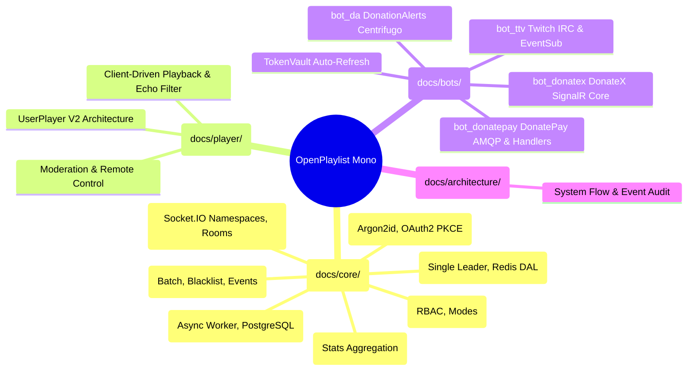

# OpenPlaylist System Architecture Index

Welcome to the central architectural documentation index for the **OpenPlaylist** monorepo!

This section contains comprehensive specifications, data models, workflows, algorithms, and interaction diagrams across all subsystems (`/back-end`, `/new_ui`, `/bot_*`).

---

## 1. Subsystem Architecture Map

---

## 2. Structured Documentation Catalog

### 2.1. Core Backend (`docs/core/`)

| Section | Documentation File | Key Components & Architecture |
| :--- | :--- | :--- |
| **Playback** | [`docs/core/playback.md`](./core/playback.md) | Single Leader Playback model, Redis DAL `PlaybackRepository`, player and OBS overlay synchronization. |
| **Playlists & Permissions** | [`docs/core/playlists.md`](./core/playlists.md) | Playlist lifecycle, operating modes (`flow`, `stream`, `static`), moderator tokens and RBAC (`MODERATOR_ACCESS`). |
| **Orders Pipeline** | [`docs/core/orders.md`](./core/orders.md) | Track intake, blacklist filtering, batch processor `order.proccess`, domain event pipeline. |
| **Realtime Engine** | [`docs/core/realtime.md`](./core/realtime.md) | Multi-namespace Socket.IO server (`/`, `/plst_upds`, `/widget`), cookie auth, and dynamic room management. |
| **Playlist Audit Logs** | [`docs/core/playlist_logs.md`](./core/playlist_logs.md) | Action audit trail for operators/moderators, async worker `logs_handler.py`, PostgreSQL storage, live broadcast `log:{playlist_id}`. |
| **History & Analytics** | [`docs/core/history_stats.md`](./core/history_stats.md) | Playback logging via `history_handler.py`, time-window stats aggregation, and data retention cleanup. |
| **Auth & Identity** | [`docs/core/auth.md`](./core/auth.md) | Password authentication (Argon2id), OAuth2 PKCE strategies, account collision resolution (Levels 1–4), and JWT sessions. |

### 2.2. Player & Frontend (`docs/player/`)

| Section | Documentation File | Key Components & Architecture |
| :--- | :--- | :--- |
| **Player V2 Quick Ref** | [`docs/player/quick_reference_player_v2.md`](./player/quick_reference_player_v2.md) | Quick cheat sheet for UserPlayer V2, `listen`/`control` modes, echo filtering, and ReactPlayer integration. |
| **Player & Moderation V2 Concept** | [`docs/player/player_and_moderation_v2_concept.md`](./player/player_and_moderation_v2_concept.md) | User Player V2 architectural concept, client-driven track selection, and remote moderation controls. |

### 2.3. Integrations & Bots (`docs/bots/`)

| Section | Documentation File | Key Components & Architecture |
| :--- | :--- | :--- |
| **Integrations & Bots Overview** | [`docs/bots/integrations.md`](./bots/integrations.md) | Comprehensive overview of donation platforms and bot microservices, `TokenVault`, RabbitMQ bus, and disconnection handling. |
| **Twitch Bot (`bot_ttv`)** | [`docs/bots/bot_ttv.md`](./bots/bot_ttv.md) | Twitch microservice: chat orders, Channel Points redemptions, subscriber role priority scoring, Redis caching. |
| **DonationAlerts Bot (`bot_da`)** | [`docs/bots/integrations.md#donationalerts`](./bots/integrations.md#donationalerts) | DonationAlerts microservice: Centrifugo WebSocket protocol, HTTP API client, OAuth2 auto-refresh. |
| **DonatePay Bot (`bot_donatepay`)** | [`docs/bots/bot_donatepay/messaging_guide.md`](./bots/bot_donatepay/messaging_guide.md) | DonatePay microservice (TypeScript): modular architecture, Centrifuge WS, AMQP RPC, and Command Handlers. |
| **DonateX Bot (`bot_donatex`)** | [`docs/bots/integrations.md#donatex`](./bots/integrations.md#donatex) | DonateX microservice: SignalR Core WebSocket (`/public-donations-hub`), 401 interception, token auto-refresh. |

### 2.4. Architecture Audits (`docs/architecture/`)

| Section | Documentation File | Key Components & Architecture |
| :--- | :--- | :--- |
| **System Architecture Audit** | [`docs/architecture/system_audit.md`](./architecture/system_audit.md) | Comprehensive audit of service boundaries, event streams, RabbitMQ queues, and concurrency bottlenecks. |

---

## 3. Bot Microservices Overview

All streaming and donation bots operate as autonomous microservices and communicate with the central backend via RabbitMQ (`main_exchange`):

| Bot | Directory | Tech Stack | External Stream Protocol | Main RabbitMQ Queues |
| :--- | :--- | :--- | :--- | :--- |
| **Twitch Bot** | [`bot_ttv/`](../bot_ttv) | Python 3.13, FastStream, TwitchIO, Redis | IRC WebSocket / EventSub | `bot.ttv.order.new` `bot.ttv.connect.request` `bot.ttv.disconnect` |
| **DonationAlerts Bot** | [`bot_da/`](../bot_da) | Python 3.13, FastStream, websockets, httpx | Centrifugo WebSocket (`$alerts:donation_{id}`) | `bot.da.order.new` `bot.da.connect.request` `bot.da.disconnect` `da.user.token.died` |
| **DonatePay Bot** | [`bot_donatepay/`](../bot_donatepay) | TypeScript, Node.js 22, amqplib, centrifuge-js | Centrifuge WebSocket (`$donations:{id}`) | `bot.donatepay.order.new` `bot.donatepay.connect.request` `bot.donatepay.disconnect` |
| **DonateX Bot** | [`bot_donatex/`](../bot_donatex) | Python 3.13, FastStream, signalrcore, aiohttp | SignalR Core Hub (`/public-donations-hub`) | `bot.donatex.order.new` `bot.donatex.connect.request` `bot.donatex.disconnect` `donatex.user.token.died` |

### Integration Lifecycle

1. **Bootstrapping & RPC Sync:** On startup, each bot fetches the active connected streamer list from the backend via RPC (`auth.user.<platform>.all.request`).
2. **Dynamic Management:** The backend dispatches connect (`bot.<platform>.connect.request`) and disconnect (`bot.<platform>.disconnect`) commands when users link/unlink accounts in the UI.
3. **Donation Intake & Parsing:** When a donation arrives, the bot validates payload integrity, parses media links (YouTube, YouTube Music, Shorts), and publishes a standardized `OrderNew` message into `bot.<platform>.order.new`.
4. **Token Management & Renewal:** Upon expiration or receiving HTTP 401 Unauthorized, the bot executes an automated refresh, publishing updated credentials to `auth.user.<platform>.tokens.refreshed` or signaling an authorization revocation `<platform>.user.token.died`.

---

## 4. Technology Stack Summary

- **Backend**: Python 3.13, FastAPI, FastStream (RabbitMQ), Taskiq, SQLAlchemy 2.0 Async, Redis, Argon2id, PyJWT, Alembic.
- **Frontend**: React 19, TypeScript, Vite, TanStack Query, Zustand, Socket.IO Client, TailwindCSS, i18next, Lucide Icons.
- **Microservices & Bots**: Python 3.13 (`bot_ttv`, `bot_da`, `bot_donatex`), Node.js 22 (`bot_donatepay`), Centrifugo, SignalR Core, TwitchIO.
- **Infrastructure & Messaging**: RabbitMQ (AMQP 0-9-1), Redis, PostgreSQL, Docker Compose.
