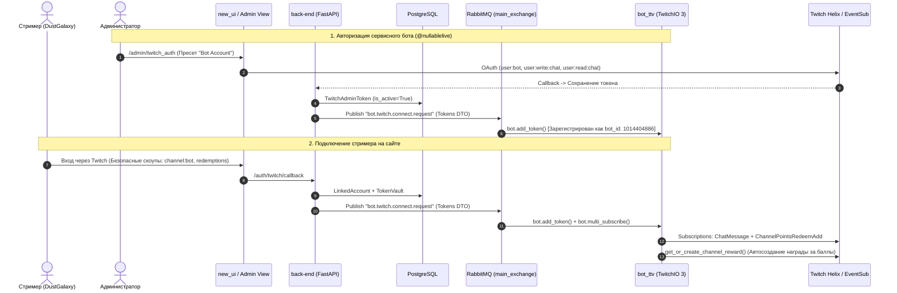
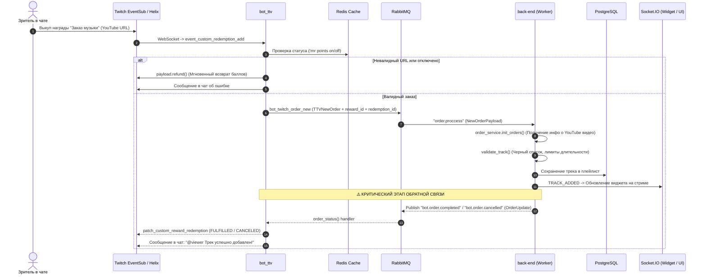
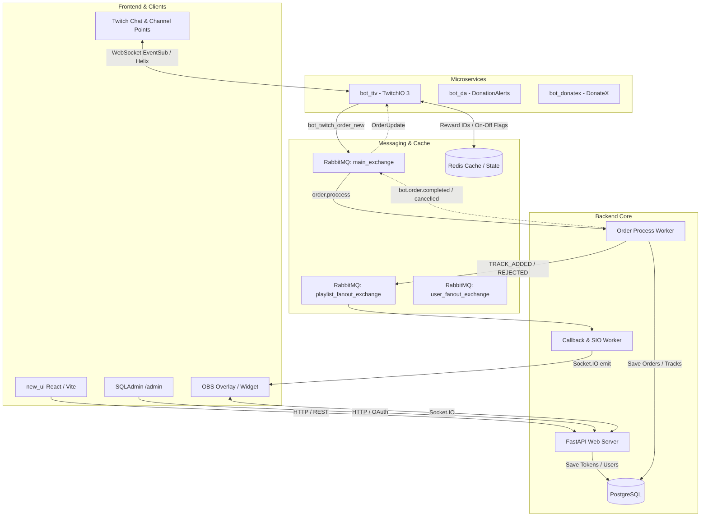

# 🔍 Комплексный аудит архитектуры: Связи, Потоки событий и Точки внимания

Документ содержит подробный анализ взаимодействия сервисов **OpenPlaylist Mono** (`new_ui`, `back-end`, `bot_ttv`, `RabbitMQ`, `Redis`, `PostgreSQL`, `Twitch API`), включая схемы потоков данных, очереди сообщений и точки внимания.

---

## 1. Карта потоков данных и событий

### 📌 Диаграмма 1: Авторизация и подключение каналов

---

### 📌 Диаграмма 2: Заказ трека за баллы канала (Channel Points)

---

### 📌 Диаграмма 3: Общая архитектура компонентов и шина RabbitMQ

---

## 2. Матрица очередей и событий RabbitMQ

| Очередь / Топик | Exchange | DTO | Источник | Получатель | Назначение |
| :--- | :--- | :--- | :--- | :--- | :--- |
| `bot.twitch.order.new` | `main_exchange` (DIRECT) | `TTVNewOrder` | `bot_ttv` | `back-end` | Передача нового заказа из Twitch в процессинг. |
| `order.proccess` | `main_exchange` (DIRECT) | `NewOrderPayload` | `back-end` | `back-end` (Worker) | Инициализация и валидация трека. |
| `internal.playlist.callback` | `playlist_fanout` (FANOUT) | `InternalPlaylistEvent` | `Worker` | `CallbackWorker` | Отправка событий через Socket.IO в UI/Виджет. |
| `bot.twitch.connect.request` | `main_exchange` (DIRECT) | `Tokens` | `back-end` | `bot_ttv` | Подключение нового стримера/бота на лету. |
| `bot.twitch.disconnect` | `main_exchange` (DIRECT) | `str` (user_id) | `back-end` | `bot_ttv` | Отключение канала и удаление подписок. |
| `auth.user.twitch.tokens.refreshed` | `main_exchange` (DIRECT) | `TwitchTokenRefreshed` | `bot_ttv` | `back-end` | Обновление протухших токенов в БД. |
| `bot.order.completed` ⚠️ | `main_exchange` (DIRECT) | `OrderUpdate` | `back-end` (Worker) | `bot_ttv` | Подтверждение заказа, закрытие награды (`FULFILLED`). |
| `bot.order.cancelled` ⚠️ | `main_exchange` (DIRECT) | `OrderUpdate` | `back-end` (Worker) | `bot_ttv` | Отклонение заказа, возврат баллов (`CANCELED`). |

---

## 3. Анализ текущего состояния системы

### ✅ Что работает идеально:
1. **Безопасность скоупов**: Обычные стримеры выдают только `channel:bot` и права на баллы. Права писать от имени стримера убраны.
2. **Админка**: В `/admin/twitch_auth` есть пресет для аккаунта бота (`user:bot`, `user:write:chat`, etc.) и автоотправка токена в RabbitMQ.
3. **Автосоздание наград**: Бот автоматически создает кастомную награду *"Заказ музыки (OpenPlaylist)"* и сохраняет ее ID в Redis.
4. **Управление стримером**: Команды `!mr points on/off/cost/title/prompt/link` работают напрямую из чата.
5. **Слушатель EventSub**: Метод `event_custom_redemption_add` правильно обрабатывает `ChannelPointsRedemptionAdd` и мгновенно возвращает баллы при ошибках в URL.

---

## 4. Обнаруженные критические точки внимания (Action Items)

### 🔴 Точка 1: Отсутствие публикации `OrderUpdate` в бэкенде
* **Где**: `back-end/src/adapters/_rabbit/worker/order_proccess_handler.py`.
* **Суть**: Воркер бэкенда принимает заказ, проверяет его, добавляет в базу данных и рассылает сокеты, **но не отправляет** сообщение в очереди `bot.order.completed` или `bot.order.cancelled`.
* **Последствия**:
  1. В чате Twitch бот не пишет уведомление зрителям о принятии/отклонении трека.
  2. Награда за баллы в Twitch Developer Console остается со статусом *"Unfulfilled"* (в ожидании) вместо *"FULFILLED"* (выполнено) или *"CANCELED"* (возвращено).

### 🟡 Точка 2: Очистка текстового ввода YouTube URL
* **Где**: `bot_ttv/src/components/music_request.py`.
* **Суть**: При выкупе за баллы зритель может случайно написать `глянь трек https://youtu.be/xyz`.
* **Решение**: Регулярное выражение `extract_youtube_video_id` надежно извлекает ID из любого текста, но URL для бэкенда лучше нормализовать как `https://www.youtube.com/watch?v={video_id}`.

### 🟡 Точка 3: Синхронизация статусов стримера при перезапуске Redis
* **Где**: Redis ключ `ttv:channel:{id}:reward_id`.
* **Суть**: Если Redis очищается, бот при следующем старте заново опрашивает Twitch Helix API через `get_or_create_channel_reward`, находит созданную награду по названию и восстанавливает кеш без создания дубликатов.
