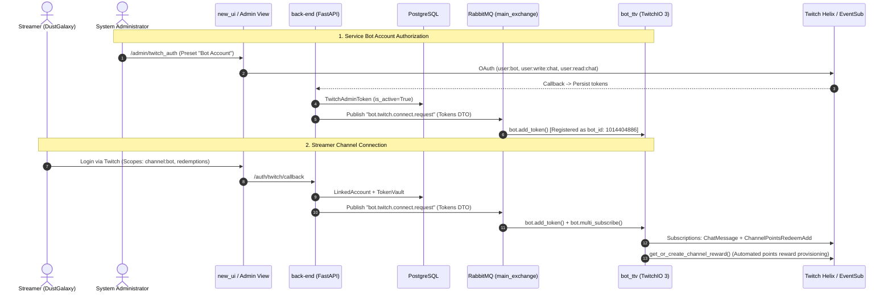
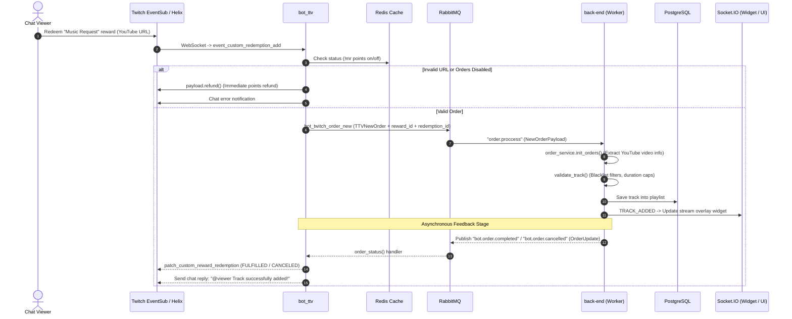
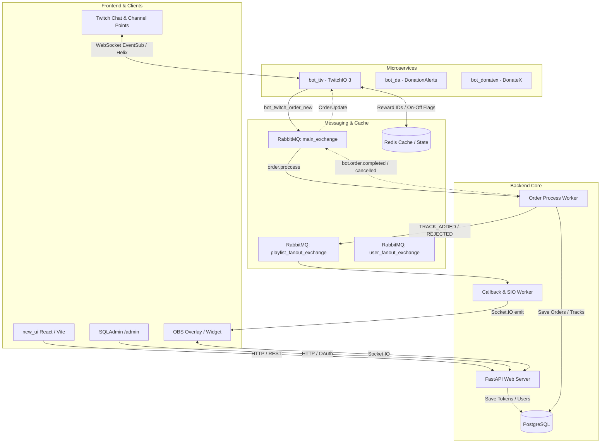

# System Architecture Audit: Connections, Event Streams & Critical Path Analysis

This document provides an architectural audit of service relationships across the **OpenPlaylist Mono** repository (`new_ui`, `back-end`, `bot_ttv`, `RabbitMQ`, `Redis`, `PostgreSQL`, `Twitch API`), detailing data streams, messaging topologies, and operational resilience.

---

## 1. System Interaction Diagrams

### Diagram 1: Authentication & Streamer Onboarding Flow

---

### Diagram 2: Channel Points Track Order Processing

---

### Diagram 3: Distributed Messaging Architecture

---

## 2. RabbitMQ Message & Event Matrix

| Queue / Topic | Exchange | DTO | Producer | Consumer | Purpose |
| :--- | :--- | :--- | :--- | :--- | :--- |
| `bot.twitch.order.new` | `main_exchange` (DIRECT) | `TTVNewOrder` | `bot_ttv` | `back-end` | Dispatch Twitch chat/reward orders to backend. |
| `order.proccess` | `main_exchange` (DIRECT) | `NewOrderPayload` | `back-end` | `back-end` (Worker) | Ingestion and playlist rule validation pipeline. |
| `internal.playlist.callback` | `playlist_fanout` (FANOUT) | `InternalPlaylistEvent` | `Worker` | `CallbackWorker` | Dispatch Socket.IO live updates to UI and OBS. |
| `bot.twitch.connect.request` | `main_exchange` (DIRECT) | `Tokens` | `back-end` | `bot_ttv` | Onboard streamer bot connection dynamically. |
| `bot.twitch.disconnect` | `main_exchange` (DIRECT) | `str` (user_id) | `back-end` | `bot_ttv` | Remove channel subscriptions on account unlink. |
| `auth.user.twitch.tokens.refreshed` | `main_exchange` (DIRECT) | `TwitchTokenRefreshed` | `bot_ttv` | `back-end` | Update renewed OAuth credentials in database. |
| `bot.order.completed` | `main_exchange` (DIRECT) | `OrderUpdate` | `back-end` (Worker) | `bot_ttv` | Order accepted, fulfill Channel Points reward. |
| `bot.order.cancelled` | `main_exchange` (DIRECT) | `OrderUpdate` | `back-end` (Worker) | `bot_ttv` | Order rejected, cancel/refund Channel Points. |

---

## 3. System Strengths & Security Audit

1. **Granular OAuth Scopes:** Streamers authorize strictly `channel:bot` and channel points scopes; identity rights to speak on behalf of the streamer are segregated.
2. **Dedicated Administration:** `/admin/twitch_auth` maintains specialized presets for bot accounts (`user:bot`, `user:write:chat`), broadcasting tokens via RabbitMQ.
3. **Automated Reward Management:** Automatic provisioning of custom Channel Points rewards with resilient recovery from Redis cache drops.
4. **Resilient URL Parsing:** Regex extractors isolate video IDs from arbitrary chat sentences and normalize canonical YouTube URLs.
