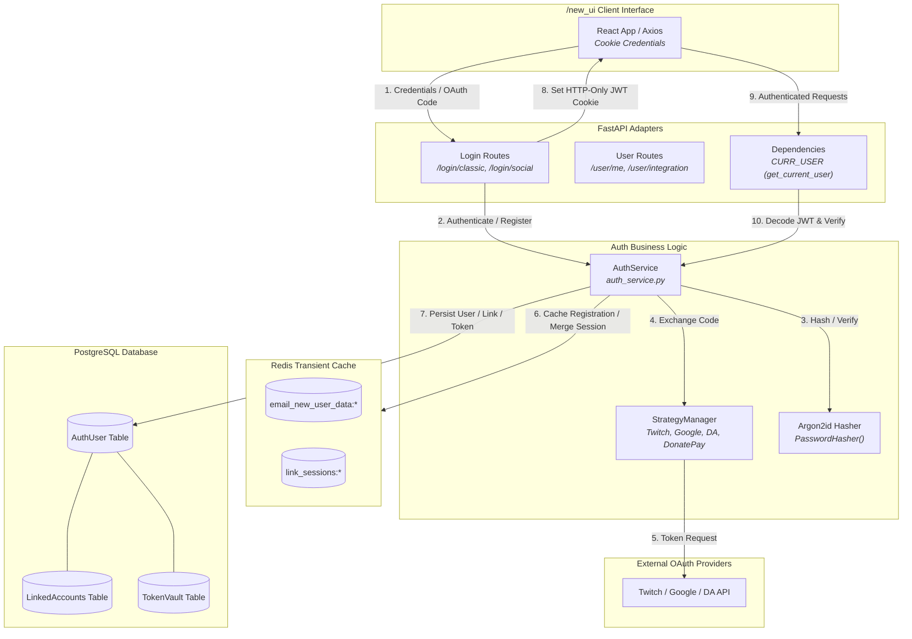
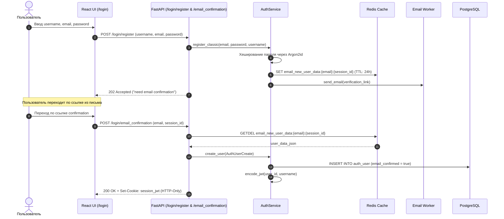
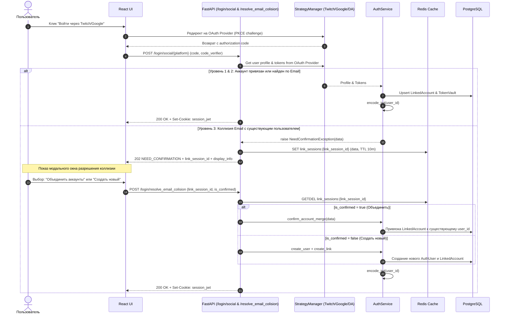
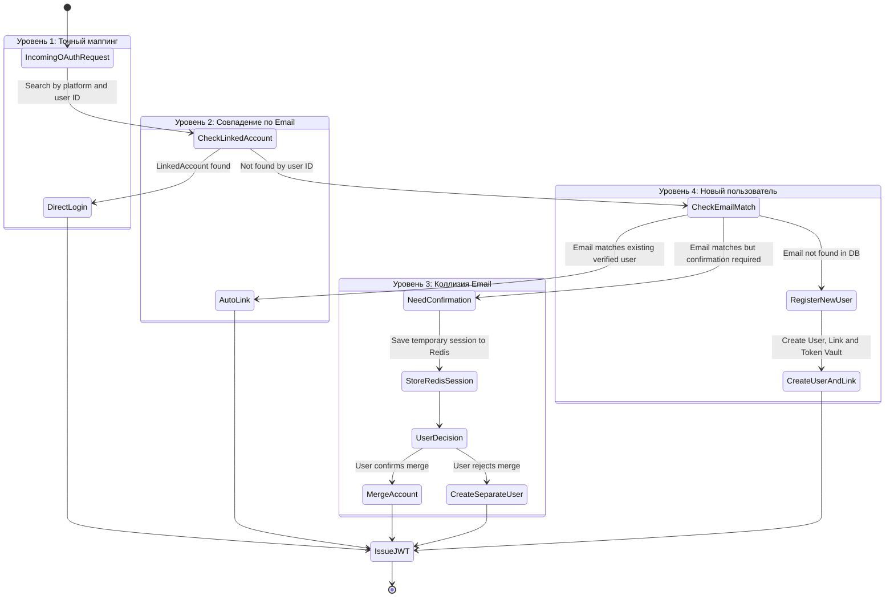

# Подсистема авторизации и идентификации (Auth & Identity System)

Документация описывает архитектуру аутентификации, авторизации, управление сессиями, стратегии OAuth2/PKCE интеграций, механизмы разрешения коллизий учетных записей и защиту паролей в проекте **OpenPlaylist**.

---

## 1. Архитектурный обзор (Architecture Overview)

Подсистема авторизации состоит из 4 ключевых компонентов:
1. **Безопасная классическая аутентификация (Argon2id + Email Verification)**:
   - Использование криптографического алгоритма **Argon2id** (`argon2-cffi`) для хеширования паролей с проверкой необходимости перехеширования (`check_needs_rehash`).
   - Двухэтапная регистрация с сохранением временного состояния пользователя в Redis (`email_new_user_data:{email}:{session_id}`) до подтверждения email.
2. **Гибкая социальная авторизация (OAuth2 / PKCE + User Key)**:
   - Паттерн **Strategy Manager** (`strategy_manager.py`) для взаимодействия с платформами: Twitch, Google, DonationAlerts, DonatePay, DonateX.
   - Поддержка стандартов OAuth2 PKCE (`code_verifier`) и прямого ввода персональных ключей (`AuthFlow.USER_KEY`).
3. **Многоуровневая обработка коллизий емейлов (Email Collision & Merge)**:
   - Изоляция аккаунтов и безопасное слияние соцсетей через временные сессии в Redis (`link_sessions:{link_session_id}`).
4. **Сессионная защита на JWT & HTTP-Only Cookies**:
   - Генерация подписанных JWT-токенов (`HS256`), передаваемых в защищенных HTTP-Only сессионных куках (`httponly=True`, `secure=True`).

---

## 2. Графики и диаграммы взаимодействия (System Diagrams)

### 2.1. Компонентная архитектура подсистемы аутентификации (Data Flow Diagram)



---

### 2.2. Диаграмма последовательности: Классическая регистрация и подтверждение Email (Registration Sequence)



---

### 2.3. Диаграмма последовательности: Социальная авторизация и разрешение коллизий (Social OAuth & Collision Resolution)



---

### 2.4. Матрица вариантов привязки и обработки уровней авторизации (Auth Levels Matrix)



---

## 3. Детальная спецификация компонентов и таблиц

### 3.1. Схема базы данных (PostgreSQL Models & Tables)
1. **`auth_user` (`src/models/auth_user.py` / `src/orm/auth_user.py`)**:
   - `id`: UUID (Primary Key).
   - `email`: String (Unique, Indexed).
   - `username`: String (Unique, Indexed).
   - `password`: String | None (Argon2id hash, null для социалок).
   - `email_confirmed`: Boolean.
   - `avatar_url`: String | None.
   - `roles`: JSONB list (список ролей пользователя).
   - `created_at`, `updated_at`: Timestamp.

2. **`linked_accounts` (`src/models/linked_accounts.py` / `src/orm/linked_accounts.py`)**:
   - `id`: UUID.
   - `user_id`: UUID (Foreign Key -> `auth_user.id`).
   - `platform`: Enum (`twitch`, `google`, `da`, `donatepay`, `donatex`).
   - `platform_user_id`: String (Идентификатор пользователя на внешней платформе).
   - `platform_username`: String.
   - `platform_email`: String | None.

3. **`token_vault` (`src/models/token_vault.py` / `src/orm/token_vault.py`)**:
   - `id`: UUID.
   - `user_id`: UUID (Foreign Key -> `auth_user.id`).
   - `platform`: Enum.
   - `access_token`: Encrypted String.
   - `refresh_token`: Encrypted String | None.
   - `expires_at`: BigInteger Timestamp.

### 3.2. Безопасность и алгоритмы шифрования
- **Password Hashing**: `Argon2id` с параметрами по умолчанию от `argon2-cffi`. Проверка устаревания параметров через `hasher.check_needs_rehash(user.password)`.
- **JWT Signatures**: `PyJWT` алгоритм `HS256`. Ключ `JWT_SECRET_KEY`, время жизни сессии задается `SESSION_LIVE_TIME` (по умолчанию 30 дней).
- **Cookie Security**:
  - `name`: `settings.COOKIE_NAME`
  - `httponly`: `True` (защита от XSS атак)
  - `secure`: `True` (передача только по HTTPS)
  - `samesite`: `lax` / `strict`

### 3.3. Брандмауэр и зависимость авторизации (`CURR_USER`)
В FastAPI эндпоинтах авторизация внедряется через зависимость:
```python
CURR_USER = Annotated[User, Depends(auth_service.get_current_user)]
```
При каждом запросе:
1. Зависимость `APIKeyCookie` извлекает токен из куки `settings.COOKIE_NAME`.
2. `auth_service.get_current_user` декодирует JWT и сверяет подпись.
3. Проверяется срок действия (`exp`).
4. Объект пользователя вычитывается из базы данных / кеша и передается в обработчик маршрута.
