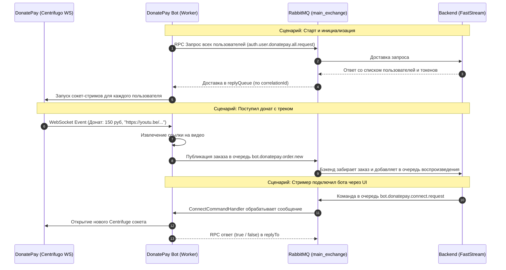
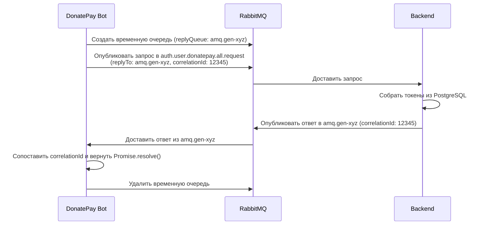

# Руководство по Messaging: AMQP Клиент и Command Handlers (для новичков)

В данном руководстве подробно и простым языком разбирается, как устроен слой взаимодействия с брокером сообщений **RabbitMQ** в микросервисе `bot_donatepay`.

Мы детально разберем два ключевых файла:
1. [`src/messaging/amqp-client.ts`](file:///e:/vs-code-projects/openplaylist-mono/bot_donatepay/src/messaging/amqp-client.ts) — шлюз для работы с RabbitMQ (подключение, очереди, отправка сообщений и RPC).
2. [`src/messaging/command-handlers.ts`](file:///e:/vs-code-projects/openplaylist-mono/bot_donatepay/src/messaging/command-handlers.ts) — обработчики входящих команд от бэкенда (подключить/отключить стримера).

---

## 1. Концепция: Что такое RabbitMQ и AMQP?

### Простая аналогия: "Почтовая служба"

Представьте, что ваше приложение — это сеть офисов:
- **Бэкенд (Python/FastAPI)** — центральный офис управления.
- **Бот DonatePay (Node.js/TypeScript)** — филиал, слушающий донаты стримеров.
- **RabbitMQ** — городская почтовая служба, связывающая их.

```
[ Producer (Отправитель) ] 
       │ 
       ▼ (Отправляет письмо с адресом)
[ Exchange (Сортировочный центр) ] 
       │ 
       ▼ (Раскладывает по правилам / routing key)
[ Queue (Почтовый ящик) ] 
       │ 
       ▼ (Курьер забирает)
[ Consumer (Получатель / Обработчик) ]
```

### Основные термины:
1. **Producer (Продюсер/Отправитель):** Тот, кто создает сообщение (например, бот поймал донат с треком и отправляет его в систему).
2. **Exchange (Обменник/Сортировочный центр):** Получает сообщения и решает, в какие очереди их направить на основе правил (routing key). В нашем боте используется `main_exchange` с типом `direct` (прямая доставка в очередь с тем же именем).
3. **Queue (Очередь/Почтовый ящик):** Место на сервере RabbitMQ, где сообщения аккуратно лежат в порядке очереди (FIFO), пока их не заберет получатель.
4. **Consumer (Консьюмер/Получатель):** Тот, кто слушает очередь и выполняет работу при поступлении письма.
5. **Ack (Acknowledge / Расписка о получении):** Сигнал от получателя: *"Я успешно обработал сообщение, его можно удалить из очереди"*. Если получатель упадет до отправки `ack`, RabbitMQ не потеряет сообщение и передаст его снова.

---

## 2. Общая архитектура взаимодействия



---

## 3. Разбор `AmqpClient` (`src/messaging/amqp-client.ts`)

Класс `AmqpClient` берет на себя всю черновую работу по управлению протоколом AMQP.

### 3.1. Подключение и Confirm-канал

В конструктор передается конфигурация `config: AppConfig`:
```typescript
public async connect(): Promise<void> {
  this.connection = await amqp.connect(this.config.rabbitUrl);
  this.channel = await this.connection.createConfirmChannel();
  // ...
  await this.setupTopology();
}
```

> [!TIP]
> **Почему `createConfirmChannel()`, а не обычный `createChannel()`?**
> Обычный канал отправляет сообщение "в пустоту" (fire-and-forget). `ConfirmChannel` гарантирует, что брокер RabbitMQ прислал подтверждение о физической записи сообщения на диск или в память. Это предотвращает потерю донатов и заказов при сетевых сбоях.

---

### 3.2. Настройка топологии (`setupTopology`)

Топология — это схема связей между обменниками и очередями:
```typescript
private async setupTopology(): Promise<void> {
  // 1. Создаем (или проверяем наличие) обменника
  await this.channel.assertExchange(this.config.mainExchange, "direct", { durable: true });

  // 2. Создаем очереди
  await this.channel.assertQueue(this.config.eventQueue, { durable: true });
  await this.channel.assertQueue(this.config.connectQueue, { durable: true });
  await this.channel.assertQueue(this.config.disconnectQueue, { durable: true });

  // 3. Привязываем (биндим) очереди к обменнику
  await this.channel.bindQueue(this.config.eventQueue, this.config.mainExchange, this.config.eventQueue);
  await this.channel.bindQueue(this.config.connectQueue, this.config.mainExchange, this.config.connectQueue);
  await this.channel.bindQueue(this.config.disconnectQueue, this.config.mainExchange, this.config.disconnectQueue);

  // 4. Ограничиваем нагрузку на воркера
  await this.channel.prefetch(1);
}
```

- `durable: true`: Очереди и сообщения сохраняются даже при перезапуске сервера RabbitMQ.
- `prefetch(1)`: Говорит RabbitMQ: *"Не присылай мне следующее сообщение, пока я не отправлю `ack` за предыдущее"*. Это защищает воркера от зависания при наплыве сотен донатов.

---

### 3.3. Публикация событий

#### Отправка нового заказа (`publishOrderEvent`)
Когда в стриме получен донат, вызывается метод:
```typescript
public publishOrderEvent(event: DonatePayNewOrderPayload): boolean {
  const payload = Buffer.from(JSON.stringify(event));
  return this.channel.publish(
    this.config.mainExchange,
    this.config.eventQueue, // routing key = "bot.donatepay.order.new"
    payload,
    { persistent: true }    // Сообщение пишется на диск
  );
}
```

#### Оповещение о протухшем токене (`publishTokenDied`)
Если DonatePay вернул ошибку `401 Unauthorized` (стример отозвал API ключ), бот сообщает об этом бэкенду:
```typescript
public publishTokenDied(event: TokenDiedPayload): boolean {
  const payload = Buffer.from(JSON.stringify(event));
  return this.channel.publish(
    this.config.mainExchange,
    this.config.tokenDiedQueue, // "donatepay.user.token.died"
    payload,
    { persistent: true }
  );
}
```
Бэкенд получит это событие и пометит интеграцию как отключенную, уведомив пользователя в веб-интерфейсе.

---

### 3.4. Паттерн RPC (Remote Procedure Call) через RabbitMQ

Обычно HTTP работает как "запрос-ответ". Очереди сообщений же асинхронны (отправил и забыл). Как сделать "запрос-ответ" через очереди?

Метод `requestAllUsers()` реализует классический паттерн **RabbitMQ RPC**:



#### Код реализации:
```typescript
public async requestAllUsers(timeoutMs = 10000): Promise<UserTokensDto[]> {
  // 1. Создаем временную эксклюзивную очередь (только для этого запроса)
  const replyQueue = await this.channel.assertQueue("", {
    exclusive: true,
    autoDelete: true,
  });

  // 2. Генерируем уникальный номер "заказа" (correlationId)
  const correlationId = crypto.randomUUID();

  return new Promise<UserTokensDto[]>((resolve, reject) => {
    let timer: NodeJS.Timeout;

    // 3. Слушаем временную очередь ответа
    const consumerPromise = this.channel!.consume(
      replyQueue.queue,
      (msg) => {
        if (!msg) return;
        // Проверяем, что ответ именно на наш запрос!
        if (msg.properties.correlationId === correlationId) {
          clearTimeout(timer);
          try {
            const rawUsers = JSON.parse(msg.content.toString());
            resolve(rawUsers);
          } catch (err) {
            reject(err);
          } finally {
            // Удаляем временную очередь
            this.channel?.deleteQueue(replyQueue.queue);
          }
        }
      },
      { noAck: true }
    );

    // 4. Таймаут, если бэкенд не ответил вовремя
    timer = setTimeout(() => {
      this.channel?.deleteQueue(replyQueue.queue);
      reject(new Error(`Timeout (${timeoutMs}ms) waiting for users`));
    }, timeoutMs);

    // 5. Отправляем запрос с заголовками replyTo и correlationId
    this.channel!.publish(
      this.config.mainExchange,
      this.config.allUsersRequestQueue,
      Buffer.from(JSON.stringify({})),
      {
        replyTo: replyQueue.queue,
        correlationId: correlationId,
        persistent: false,
      }
    );
  });
}
```

---

## 4. Разбор `Command Handlers` (`src/messaging/command-handlers.ts`)

### Зачем нужен паттерн Command Handler?
Вместо того чтобы писать огромную функцию с сотней условий `if/else` или `switch(command)`, логика каждой команды изолируется в свой отдельный класс:
- `ConnectCommandHandler` — знает всё о том, как подключить пользователя.
- `DisconnectCommandHandler` — знает всё о том, как отключить пользователя.

Каждый хэндлер тестируется независимо и имеет одну четкую ответственность (**Single Responsibility Principle**).

---

### 4.1. `ConnectCommandHandler`

Слушает очередь `bot.donatepay.connect.request`.

```typescript
export class ConnectCommandHandler {
  constructor(
    private readonly amqpClient: IAmqpClient,
    private readonly streamManager: StreamManager,
    logger?: Logger,
  ) {}

  public async handle(msg: amqp.ConsumeMessage | null): Promise<boolean> {
    if (!msg) return false;

    let success = false;
    try {
      const payload = JSON.parse(msg.content.toString());

      // 1. Поддержка разных форматов входных данных (DTO)
      let connData: ConnectionData | null = null;

      // Стандартный формат: { platform_user_id, access_token, user_id }
      if (payload.platform_user_id && payload.access_token) {
        connData = {
          user_id: payload.user_id || payload.platform_user_id,
          platform_user_id: payload.platform_user_id,
          access_token: payload.access_token,
          // ...
        };
      } 
      // Legacy формат подписки: { action: "subscribe", channel: "$public:123", token: "..." }
      else if (payload.action === "subscribe" && payload.token && payload.channel) {
        const platformUserId = payload.channel.replace("$public:", "");
        connData = {
          user_id: payload.user_id || platformUserId,
          platform_user_id: platformUserId,
          access_token: payload.token,
        };
      }

      // 2. Запуск сокет-стрима через StreamManager
      if (connData) {
        success = await this.streamManager.startStream(connData);
      }
    } catch (err: any) {
      this.logger.error("Ошибка команды подключения:", err.message);
    }

    // 3. Если вызывающая сторона ждала RPC ответ — отправляем результат
    if (msg.properties.replyTo) {
      this.amqpClient.sendRpcReply(
        msg.properties.replyTo,
        msg.properties.correlationId,
        success,
      );
    }

    // 4. Обязательно подтверждаем обработку сообщения!
    this.amqpClient.ack(msg);
    return success;
  }
}
```

---

### 4.2. `DisconnectCommandHandler`

Слушает очередь `bot.donatepay.disconnect`.

Главная особенность — гибкая нормализация (санитизация) входных данных. Сообщение может прийти в виде:
1. Обычной строки: `"903168"` или `"$public:903168"`
2. JSON объекта: `{"platform_user_id": "903168"}`
3. JSON канала: `{"channel": "$public:903168"}`

```typescript
export class DisconnectCommandHandler {
  public async handle(msg: amqp.ConsumeMessage | null): Promise<boolean> {
    if (!msg) return false;

    let success = false;
    try {
      const contentStr = msg.content.toString();
      // Очистка от префикса $public: и лишних кавычек
      let platformUserId = contentStr.replace(/"/g, "").replace("$public:", "").trim();

      try {
        const parsed = JSON.parse(contentStr);
        if (typeof parsed === "string") {
          platformUserId = parsed.replace("$public:", "").trim();
        } else if (parsed.platform_user_id) {
          platformUserId = String(parsed.platform_user_id).trim();
        } else if (parsed.channel) {
          platformUserId = String(parsed.channel).replace("$public:", "").trim();
        }
      } catch {
        // Если это была простая не-JSON строка, значение уже очищено выше
      }

      if (platformUserId) {
        // Останавливаем стрим в StreamManager
        success = this.streamManager.stopStream(platformUserId);
      }
    } catch (err: any) {
      this.logger.error("Ошибка отключения:", err.message);
    }

    // Отправляем RPC ответ, если требовался
    if (msg.properties.replyTo) {
      this.amqpClient.sendRpcReply(
        msg.properties.replyTo,
        msg.properties.correlationId,
        success,
      );
    }

    // Подтверждаем получение
    this.amqpClient.ack(msg);
    return success;
  }
}
```

---

## 5. Памятка и частые ошибки (Best Practices)

| Правило | Почему это важно |
| :--- | :--- |
| **Всегда вызывайте `ack(msg)`** | Если забыть вызвать `ack(msg)`, сообщение останется в статусе `Unacked`. При перезапуске воркера оно вернется в очередь, а при `prefetch(1)` воркер вообще заблокируется навсегда. |
| **Используйте `try/catch` внутри хэндлера** | Нельзя допускать падения консьюмера из-за битого JSON. Если JSON сломан, логируем ошибку, отправляем `ack(msg)` (чтобы выбросить мусор) и продолжаем работу. |
| **Пользуйтесь интерфейсами (`IAmqpClient`)** | Внедрение зависимостей (Dependency Injection) через интерфейсы позволяет тестировать хэндлеры за 2 миллисекунды без запуска реального брокера RabbitMQ. |
| **Не блокируйте Event Loop** | Вся работа с очередями и парсингом асинхронна (`async/await`), что гарантирует высокую производительность Node.js. |

---

## 6. Пример Unit-теста для хэндлера

Благодаря архитектуре с внедрением зависимостей протестировать хэндлер очень просто:

```typescript
it("подключает пользователя и шлет RPC ответ", async () => {
  // 1. Создаем мок клиента AMQP
  const replies: any[] = [];
  const acks: any[] = [];
  const mockAmqp: IAmqpClient = {
    sendRpcReply: (replyTo, corrId, data) => replies.push(data),
    ack: (msg) => acks.push(msg),
    // ...
  };

  // 2. Создаем мок менеджера стримов
  const mockStreamManager = {
    startStream: async () => true,
  } as unknown as StreamManager;

  const handler = new ConnectCommandHandler(mockAmqp, mockStreamManager);

  // 3. Имитируем сообщение из RabbitMQ
  const fakeMsg = {
    content: Buffer.from(JSON.stringify({
      platform_user_id: "12345",
      access_token: "secret"
    })),
    properties: { replyTo: "reply-queue", correlationId: "id-1" },
  } as amqp.ConsumeMessage;

  // 4. Выполняем
  const result = await handler.handle(fakeMsg);

  // 5. Проверяем результат
  assert.strictEqual(result, true);
  assert.strictEqual(replies[0], true);
  assert.strictEqual(acks.length, 1);
});
```
