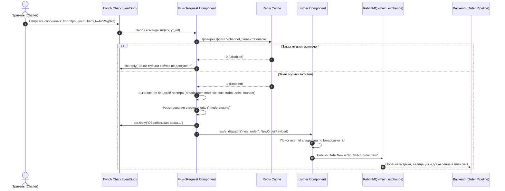
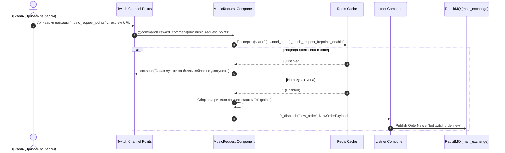
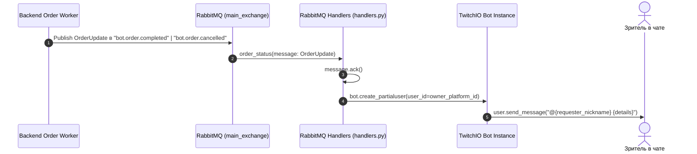
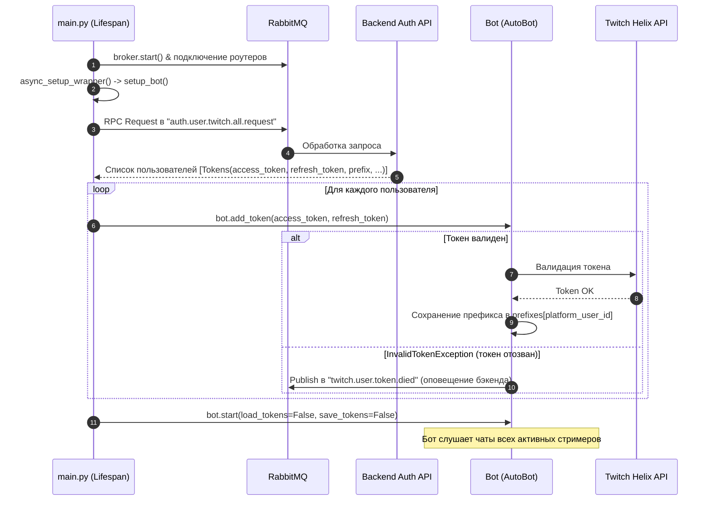

# Архитектура микросервиса Twitch-бота (bot_ttv Architecture)

Документ описывает внутреннюю архитектуру, механизмы интеграции, форматы сообщений и жизненный цикл микросервиса **`bot_ttv`** — официального Twitch-бота платформы **OpenPlaylist**.

---

## 1. Архитектурный обзор (System Overview)

Микросервис `bot_ttv` обеспечивает двустороннее взаимодействие между чатами стримеров на платформе **Twitch** и ядром **OpenPlaylist**:

1. **Музыкальные заказы из чата Twitch**:
   - Прием команд заказа треков (`!mr <url>`, `::mr <url>`) с динамическим префиксом для каждого стримера.
   - Прием заказов через баллы канала Twitch (**Channel Points**) при активации награды `music_request_points`.
   - Вычисление рангов и привилегий зрителя (Broadcaster, Moderator, VIP, Subscriber, Turbo, Artist, Founder) для расчета приоритета очереди.
2. **Обратная связь в чат**:
   - Асинхронное получение статусов заказов от бэкенда (`bot.order.completed`, `bot.order.cancelled`, `bot.order.partially_completed`) и отправка персональных уведомлений заказчикам в чат.
3. **Управление состоянием и модерация**:
   - Включение и выключение заказов музыки модераторами стримера (`!mr on/off`, `!mr points on/off`).
   - Кэширование состояния фич-флагов в **Redis**.
4. **Управление мультитенантным подключением**:
   - Единый инстанс `twitchio.ext.commands.AutoBot`, обслуживающий сотни каналов одновременно.
   - Динамическое подключение (`bot.twitch.connect.request`) и отключение (`bot.twitch.disconnect`).
   - Автоматическая ротация и синхронизация OAuth токенов с `TokenVault` бэкенда.

---

## 2. Компонентная архитектура (Component Architecture)

```mermaid
flowchart TB
    subgraph TwitchPlatform ["Twitch Platform"]
        TTV_Chat["Twitch Chat (IRC / EventSub WS)"]
        TTV_Points["Channel Points Custom Reward"]
        TTV_API["Twitch Helix API (OAuth & Tokens)"]
    end

    subgraph BotTTV ["bot_ttv Microservice Container"]
        MainApp["main.py (FastStream Application)"]
        
        subgraph TwitchIOCore ["TwitchIO AutoBot Engine (bot_setup.py)"]
            BotInstance["Bot (commands.AutoBot)"]
            PrefixManager["Dynamic Prefix Router"]
        end

        subgraph ComponentsLayer ["Bot Components (src/components)"]
            MainCmds["MainCommands\n(!hi, !say, !socials)"]
            MusicReq["MusicRequest\n(!mr, !mr on/off, Channel Points)"]
            OrderListener["Listner\n(event_safe_new_order dispatcher)"]
        end

        subgraph AdaptersLayer ["Adapters Layer (src/adapters)"]
            RabbitHandlers["RabbitMQ Handlers (FastStream Router)"]
            RedisClient["RedisAdapter (src/adapters/_redis)"]
        end

        subgraph ACLLayer ["Anti-Corruption Layer (src/acl)"]
            UserACL["UserACL (auth.user.twitch.all.request)"]
            PlaylistACL["PlaylistACL (playlist.settings.request)"]
        end
    end

    subgraph MessagingAndCache ["Infrastructure Layer"]
        RABBIT["RabbitMQ Broker (main_exchange / topic_exchange)"]
        REDIS[("Redis Cache")]
    end

    subgraph OpenPlaylistBackend ["OpenPlaylist Backend Core"]
        BackendOrders["Order Processing Pipeline\n(order.proccess)"]
        TokenVault["Token Refresh TaskIQ Task\n(src/tasks/tokens.py)"]
        UserBotAPI["User Bot Management API\n(/user/bots/twitch/*)"]
    end

    %% External Twitch Connections
    TTV_Chat <-->|EventSub WebSocket| BotInstance
    TTV_Points -->|Custom Reward Redemption| MusicReq
    BotInstance <-->|OAuth Refresh & Validation| TTV_API

    %% Bot Internal Links
    MainApp -->|Lifespan Startup| BotInstance
    MainApp -->|Init & Connect| RabbitHandlers
    MainApp -->|Init & Connect| RedisClient
    BotInstance --> MainCmds
    BotInstance --> MusicReq
    BotInstance --> OrderListener
    BotInstance --> PrefixManager

    %% Components to Storage / Messaging
    MusicReq <-->|mr:enable / points:enable| RedisClient
    MusicReq -->|safe_dispatch('new_order')| OrderListener
    OrderListener -->|Publish bot.twitch.order.new| RABBIT
    UserACL <-->|RPC Request/Reply| RABBIT

    %% Rabbit to Backend
    RABBIT <-->|bot.order.* status updates| RabbitHandlers
    RABBIT <-->|bot.twitch.connect/disconnect| RabbitHandlers
    RABBIT -->|bot.twitch.order.new| BackendOrders
    TokenVault -->|auth.token.refreshed.twitch| RABBIT
    UserBotAPI -->|bot.twitch.connect.request| RABBIT
    RabbitHandlers -->|Send chat reply| BotInstance
```

---

## 3. Внутренняя структура модулей (Directory Structure)

```
bot_ttv/
├── Dockerfile                  # Сборка контейнера Python 3.13
├── pyproject.toml              # Зависимости: faststream, twitchio, redis, pydantic, asqlite
├── main.py                     # Lifespan FastStream, запуск RabbitMQ, Redis и бота
└── src/
    ├── config.py               # Pydantic BaseSettings (.env конфигурация)
    ├── log_setup.py            # Настройка логов
    ├── bot_setup.py            # Класс Bot(commands.AutoBot), инициализация токенов и EventSub
    ├── utils.py                # Regex YouTube URL, валидаторы прав стримера/модератора
    ├── acl/                    # Anti-Corruption Layer (RPC запросы к бэкенду)
    │   ├── playlist.py         # PlaylistACL: получение настроек плейлиста
    │   └── user.py             # UserACL: получение списка стримеров при старте
    ├── adapters/
    │   ├── _rabbit/            # RabbitMQ адаптер (FastStream)
    │   │   ├── broker.py       # Определение очередей и эксчейнджей
    │   │   ├── handlers.py     # Обработчики очередей (статусы заказов, подключение, настройки)
    │   │   └── dto/            # Pydantic DTO (Order, Settings, User Tokens)
    │   │       ├── order.py    # OrderNew, OrderUpdate, NewOrderPayload
    │   │       ├── settings.py # ReadPlaylistSettings, SortSettings
    │   │       └── user.py     # Tokens, TwitchBotSettings, SettingsConteiner
    │   └── _redis/             # Redis адаптер
    │       └── broker.py       # RedisAdapter c декоратором @ready_check
    └── components/             # TwitchIO компоненты
        ├── listners.py         # Listner: трансформация NewOrderPayload -> OrderNew -> RabbitMQ
        ├── main_commands.py    # Базовые команды (!hi, !say, !give, !choice, !socials)
        └── music_request.py    # Музыкальные заказы (!mr, !mr on/off, !mr points on/off, reward)
```

---

## 4. Потоки данных и диаграммы последовательности (Data Flows & Sequences)

### 4.1. Заказ музыки через чат-команду (`!mr <url>`)



---

### 4.2. Заказ музыки через Twitch Channel Points



---

### 4.3. Асинхронное уведомление о статусе заказа в чат



---

### 4.4. Жизненный цикл сервиса и регистрация стримеров (Startup & OAuth Flow)



---

## 5. Контракты очередей RabbitMQ (Message Contracts)

### 5.1. Входящие сообщения (Subscribers)

| Очередь / Топик | Exchange | DTO / Тип | Описание |
| :--- | :--- | :--- | :--- |
| `bot.order.completed` | `main_exchange` (DIRECT) | `OrderUpdate` | Уведомление об успешном добавлении заказа в плейлист. |
| `bot.order.cancelled` | `main_exchange` (DIRECT) | `OrderUpdate` | Уведомление об отмене заказа (черный список, невалидный URL, ошибка). |
| `bot.order.partially_completed` | `main_exchange` (DIRECT) | `OrderUpdate` | Частичное выполнение заказа. |
| `bot.twitch.connect.request` | `main_exchange` (DIRECT) | `Tokens` | Подключение нового стримера в рантайме (добавление токена и подписка на EventSub). |
| `bot.twitch.disconnect` | `main_exchange` (DIRECT) | `str` (platform_user_id) | Отключение стримера и удаление его токена из `AutoBot`. |
| `bot.twitch.settings` | `main_exchange` (DIRECT) | `SettingsConteiner` | Обновление пользовательских настроек бота (префикс команд). |
| `auth.token.refreshed.twitch` | `topic_exchange` (TOPIC) | `Tokens` | Получение обновленных токенов от фонового воркера бэкенда. |

### 5.2. Исходящие сообщения (Publishers / RPC)

| Очередь / Топик | Exchange | DTO / Payload | Описание |
| :--- | :--- | :--- | :--- |
| `bot.twitch.order.new` | `main_exchange` (DIRECT) | `OrderNew` | Публикация нового заказа трека в пайплайн бэкенда. |
| `auth.user.twtich.tokens.refreshed` | `main_exchange` (DIRECT) | `dict` (twitch_id, tokens) | Оповещение бэкенда о том, что TwitchIO автоматически обновил токен. |
| `twitch.user.token.died` | `main_exchange` (DIRECT) | `dict` (platform_user_id, ...) | Оповещение об аннулировании токена стримера. |
| `auth.user.twitch.all.request` | `main_exchange` (DIRECT) | RPC Request -> `list[Tokens]` | Запрос полного списка подключенных стримеров при старте бота. |
| `playlist.settings.request` | `main_exchange` (DIRECT) | RPC Request -> `ReadPlaylistSettings` | Запрос настроек конкретного плейлиста (ACL). |

---

## 6. Ключи и структуры в Redis (Redis Key Schema)

| Шаблон ключа | Тип | Назначение | Пример значения |
| :--- | :--- | :--- | :--- |
| `{channel_name}:mr:enable` | `string` (`int`) | Флаг доступности текстовой команды `!mr` | `"1"` (включено), `"0"` (выключено) |
| `{channel_name}_music_request_forpoints_enable` | `string` (`int`) | Флаг доступности заказа за баллы канала | `"1"`, `"0"` |
| `{user_id}:{playlist_name}:settings` *(резерв)* | `string` (`JSON`) | Кэш настроек плейлиста и лимитов | `{"is_active": true, ...}` |
| `{playlist_name}:cooldown:{yt_id}` *(резерв)* | `string` (с TTL) | Кулдаун повторного заказа одинакового видео | `"1"` |

---

## 7. Анализ кода, технический аудит и рекомендации (Code Review & Improvements)

В ходе архитектурного аудита кодовой базы `bot_ttv` выявлены следующие точки внимания и рекомендации по рефакторингу:

### 7.1. Опечатки в наименованиях (Typos)
1. **`src/config.py` и `src/bot_setup.py`**:
   - Поле `TWICTH_CLIENT_SECRET` содержит опечатку. Рекомендуется переименовать в `TWITCH_CLIENT_SECRET`.
2. **`src/adapters/_rabbit/broker.py`**:
   - Очередь `auth_user_twitch_tokens_refreshed` названа `"auth.user.twtich.tokens.refreshed"` (с опечаткой `twtich`). Следует синхронизировать с бэкендом.

### 7.2. Унификация формата приоритетов (`priority`)
- В методе `mr` приоритеты собираются через двоеточие с полными названиями:
  ```python
  priority=":".join(["moderator", "vip"])  # -> "moderator:vip"
  ```
  При этом в коде присутствует опечатка: `"tartist"` вместо `"artist"`.
- В методе `music_request_by_points` приоритеты собираются однобуквенно без разделителя:
  ```python
  priority="".join(["p", "b", "m"])  # -> "pbm"
  ```
- **Рекомендация**: унифицировать формат приоритетов к единому перечислению (например, `"points:moderator:vip"`), чтобы обработчик заказов на бэкенде применял консистентные правила расчета весов (`cost_mode: add/max`).

### 7.3. Консистентность типов идентификаторов
- В `music_request_by_points`:
  ```python
  broadcaster_id=int(ctx.channel.id),
  chatter_id=int(ctx.author.id)
  ```
  В DTO `NewOrderPayload` поля объявлены как `str`. В Python/Pydantic v2 это может приводить к неявным конвертациям или ошибкам валидации.
- **Рекомендация**: Всегда передавать `str(ctx.channel.id)` и `str(ctx.author.id)`.

### 7.4. Стандартизация Redis-ключей
- Ключи используют смешанный стиль: `{channel}:mr:enable` (с двоеточиями) и `{channel}_music_request_forpoints_enable` (со знаками подчеркивания). Кроме того, они завязаны на `channel_name` (который стример может сменить на Twitch), а не на постоянный `broadcaster_id`.
- **Рекомендация**: перейти к ключам вида:
  - `ttv:channel:{broadcaster_id}:mr_enabled`
  - `ttv:channel:{broadcaster_id}:points_enabled`

### 7.5. Очистка устаревшего SQLite-кода (Legacy Code Cleanup)
- В модуле `src/utils.py` сохранились неиспользуемые методы (`get_user_id`, `get_twitch_id`, `setup_database`), а в корне сервиса находятся файлы `tokens.db`, `users.db`. В актуальной архитектуре хранилищем состояния и токенов является PostgreSQL бэкенда, доступный через RabbitMQ RPC.
- **Рекомендация**: удалить неиспользуемые SQLite-функции и добавить временные SQLite-файлы в `.gitignore`.
