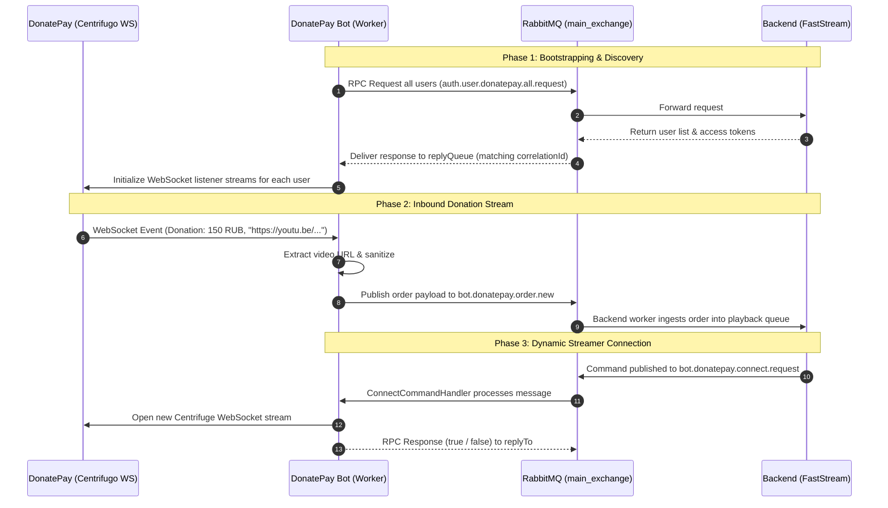
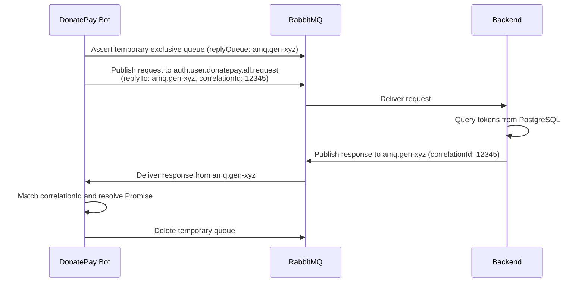

# Messaging Guide: AMQP Client & Command Handlers

This guide provides a comprehensive walkthrough of the message-driven communication layer built with **RabbitMQ** inside the `bot_donatepay` microservice.

Key components covered:
1. [`src/messaging/amqp-client.ts`](../../../bot_donatepay/src/messaging/amqp-client.ts) — RabbitMQ client gateway (connections, queues, publishers, and RPC mechanics).
2. [`src/messaging/command-handlers.ts`](../../../bot_donatepay/src/messaging/command-handlers.ts) — Command handlers processing backend directives (connect/disconnect streamers).

---

## 1. Concepts: RabbitMQ & AMQP 0-9-1

### Practical Analogy: "Postal Dispatch Network"

Consider the distributed architecture as a network of coordinated offices:
- **Backend (Python / FastAPI):** Central administration office.
- **DonatePay Bot (Node.js / TypeScript):** External branch office monitoring live streamer donation streams.
- **RabbitMQ:** High-speed postal dispatch system connecting them.

```text
[ Producer (Sender) ] 
       │ 
       ▼ (Dispatches letter with routing address)
[ Exchange (Sorting Center) ] 
       │ 
       ▼ (Directs to destination according to routing key)
[ Queue (Mailbox) ] 
       │ 
       ▼ (Courier pickup)
[ Consumer (Worker / Handler) ]
```

### Core Terminology:
1. **Producer:** Process creating and publishing messages (e.g., bot captures a donation with a YouTube URL and dispatches it to the system).
2. **Exchange:** Message routing agent. In `bot_donatepay`, `main_exchange` uses `direct` routing (delivers directly to queues matching the routing key).
3. **Queue:** Buffer storing messages sequentially (FIFO) until retrieved by workers.
4. **Consumer:** Worker listening to a queue to process inbound payloads.
5. **Ack (Acknowledgment):** Signal from the consumer: *"Message processed successfully, safe to purge from queue"*. If a worker crashes before sending `ack`, RabbitMQ re-queues the message to prevent data loss.

---

## 2. Interaction Sequence Diagram



---

## 3. AMQP Client Architecture (`src/messaging/amqp-client.ts`)

The `AmqpClient` class manages low-level AMQP connection lifecycles and channel topologies.

### 3.1. Connection & Confirm Channels

```typescript
public async connect(): Promise<void> {
  this.connection = await amqp.connect(this.config.rabbitUrl);
  this.channel = await this.connection.createConfirmChannel();
  // ...
  await this.setupTopology();
}
```

> [!TIP]
> **Why `createConfirmChannel()` over standard `createChannel()`?**  
> Standard channels use fire-and-forget dispatch. `ConfirmChannel` guarantees that the RabbitMQ broker returns publisher confirms when messages are persisted to disk or buffer, preventing lost donations during network blips.

---

### 3.2. Topology Setup (`setupTopology`)

```typescript
private async setupTopology(): Promise<void> {
  // 1. Declare main direct exchange
  await this.channel.assertExchange(this.config.mainExchange, "direct", { durable: true });

  // 2. Declare queues
  await this.channel.assertQueue(this.config.eventQueue, { durable: true });
  await this.channel.assertQueue(this.config.connectQueue, { durable: true });
  await this.channel.assertQueue(this.config.disconnectQueue, { durable: true });

  // 3. Bind queues to exchange
  await this.channel.bindQueue(this.config.eventQueue, this.config.mainExchange, this.config.eventQueue);
  await this.channel.bindQueue(this.config.connectQueue, this.config.mainExchange, this.config.connectQueue);
  await this.channel.bindQueue(this.config.disconnectQueue, this.config.mainExchange, this.config.disconnectQueue);

  // 4. Set worker prefetch buffer
  await this.channel.prefetch(1);
}
```

- `durable: true`: Preserves topology and messages across RabbitMQ broker restarts.
- `prefetch(1)`: Instructs RabbitMQ not to dispatch new messages to this consumer until the previous message is acknowledged, preventing memory exhaustion under burst traffic.

---

### 3.3. Event Publishing

#### Track Order Dispatch (`publishOrderEvent`)
```typescript
public publishOrderEvent(event: DonatePayNewOrderPayload): boolean {
  const payload = Buffer.from(JSON.stringify(event));
  return this.channel.publish(
    this.config.mainExchange,
    this.config.eventQueue, // routing key = "bot.donatepay.order.new"
    payload,
    { persistent: true }    // Enforce disk persistence
  );
}
```

#### Revoked Token Notification (`publishTokenDied`)
```typescript
public publishTokenDied(event: TokenDiedPayload): boolean {
  const payload = Buffer.from(JSON.stringify(event));
  return this.channel.publish(
    this.config.mainExchange,
    this.config.tokenDiedQueue, // "donatepay.user.token.died"
    payload,
    { persistent: true }
  );
}
```

---

### 3.4. RabbitMQ RPC Pattern (Remote Procedure Call)

Method `requestAllUsers()` implements the standard **RabbitMQ RPC Pattern**:



---

## 4. Command Handlers (`src/messaging/command-handlers.ts`)

### Why Command Handlers?
Isolating inbound command logic into dedicated single-responsibility classes ensures modularity and testability:
- `ConnectCommandHandler`: Manages dynamic streamer stream initialization.
- `DisconnectCommandHandler`: Manages graceful stream termination.

---

### 4.1. `ConnectCommandHandler`

Listens to `bot.donatepay.connect.request`:

```typescript
export class ConnectCommandHandler {
  constructor(
    private readonly amqpClient: IAmqpClient,
    private readonly streamManager: StreamManager,
    logger?: Logger,
  ) {}

  public async handle(msg: amqp.ConsumeMessage | null): Promise<boolean> {
    if (!msg) return false;

    let success = false;
    try {
      const payload = JSON.parse(msg.content.toString());

      let connData: ConnectionData | null = null;

      if (payload.platform_user_id && payload.access_token) {
        connData = {
          user_id: payload.user_id || payload.platform_user_id,
          platform_user_id: payload.platform_user_id,
          access_token: payload.access_token,
        };
      } else if (payload.action === "subscribe" && payload.token && payload.channel) {
        const platformUserId = payload.channel.replace("$public:", "");
        connData = {
          user_id: payload.user_id || platformUserId,
          platform_user_id: platformUserId,
          access_token: payload.token,
        };
      }

      if (connData) {
        success = await this.streamManager.startStream(connData);
      }
    } catch (err: any) {
      this.logger.error("Connect command error:", err.message);
    }

    if (msg.properties.replyTo) {
      this.amqpClient.sendRpcReply(
        msg.properties.replyTo,
        msg.properties.correlationId,
        success,
      );
    }

    this.amqpClient.ack(msg);
    return success;
  }
}
```

---

### 4.2. `DisconnectCommandHandler`

Listens to `bot.donatepay.disconnect`:

```typescript
export class DisconnectCommandHandler {
  public async handle(msg: amqp.ConsumeMessage | null): Promise<boolean> {
    if (!msg) return false;

    let success = false;
    try {
      const contentStr = msg.content.toString();
      let platformUserId = contentStr.replace(/"/g, "").replace("$public:", "").trim();

      try {
        const parsed = JSON.parse(contentStr);
        if (typeof parsed === "string") {
          platformUserId = parsed.replace("$public:", "").trim();
        } else if (parsed.platform_user_id) {
          platformUserId = String(parsed.platform_user_id).trim();
        } else if (parsed.channel) {
          platformUserId = String(parsed.channel).replace("$public:", "").trim();
        }
      } catch {
        // Plain string handling
      }

      if (platformUserId) {
        success = this.streamManager.stopStream(platformUserId);
      }
    } catch (err: any) {
      this.logger.error("Disconnect command error:", err.message);
    }

    if (msg.properties.replyTo) {
      this.amqpClient.sendRpcReply(
        msg.properties.replyTo,
        msg.properties.correlationId,
        success,
      );
    }

    this.amqpClient.ack(msg);
    return success;
  }
}
```

---

## 5. Best Practices & Reliability

| Practice | Rationale |
| :--- | :--- |
| **Always invoke `ack(msg)`** | Unacknowledged messages remain locked in the queue and block future processing when `prefetch(1)` is active. |
| **Internal `try/catch` wrappers** | Prevents consumer process termination on malformed JSON payloads. |
| **Interface Abstractions (`IAmqpClient`)** | Enables isolated unit testing with mocks without spinning up real RabbitMQ containers. |
| **Non-blocking Event Loop** | Pure async operations (`async/await`) maintain maximum Node.js I/O concurrency. |
