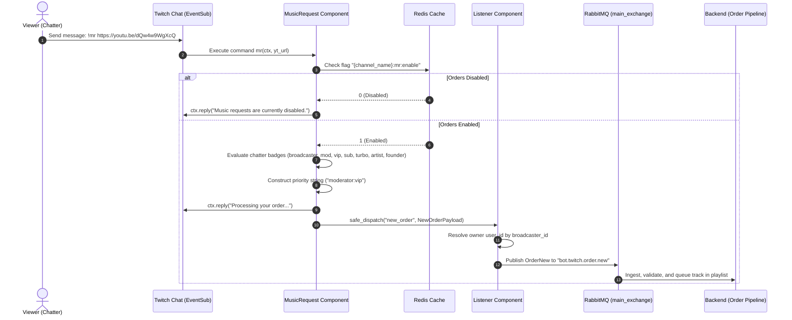
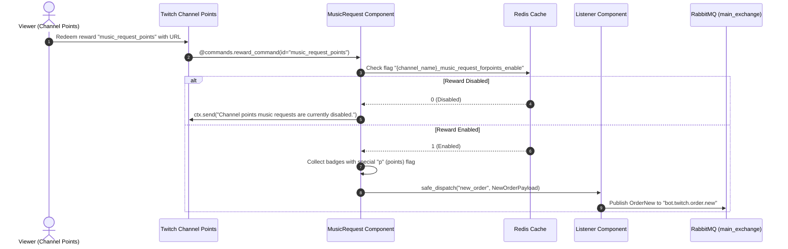
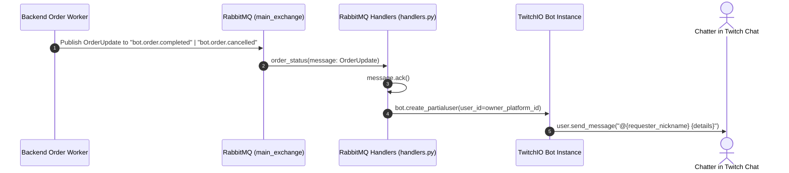
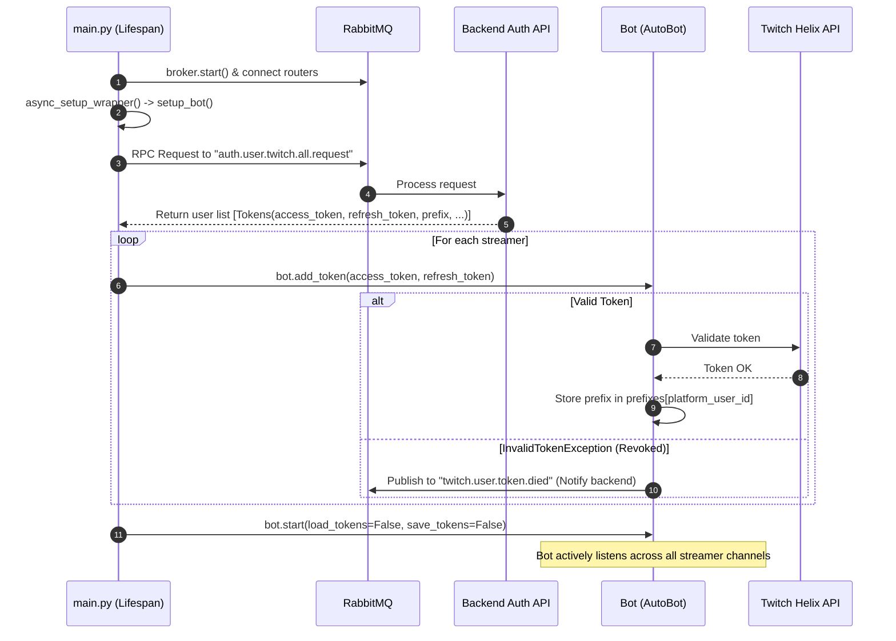

# Twitch Bot Microservice Architecture (`bot_ttv`)

This document describes the internal architecture, integration patterns, message schemas, and operational lifecycle of **`bot_ttv`**—the official Twitch bot microservice for the **OpenPlaylist** platform.

---

## 1. System Overview

The `bot_ttv` microservice enables bidirectional communication between streamer Twitch chats and the **OpenPlaylist** core:

1. **Twitch Chat Music Requests:**
   - Ingests track order commands (`!mr <url>`, `::mr <url>`) with per-channel dynamic command prefixes.
   - Accepts requests via Twitch **Channel Points** rewards (`music_request_points`).
   - Resolves viewer badge privileges (Broadcaster, Moderator, VIP, Subscriber, Turbo, Artist, Founder) to calculate queue priority scoring.
2. **Real-time Chat Feedback:**
   - Asynchronously receives order lifecycle updates from backend workers (`bot.order.completed`, `bot.order.cancelled`, `bot.order.partially_completed`) and dispatches notifications directly to chatters.
3. **State Management & In-Stream Moderation:**
   - Channel moderators can toggle order availability on the fly (`!mr on/off`, `!mr points on/off`).
   - Feature flags are cached with sub-millisecond access in **Redis**.
4. **Multi-Tenant Connection Engine:**
   - Single multi-tenant `twitchio.ext.commands.AutoBot` instance serving hundreds of streamer channels concurrently.
   - Dynamic channel joining (`bot.twitch.connect.request`) and parting (`bot.twitch.disconnect`).
   - Automatic OAuth2 token rotation synchronized with the backend's `TokenVault`.

---

## 2. Component Architecture

```mermaid
flowchart TB
    subgraph TwitchPlatform ["Twitch Platform"]
        TTV_Chat["Twitch Chat (IRC / EventSub WS)"]
        TTV_Points["Channel Points Custom Reward"]
        TTV_API["Twitch Helix API (OAuth & Tokens)"]
    end

    subgraph BotTTV ["bot_ttv Microservice Container"]
        MainApp["main.py (FastStream Application)"]
        
        subgraph TwitchIOCore ["TwitchIO AutoBot Engine (bot_setup.py)"]
            BotInstance["Bot (commands.AutoBot)"]
            PrefixManager["Dynamic Prefix Router"]
        end

        subgraph ComponentsLayer ["Bot Components (src/components)"]
            MainCmds["MainCommands\n(!hi, !say, !socials)"]
            MusicReq["MusicRequest\n(!mr, !mr on/off, Channel Points)"]
            OrderListener["Listner\n(event_safe_new_order dispatcher)"]
        end

        subgraph AdaptersLayer ["Adapters Layer (src/adapters)"]
            RabbitHandlers["RabbitMQ Handlers (FastStream Router)"]
            RedisClient["RedisAdapter (src/adapters/_redis)"]
        end

        subgraph ACLLayer ["Anti-Corruption Layer (src/acl)"]
            UserACL["UserACL (auth.user.twitch.all.request)"]
            PlaylistACL["PlaylistACL (playlist.settings.request)"]
        end
    end

    subgraph MessagingAndCache ["Infrastructure Layer"]
        RABBIT["RabbitMQ Broker (main_exchange / topic_exchange)"]
        REDIS[("Redis Cache")]
    end

    subgraph OpenPlaylistBackend ["OpenPlaylist Backend Core"]
        BackendOrders["Order Processing Pipeline\n(order.proccess)"]
        TokenVault["Token Refresh Taskiq Task\n(src/tasks/tokens.py)"]
        UserBotAPI["User Bot Management API\n(/user/bots/twitch/*)"]
    end

    %% External Twitch Connections
    TTV_Chat <-->|EventSub WebSocket| BotInstance
    TTV_Points -->|Custom Reward Redemption| MusicReq
    BotInstance <-->|OAuth Refresh & Validation| TTV_API

    %% Bot Internal Links
    MainApp -->|Lifespan Startup| BotInstance
    MainApp -->|Init & Connect| RabbitHandlers
    MainApp -->|Init & Connect| RedisClient
    BotInstance --> MainCmds
    BotInstance --> MusicReq
    BotInstance --> OrderListener
    BotInstance --> PrefixManager

    %% Components to Storage / Messaging
    MusicReq <-->|mr:enable / points:enable| RedisClient
    MusicReq -->|safe_dispatch('new_order')| OrderListener
    OrderListener -->|Publish bot.twitch.order.new| RABBIT
    UserACL <-->|RPC Request/Reply| RABBIT

    %% Rabbit to Backend
    RABBIT <-->|bot.order.* status updates| RabbitHandlers
    RABBIT <-->|bot.twitch.connect/disconnect| RabbitHandlers
    RABBIT -->|bot.twitch.order.new| BackendOrders
    TokenVault -->|auth.token.refreshed.twitch| RABBIT
    UserBotAPI -->|bot.twitch.connect.request| RABBIT
    RabbitHandlers -->|Send chat reply| BotInstance
```

---

## 3. Directory Structure

```text
bot_ttv/
├── Dockerfile                  # Python 3.13 Container Build
├── pyproject.toml              # Dependencies: faststream, twitchio, redis, pydantic, asqlite
├── main.py                     # FastStream Lifespan, RabbitMQ, Redis, and Bot startup
└── src/
    ├── config.py               # Pydantic BaseSettings (.env loader)
    ├── log_setup.py            # Structured logging configuration
    ├── bot_setup.py            # Bot(commands.AutoBot), token initialization, EventSub
    ├── utils.py                # Regex YouTube parsers, streamer/moderator role guards
    ├── acl/                    # Anti-Corruption Layer (RPC requests to backend)
    │   ├── playlist.py         # PlaylistACL: playlist settings fetcher
    │   └── user.py             # UserACL: initial streamer list resolver
    ├── adapters/
    │   ├── _rabbit/            # RabbitMQ FastStream adapter
    │   │   ├── broker.py       # Queue and Exchange topology
    │   │   ├── handlers.py     # Consumer routers (order statuses, connection, settings)
    │   │   └── dto/            # Pydantic DTOs (Order, Settings, User Tokens)
    │   │       ├── order.py    # OrderNew, OrderUpdate, NewOrderPayload
    │   │       ├── settings.py # ReadPlaylistSettings, SortSettings
    │   │       └── user.py     # Tokens, TwitchBotSettings, SettingsConteiner
    │   └── _redis/             # Redis Cache Adapter
    │       └── broker.py       # RedisAdapter with @ready_check decorator
    └── components/             # TwitchIO Command Components
        ├── listners.py         # Listener: NewOrderPayload -> OrderNew -> RabbitMQ
        ├── main_commands.py    # General chat commands (!hi, !say, !give, !socials)
        └── music_request.py    # Music commands (!mr, !mr on/off, !mr points on/off)
```

---

## 4. Data Flows & Sequence Diagrams

### 4.1. Track Order via Chat Command (`!mr <url>`)



---

### 4.2. Track Order via Twitch Channel Points



---

### 4.3. Asynchronous Order Status Notification to Chat



---

### 4.4. Service Startup & OAuth Bootstrapping Flow



---

## 5. RabbitMQ Message Contracts

### 5.1. Inbound Queues (Subscribers)

| Queue / Topic | Exchange | DTO / Type | Description |
| :--- | :--- | :--- | :--- |
| `bot.order.completed` | `main_exchange` (DIRECT) | `OrderUpdate` | Notification when order is accepted into playlist queue. |
| `bot.order.cancelled` | `main_exchange` (DIRECT) | `OrderUpdate` | Notification when order is rejected (blacklist, invalid URL, error). |
| `bot.order.partially_completed` | `main_exchange` (DIRECT) | `OrderUpdate` | Partial order execution notice. |
| `bot.twitch.connect.request` | `main_exchange` (DIRECT) | `Tokens` | Dynamic streamer onboarding (registers OAuth token & EventSub). |
| `bot.twitch.disconnect` | `main_exchange` (DIRECT) | `str` (platform_user_id) | Disconnect streamer and purge credentials from `AutoBot`. |
| `bot.twitch.settings` | `main_exchange` (DIRECT) | `SettingsConteiner` | Update custom bot command prefixes. |
| `auth.token.refreshed.twitch` | `topic_exchange` (TOPIC) | `Tokens` | Receive renewed tokens from backend worker. |

### 5.2. Outbound Queues (Publishers / RPC)

| Queue / Topic | Exchange | DTO / Payload | Description |
| :--- | :--- | :--- | :--- |
| `bot.twitch.order.new` | `main_exchange` (DIRECT) | `OrderNew` | Submit track order into backend processing pipeline. |
| `auth.user.twitch.tokens.refreshed` | `main_exchange` (DIRECT) | `dict` (twitch_id, tokens) | Inform backend that TwitchIO rotated OAuth credentials. |
| `twitch.user.token.died` | `main_exchange` (DIRECT) | `dict` (platform_user_id, ...) | Notify backend of revoked authorization. |
| `auth.user.twitch.all.request` | `main_exchange` (DIRECT) | RPC Request -> `list[Tokens]` | Fetch active streamer tokens on microservice startup. |
| `playlist.settings.request` | `main_exchange` (DIRECT) | RPC Request -> `ReadPlaylistSettings` | Query target playlist constraints (ACL). |

---

## 6. Redis Key Schema

| Key Pattern | Type | Purpose | Example Value |
| :--- | :--- | :--- | :--- |
| `{channel_name}:mr:enable` | `string` (`int`) | Toggle text command `!mr` | `"1"` (enabled), `"0"` (disabled) |
| `{channel_name}_music_request_forpoints_enable` | `string` (`int`) | Toggle Channel Points redemption | `"1"`, `"0"` |
| `{user_id}:{playlist_name}:settings` *(reserved)* | `string` (`JSON`) | Cached playlist rules and duration caps | `{"is_active": true, ...}` |
| `{playlist_name}:cooldown:{yt_id}` *(reserved)* | `string` (with TTL) | Track re-order cooldown timer | `"1"` |
