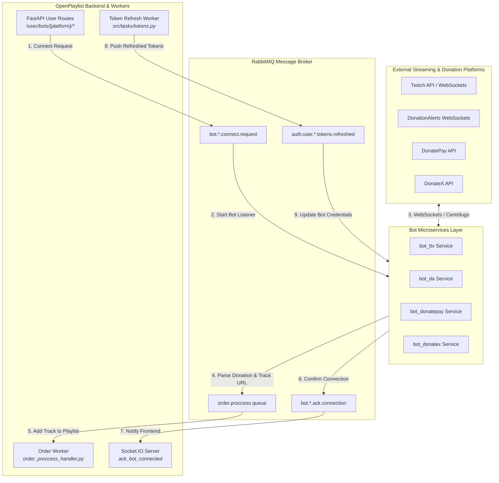
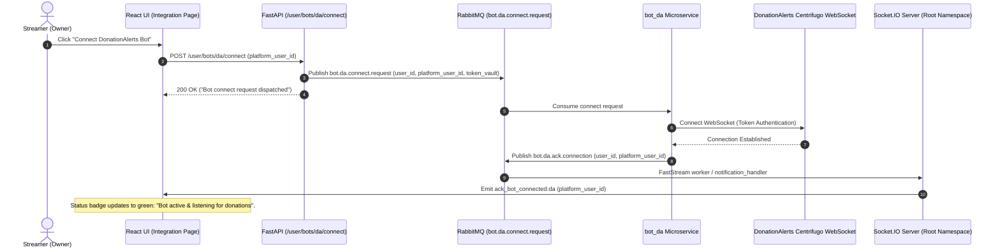
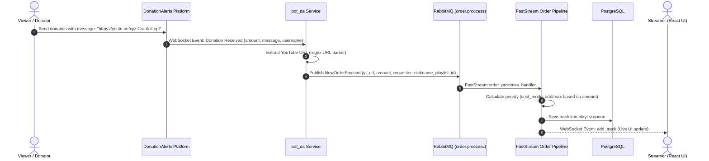
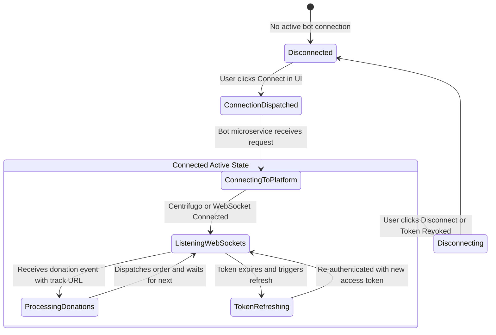

# External Integrations & Bots Architecture

This document describes the microservices architecture of external streaming and donation bots (Twitch, DonationAlerts, DonatePay, DonateX), automated token refreshing, and donation media intake in **OpenPlaylist**.

---

## 1. Architecture Overview

The integration layer consists of decoupled autonomous bot microservices communicating with the core backend through **RabbitMQ (AMQP 0-9-1)** and **FastStream**.

1. **Bot Microservices Ecosystem:**
   - **`bot_da`:** **DonationAlerts** listener microservice (Centrifugo WebSocket for donations and chat alerts).
   - **`bot_ttv`:** **Twitch** interaction microservice (chat commands, Channel Points redemptions, subscriber priority queues).
   - **`bot_donatepay`:** **DonatePay** high-throughput TypeScript microservice.
   - **`bot_donatex`:** **DonateX** SignalR Core microservice.

2. **RabbitMQ Messaging Topology (`queues.py`):**
   - `bot.{platform}.connect.request`: Inbound command to start listening on behalf of a streamer.
   - `bot.{platform}.connect.response`: Outbound status confirmation from the bot.
   - `bot.{platform}.order.new`: Normalized track request extracted from donation/chat messages.
   - `bot.{platform}.ack.connection`: Active connection heartbeat and state acknowledgment.
   - `bot.{platform}.disconnect`: Inbound command to terminate bot session.

3. **Automated Token Vault & Refresh:**
   - The queue `auth.user.{platform}.tokens.refreshed` streams renewed Access/Refresh token pairs after proactive background refreshes before session expiry.

---

## 2. System Diagrams

### 2.1. Integration Component Topology (Data Flow Diagram)

---

### 2.2. Sequence Diagram: Bot Connection Flow

---

### 2.3. Sequence Diagram: Donation Track Order Processing

---

### 2.4. Bot Connection State Machine

---

## 3. Queue Contracts & Data Models

### 3.1. Message Schema `bot.{platform}.connect.request`

- `user_id`: UUID of OpenPlaylist user.
- `platform`: Enum (`da`, `twitch`, `donatepay`, `donatex`).
- `platform_user_id`: External platform account ID.
- `access_token`: Encrypted token from `TokenVault`.
- `refresh_token`: Encrypted refresh token.

### 3.2. Automated Token Refresh Lifecycle

- Background task `src/tasks/tokens.py` scans expiring tokens in `TokenVault`.
- If `expires_at < now()`, OAuth refresh requests execute and the new credentials publish to `auth.user.{platform}.tokens.refreshed`.
- Connected bot microservices update authentication headers on the fly without disconnecting the WebSocket connection.
