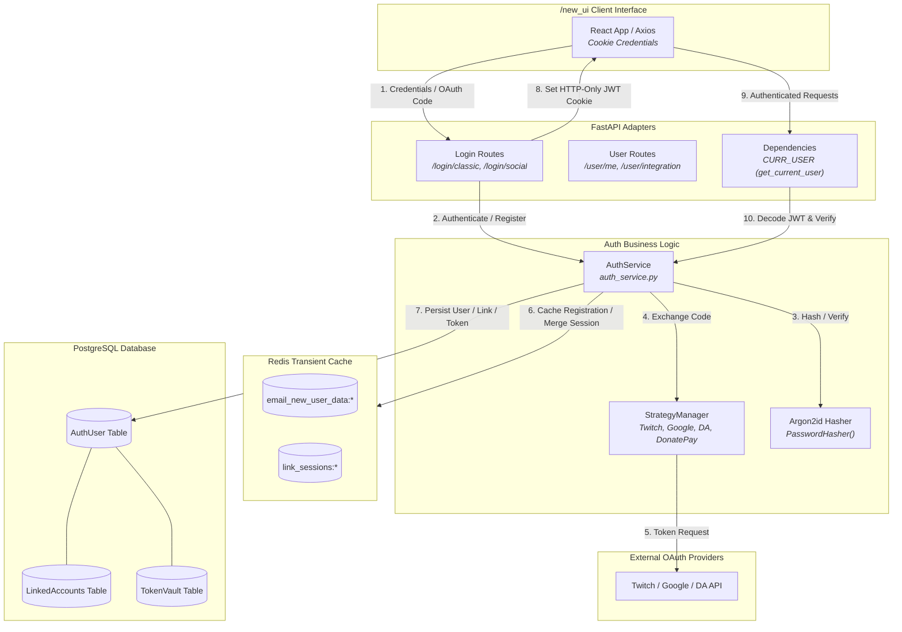
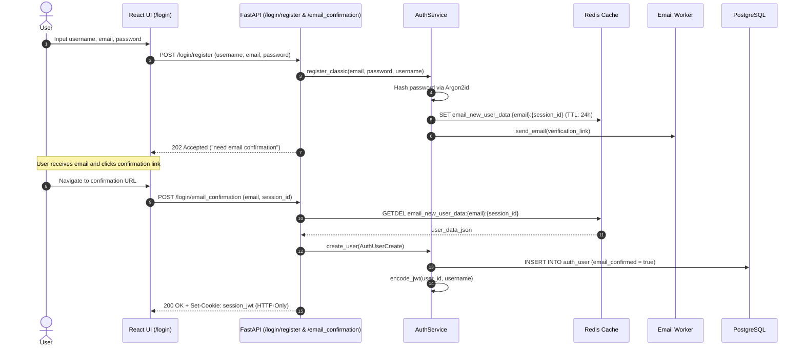
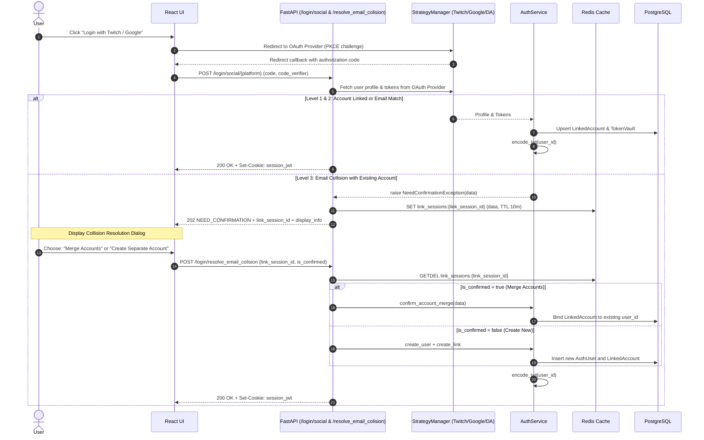
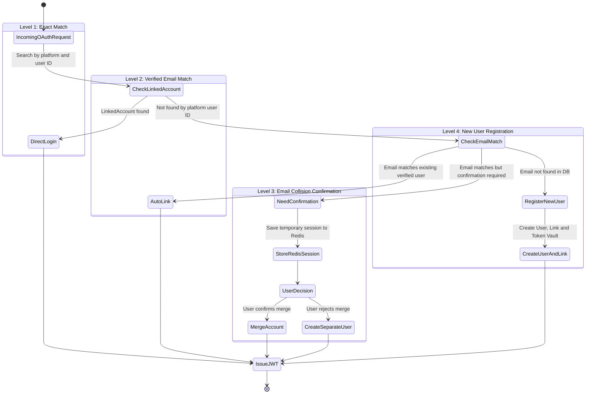

# Auth & Identity System Architecture

This document describes the authentication, authorization, session management, OAuth2/PKCE integration strategies, account collision resolution, and password security in the **OpenPlaylist** platform.

---

## 1. Architecture Overview

The authentication and identity subsystem consists of 4 core architectural modules:

1. **Secure Classic Authentication (Argon2id + Email Verification):**
   - Password hashing utilizing cryptographic **Argon2id** (`argon2-cffi`) with automatic parameter rehash verification (`check_needs_rehash`).
   - Two-phase registration staging unconfirmed account records in Redis (`email_new_user_data:{email}:{session_id}`) until email link activation.
2. **Pluggable Social Authentication (OAuth2 / PKCE + User Key):**
   - **Strategy Manager Pattern** (`strategy_manager.py`) abstracting external platform handshakes: Twitch, Google, DonationAlerts, DonatePay, DonateX.
   - Support for OAuth2 PKCE (`code_verifier`) and direct personal token ingestion (`AuthFlow.USER_KEY`).
3. **Multi-Level Email Collision & Account Merging:**
   - Account isolation with secure user-confirmed social profile merging coordinated via temporary Redis sessions (`link_sessions:{link_session_id}`).
4. **Session Integrity via JWT & HTTP-Only Cookies:**
   - Cryptographically signed JWT tokens (`HS256`/`RS256`) transported exclusively within secure HTTP-Only session cookies (`httponly=True`, `secure=True`).

---

## 2. System Diagrams

### 2.1. Authentication Subsystem Architecture (Data Flow Diagram)



---

### 2.2. Sequence Diagram: Classic Registration & Email Confirmation



---

### 2.3. Sequence Diagram: Social OAuth & Collision Resolution



---

### 2.4. Authentication Level Resolution Matrix



---

## 3. Data Model & Security Specifications

### 3.1. Database Schema (PostgreSQL Models)

1. **`auth_user` (`src/models/auth_user.py` / `src/orm/auth_user.py`):**
   - `id`: UUID (Primary Key).
   - `email`: String (Unique, Indexed).
   - `username`: String (Unique, Indexed).
   - `password`: String | None (Argon2id hash, null for OAuth-only users).
   - `email_confirmed`: Boolean.
   - `avatar_url`: String | None.
   - `roles`: JSONB list (User roles array).
   - `created_at`, `updated_at`: Timestamp.

2. **`linked_accounts` (`src/models/linked_accounts.py` / `src/orm/linked_accounts.py`):**
   - `id`: UUID.
   - `user_id`: UUID (Foreign Key -> `auth_user.id`).
   - `platform`: Enum (`twitch`, `google`, `da`, `donatepay`, `donatex`).
   - `platform_user_id`: String (External user identifier).
   - `platform_username`: String.
   - `platform_email`: String | None.

3. **`token_vault` (`src/models/token_vault.py` / `src/orm/token_vault.py`):**
   - `id`: UUID.
   - `user_id`: UUID (Foreign Key -> `auth_user.id`).
   - `platform`: Enum.
   - `access_token`: Encrypted String.
   - `refresh_token`: Encrypted String | None.
   - `expires_at`: BigInteger Timestamp.

### 3.2. Security & Cryptographic Standards

- **Password Hashing**: `Argon2id` via `argon2-cffi`. Outdated hash parameters checked via `hasher.check_needs_rehash(user.password)`.
- **JWT Signatures**: `PyJWT` algorithm `RS256` / `HS256`. Session validity configured by `SESSION_LIVE_TIME` (default: 30 days).
- **Cookie Hardening**:
  - `name`: `settings.COOKIE_NAME`
  - `httponly`: `True` (Protection against XSS token exfiltration)
  - `secure`: `True` (Enforced HTTPS transmission)
  - `samesite`: `lax` / `strict`

### 3.3. Route Authentication Guard (`CURR_USER`)

In FastAPI route endpoints, authentication is injected via dependency injection:

```python
CURR_USER = Annotated[User, Depends(auth_service.get_current_user)]
```

On every request:
1. `APIKeyCookie` extracts the token from the secure cookie.
2. `auth_service.get_current_user` decodes the JWT and validates signature integrity.
3. Expiration claim (`exp`) is verified.
4. User entity is fetched from the database / cache and supplied to the route handler.
