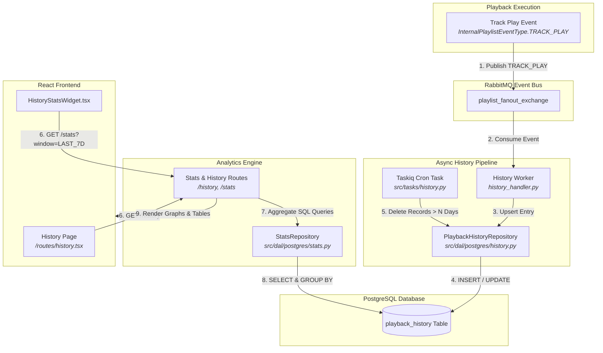
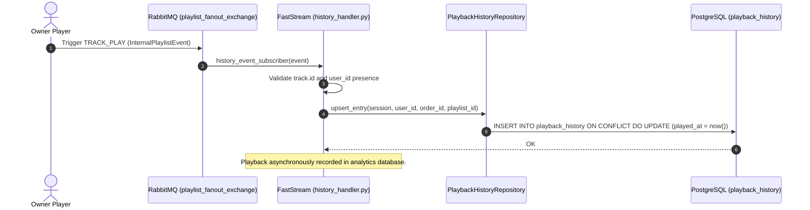
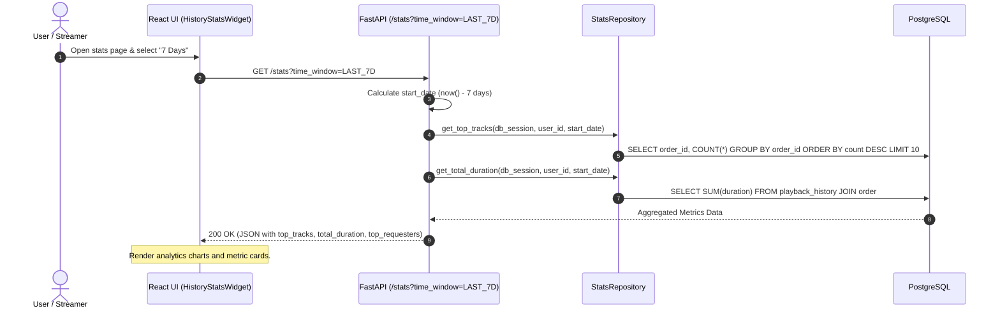
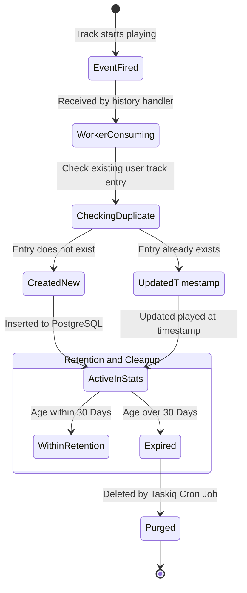

# Playback History & Analytics System Architecture

This document describes the track history ingestion pipeline, automated retention cleanup, metrics aggregation, and analytics querying in **OpenPlaylist**.

---

## 1. Architecture Overview

The history subsystem captures playback events to generate aggregate performance and viewership metrics for streamers and users.

1. **Asynchronous Playback Logging (FastStream Worker `history_handler.py`):**
   - Subscribes to the central event exchange `playlist_fanout_exchange`.
   - Intercepts `InternalPlaylistEvent` with type `TRACK_PLAY`.
   - Safely records occurrences via `PlaybackHistoryRepository.upsert_entry()` without blocking the real-time audio playback stream.

2. **History Storage & Retention (PostgreSQL + Taskiq Cleanup):**
   - Database model `playback_history`: Associates `user_id`, `playlist_id`, `order_id` (track), and timestamp `played_at`.
   - Automated Cleanup: Scheduled Taskiq cron job (`src/tasks/history.py`) purges expired records older than $N$ days (`clean_old_history`).

3. **Analytics Service (`stats_routes.py` / `StatsRepository`):**
   - Configurable Time Windows (`TimeWindow`): `LAST_24H` (24 hours), `LAST_7D` (7 days), `LAST_30D` (30 days), `ALL_TIME` (all historical data).
   - Core Metrics:
     - Total playback duration (in seconds/hours).
     - Top popular tracks (frequency ranking).
     - Top ordering users (by donation volume or priority).

---

## 2. System Diagrams

### 2.1. History Collection & Analytics Data Flow Diagram

---

### 2.2. Sequence Diagram: Playback History Upsert

---

### 2.3. Sequence Diagram: Statistics Query

---

### 2.4. History Entry State Machine

---

## 3. Schema & Endpoint Specifications

### 3.1. Entity Schema `playback_history`

- `id`: UUID (Primary Key).
- `user_id`: UUID (Foreign Key -> `auth_user.id`).
- `playlist_id`: UUID (Foreign Key -> `playlist.id`).
- `order_id`: UUID (Foreign Key -> `order.id`).
- `played_at`: Timestamp (Indexed).

### 3.2. Time Windows (`TimeWindow` Enum)

- `LAST_24H`: Trailing 24-hour interval.
- `LAST_7D`: Trailing 7-day interval.
- `LAST_30D`: Trailing 30-day interval.
- `ALL_TIME`: Complete historical aggregate.
