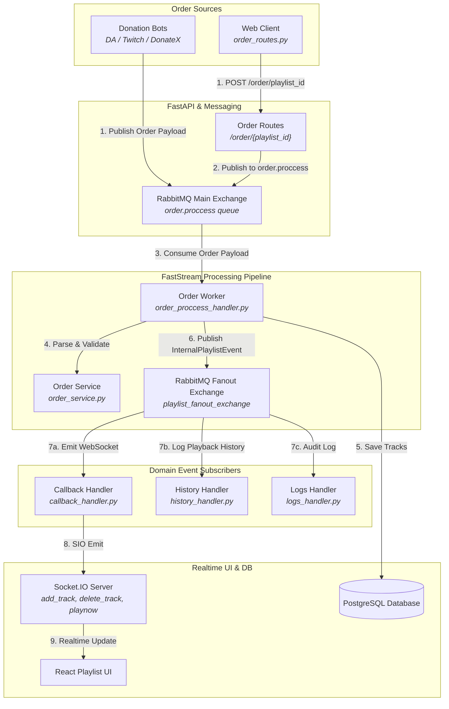
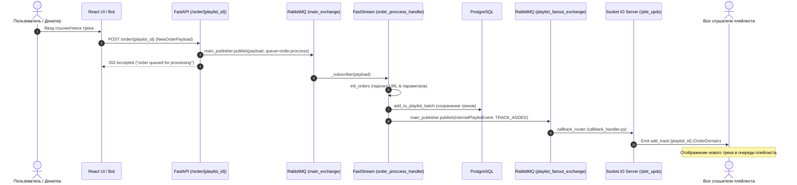
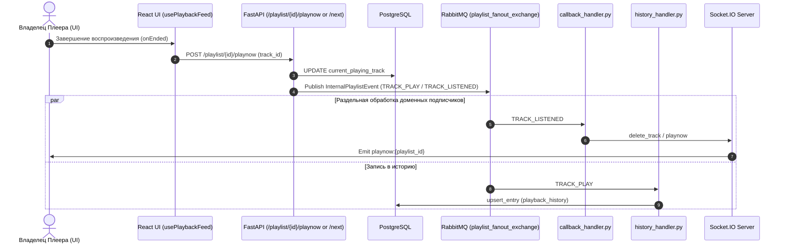
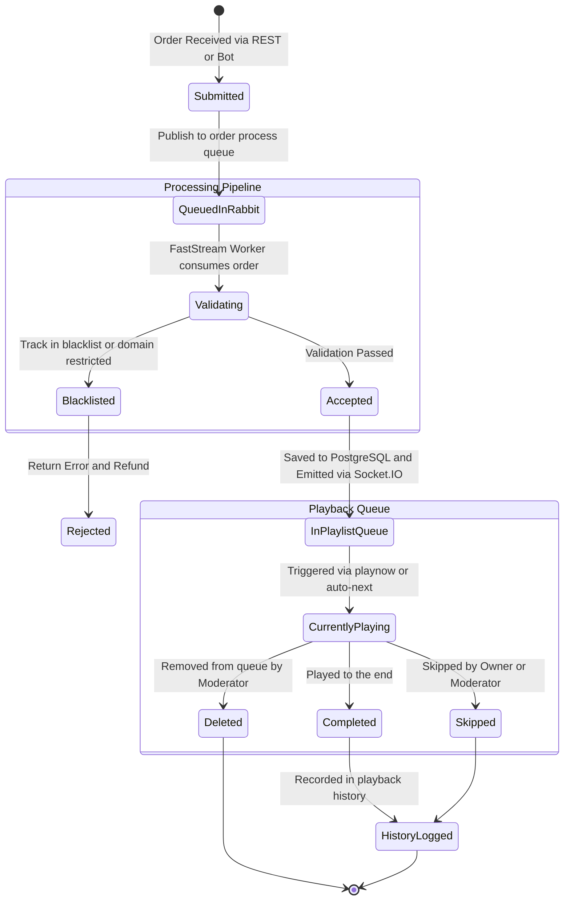

# Подсистема заказов и обработки треков (Order & Track Request Pipeline)

Документация описывает архитектуру приема, валидации, расчета приоритетов, обработки и смены треков в проекте **OpenPlaylist**.

---

## 1. Архитектурный обзор (Architecture Overview)

Подсистема отвечает за жизненный цикл музыкальных заказов: от момента создания пользователем или донат-ботом до воспроизведения и логирования.

1. **Прием и инициализация заказов (`order_service.py`)**:
   - Извлечение метаданных (YouTube ID, названия, длительности, автора, источника).
   - Поддержка единичных заказов и батчей (`start_from_target`).
   - Валидация по правилам плейлиста (разрешенные источники `allow_sources`, черные списки `track_black_list`, максимальный размер плейлиста `max_playlist_size`).

2. **Асинхронная обработка заказов (FastStream Worker `order.proccess`)**:
   - Сообщения заказов попадают в очередь `order.proccess` (`main_exchange`).
   - FastStream воркер (`order_proccess_handler.py`) батчами сохраняет треки в БД через `add_to_playlist_batch`.
   - Публикация событийно-ориентированного события `InternalPlaylistEvent` (`event_type: TRACK_ADDED`) в `playlist_fanout_exchange`.

3. **Смена состояний трека и вещание**:
   - При смене трека (`playnow`, `next`, `skip`) воркер выбивает событие `InternalPlaylistEvent` в `playlist_fanout_exchange`.
   - `callback_handler.py` подписывается на событие и отправляет клиентские Socket.IO команды: `add_track`, `delete_track`, `playnow`.
   - `history_handler.py` фиксирует прослушивание трека в истории (`playback_history`).

---

## 2. Графики и диаграммы взаимодействия (System Diagrams)

### 2.1. Компонентный график обработки заказов (Data Flow Diagram)

---

### 2.2. Диаграмма последовательности: Создание заказа (Order Processing Sequence)

---

### 2.3. Диаграмма последовательности: Автопереход и сфера событий смены трека (Track Transition)

---

### 2.4. Состояния заказа (Order Lifecycle State Machine)

---

## 3. Детальная спецификация моделей заказов

### 3.1. Структура `OrderDomain` / `track_data`
- `id`: UUID.
- `playlist_id`: UUID.
- `yt_video_id`: String (Идентификатор видео/аудио источника).
- `title`: String.
- `author`: String.
- `duration`: Float (Секунды).
- `source`: Enum (`youtube`, `vk`, `web`, etc.).
- `from_owner`: Boolean (Флаг заказа самим владельцем).
- `requester_nickname`: String | None.
- `priority`: Integer (Рассчитывается на основе стоимости заказа).
- `created_at`: Timestamp.
