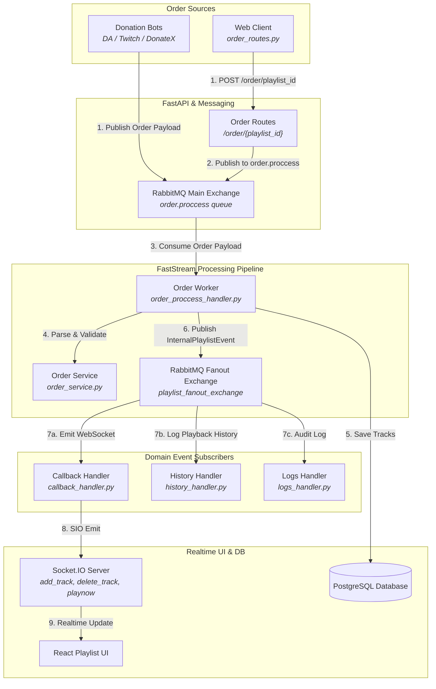
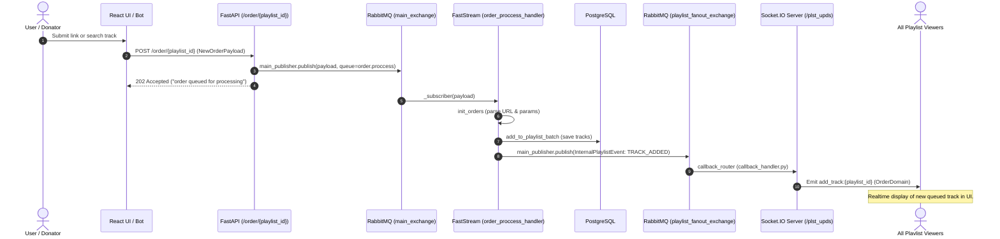
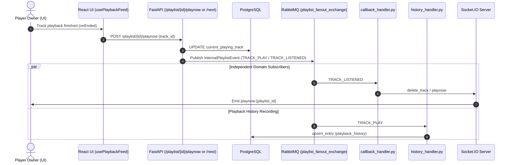
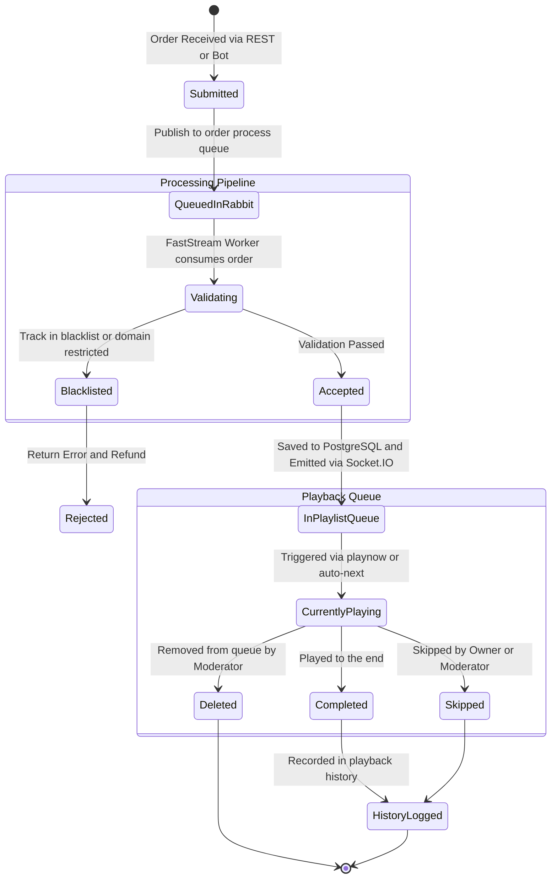

# Order & Track Request Pipeline Architecture

This document describes the track request intake, validation, priority calculation, queue scheduling, and transition lifecycle in the **OpenPlaylist** platform.

---

## 1. Architecture Overview

The order subsystem orchestrates the complete lifecycle of user track submissions—from arrival via Web UI or donation bots to active playback and historical analytics logging.

1. **Order Intake & Initialization (`order_service.py`):**
   - Media metadata extraction (YouTube ID, title, duration, author, platform source).
   - Support for single track submissions and batch operations (`start_from_target`).
   - Rule-based validation against playlist constraints (allowed sources `allow_sources`, blacklist filters `track_black_list`, maximum capacity `max_playlist_size`).

2. **Asynchronous Order Ingestion (FastStream Worker `order.proccess`):**
   - Inbound requests enter the durable RabbitMQ queue `order.proccess` (`main_exchange`).
   - The FastStream worker (`order_proccess_handler.py`) persists tracks in batches to PostgreSQL via `add_to_playlist_batch`.
   - Emits an asynchronous domain event `InternalPlaylistEvent` (`event_type: TRACK_ADDED`) into `playlist_fanout_exchange`.

3. **Track Transitions & Broadcast:**
   - On track changes (`playnow`, `next`, `skip`), the worker dispatches `InternalPlaylistEvent` to `playlist_fanout_exchange`.
   - `callback_handler.py` consumes the event and broadcasts Socket.IO client updates: `add_track`, `delete_track`, `playnow`.
   - `history_handler.py` records finished tracks into `playback_history` for analytics aggregation.

---

## 2. System Diagrams

### 2.1. Order Processing Data Flow Diagram

---

### 2.2. Sequence Diagram: Order Processing

---

### 2.3. Sequence Diagram: Track Transition & Event Broadcast

---

### 2.4. Order Lifecycle State Machine

---

## 3. Order Data Models

### 3.1. Entity Schema `OrderDomain` / `track_data`
- `id`: UUID primary key.
- `playlist_id`: UUID.
- `yt_video_id`: String (Video/audio provider identifier).
- `title`: String.
- `author`: String.
- `duration`: Float (Seconds).
- `source`: Enum (`youtube`, `vk`, `web`, etc.).
- `from_owner`: Boolean (Whether ordered by the playlist owner).
- `requester_nickname`: String | None.
- `priority`: Integer (Calculated score based on donation value or user role).
- `created_at`: Timestamp.
