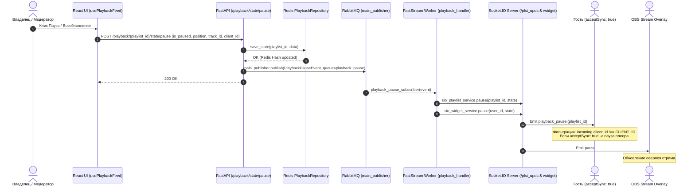
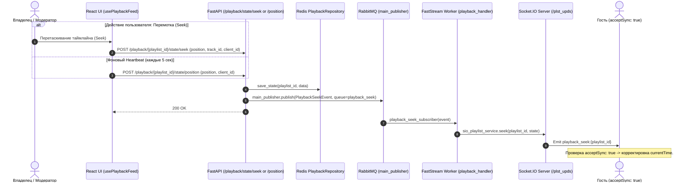
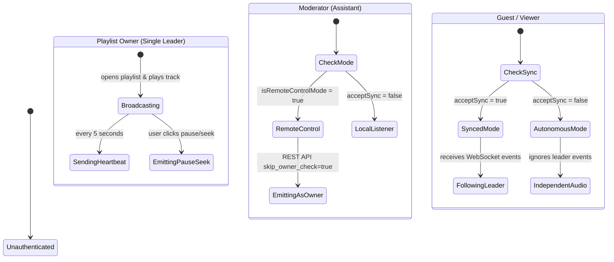

# Система управления воспроизведением (Playback System Architecture)

Документация описывает архитектуру, роли, структуру данных, событийно-ориентированный пайплайн (RabbitMQ FastStream + Socket.IO) и взаимодействие интерфейсов `/backend` и `/new_ui`.

---

## 1. Архитектурный обзор (Architecture Overview)

Архитектура системы построена на трех фундаментальных принципах:
1. **Модель Единственного Лидера (Single Leader)**: Только **Владелец плейлиста (Owner)** является главным источником правды для активного проигрывания.
2. **Единый Event-Driven пайплайн (RabbitMQ $\rightarrow$ FastStream $\rightarrow$ Socket.IO)**: Управление воспроизведением использует ту же брокерную шину RabbitMQ (`main_publisher.publish`), что и остальные доменные события системы (`playnow`, `track_added`, `settings_changed`).
3. **Изолированный слой данных (Redis DAL Repository)**: Высокочастотные изменения позиции и статуса паузы кешируются в Redis Hash через репозиторий `src/dal/_redis/playback_repository.py` без нагрузки на PostgreSQL.

---

## 2. Графики и диаграммы взаимодействия (System Diagrams)

### 2.1. Компонентный график потоков данных (Data Flow Diagram)

---

### 2.2. Диаграмма последовательности: Пауза / Резюм (Sequence Diagram - Pause/Resume)

---

### 2.3. Диаграмма последовательности: Перемотка и Heartbeat (Sequence Diagram - Seek & Position)

---

### 2.4. Матрица ролей и вариантов использования (Role Behavior Matrix)

---

## 3. Спецификация слоев и компонентов

### 3.1. Слой данных Redis (DAL Repository)
- **Файл**: `src/dal/_redis/playback_repository.py`
- **Структура ключа**: Redis Hash `playback:{playlist_id}` (TTL: 3 дня / 259200 секунд).
- **Поля Hash**:
  - `is_paused`: Флаг паузы ("1" / "0").
  - `position`: Текущая секунда трека (float строка, e.g. "42.5").
  - `track_id`: UUID текущего воспроизводимого трека.

### 3.2. Событийный слой RabbitMQ & FastStream
- **Exchange** (`src/adapters/_rabbit/queues.py`): `main_exchange` (Direct Exchange)
- **Очереди**:
  - `playback.pause` (`playback_pause_queue`)
  - `playback.seek` (`playback_seek_queue`)
- **События** (`src/dto/playback.py`):
  - `PlaybackPauseEvent`: `playlist_id`, `user_id`, `state: Pause`
  - `PlaybackSeekEvent`: `playlist_id`, `user_id`, `state: Seek`
- **Издатель**: `main_publisher.publish(..., exchange=main_exchange)` (`src/adapters/_rabbit/broker.py`)
- **Обработчик (FastStream Worker)**: `@router.subscriber(queue, main_exchange)` в `src/adapters/_rabbit/worker/playback_handler.py`

### 3.3. Клиентский слой (Frontend `/new_ui`)
- **Основной хук**: `usePlaybackFeed.ts` (`src/features/player/hooks/usePlaybackFeed.ts`)
- **Стор состояний**: `createPlaylistCacheSlice.ts` (`src/stores/playlistStore/createPlaylistCacheSlice.ts`)
- **Фильтрация зацикливания**: Каждый клиент генерирует уникальный `CLIENT_ID`. Если полученный эвент `client_id === CLIENT_ID`, эвент игнорируется.
