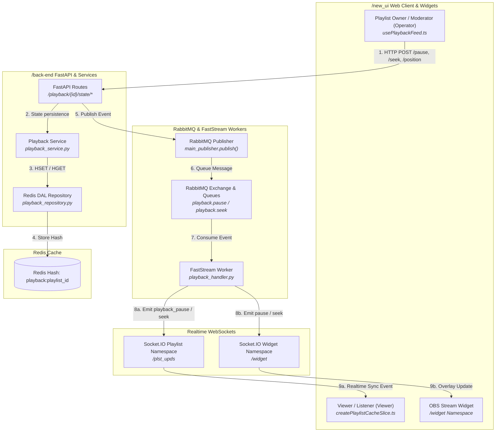
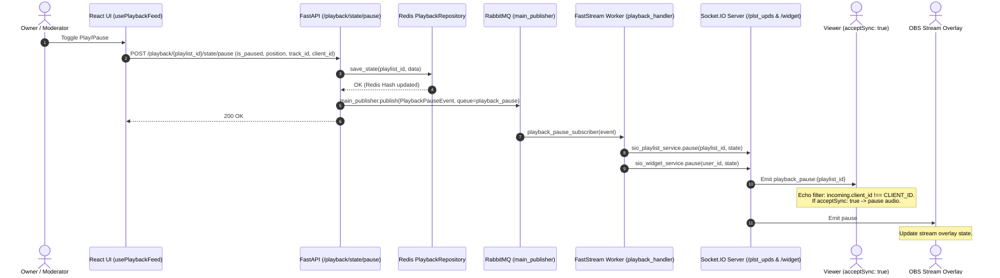
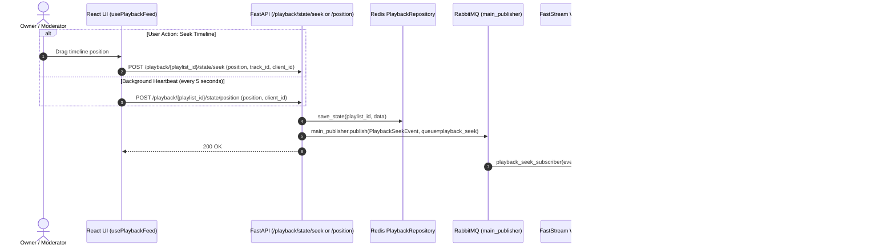
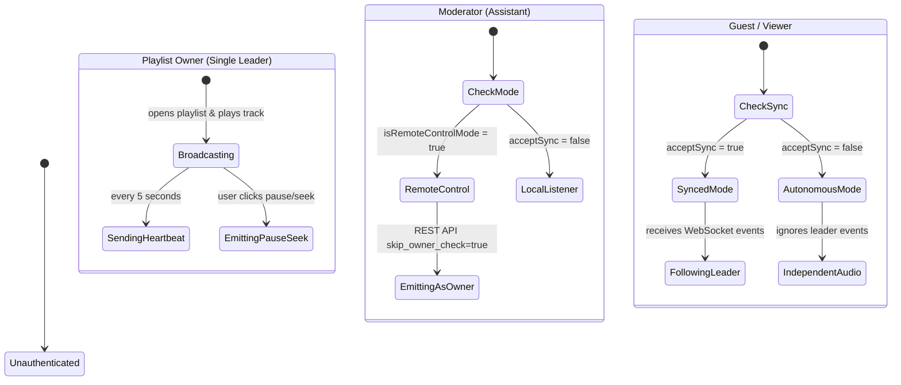

# Playback System Architecture

This document describes the playback synchronization architecture, user roles, data structures, event-driven message pipeline (RabbitMQ FastStream + Socket.IO), and frontend-backend interaction across `/back-end` and `/new_ui`.

---

## 1. Architecture Overview

The playback system is built upon three core design principles:
1. **Single Leader Model:** Only the **Playlist Owner** acts as the single source of truth for active playback progression.
2. **Unified Event-Driven Pipeline (RabbitMQ $\rightarrow$ FastStream $\rightarrow$ Socket.IO):** Playback operations utilize the central RabbitMQ message bus (`main_publisher.publish`), maintaining parity with all other domain events (`playnow`, `track_added`, `settings_changed`).
3. **Isolated Persistence Layer (Redis DAL Repository):** High-frequency position updates and pause toggles are cached directly in Redis Hash structures via `src/dal/_redis/playback_repository.py` without burdening PostgreSQL.

---

## 2. System Diagrams

### 2.1. Component Data Flow Diagram

---

## 2.2. Sequence Diagram: Pause / Resume

---

## 2.3. Sequence Diagram: Seek & Heartbeat

---

## 2.4. Role Behavior Matrix

---

## 3. Component & Layer Specifications

### 3.1. Redis Data Layer (DAL Repository)
- **Source File**: `src/dal/_redis/playback_repository.py`
- **Key Schema**: Redis Hash `playback:{playlist_id}` (TTL: 3 days / 259,200 seconds).
- **Hash Fields**:
  - `is_paused`: Pause indicator flag ("1" / "0").
  - `position`: Current audio offset in seconds (float string, e.g. "42.5").
  - `track_id`: UUID of the active track.

### 3.2. Messaging Layer (RabbitMQ & FastStream)
- **Exchange** (`src/adapters/_rabbit/queues.py`): `main_exchange` (Direct Exchange).
- **Queues**:
  - `playback.pause` (`playback_pause_queue`)
  - `playback.seek` (`playback_seek_queue`)
- **DTO Schemas** (`src/dto/playback.py`):
  - `PlaybackPauseEvent`: `playlist_id`, `user_id`, `state: Pause`
  - `PlaybackSeekEvent`: `playlist_id`, `user_id`, `state: Seek`
- **Publisher**: `main_publisher.publish(..., exchange=main_exchange)` (`src/adapters/_rabbit/broker.py`)
- **Consumer**: `@router.subscriber(queue, main_exchange)` in `src/adapters/_rabbit/worker/playback_handler.py`

### 3.3. Client Layer (Frontend `/new_ui`)
- **Primary Hook**: `usePlaybackFeed.ts` (`src/features/player/hooks/usePlaybackFeed.ts`)
- **State Store**: `createPlaylistCacheSlice.ts` (`src/stores/playlistStore/createPlaylistCacheSlice.ts`)
- **Anti-Echo Filter**: Each client instance generates a unique `CLIENT_ID`. If an incoming event carries `client_id === CLIENT_ID`, the initiator ignores the echo event to avoid infinite playback feedback loops.
