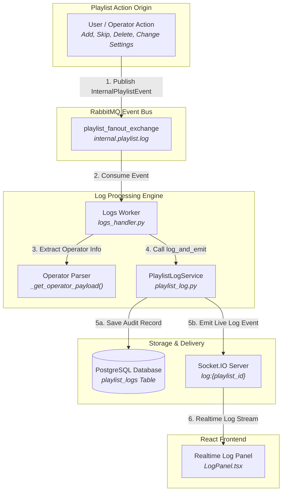
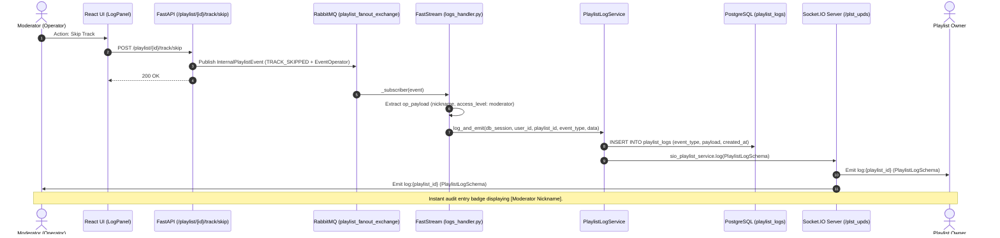
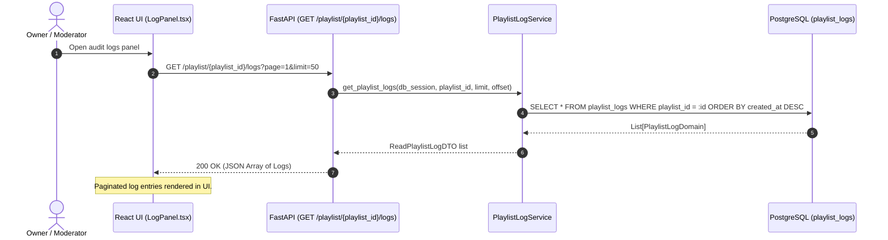
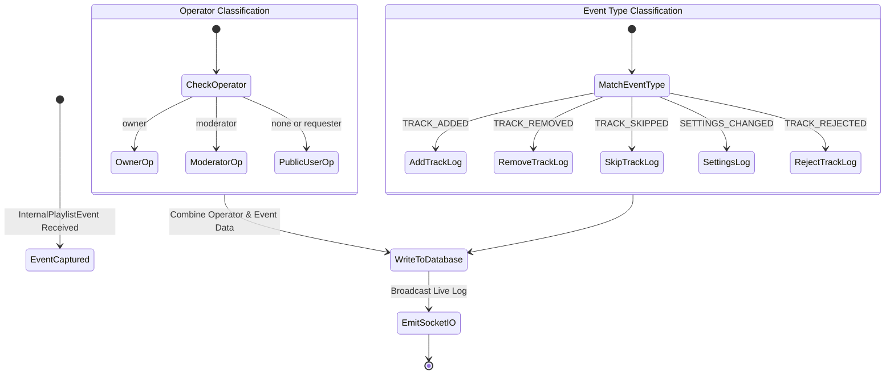

# Playlist Logs & Audit System Architecture

This document describes the event logging architecture, operator action recording, audit persistence, and real-time log distribution in **OpenPlaylist**.

---

## 1. Architecture Overview

The audit logging subsystem ensures operational transparency, enabling playlist owners and moderators to monitor management actions in real time.

1. **Asynchronous Event Ingestion (`logs_handler.py`):**
   - The FastStream worker subscribes to the domain event bus `playlist_fanout_exchange` (queue `internal.playlist.log`).
   - Intercepts all domain events (`TRACK_ADDED`, `TRACK_REJECTED`, `TRACK_REMOVED`, `TRACK_PLAY`, `TRACK_SKIPPED`, `SETTINGS_CHANGED`, etc.).
   - Extracts operator metadata (`_get_operator_payload`): username, ID, and authorization level (`owner`, `moderator`, `none`).

2. **Log Service & Dual Dispatch (`playlist_log_service.py`):**
   - Method `log_and_emit()` executes two consecutive operations:
     1. **Persistence:** Writes `PlaylistLogSchema` into PostgreSQL table `playlist_logs`.
     2. **Realtime Broadcast:** Invokes `sio_playlist_service.log()`, emitting Socket.IO event `log:{playlist_id}` to connected owners and moderators.

3. **Frontend Audit Interface (`LogPanel.tsx`):**
   - The log panel in `new_ui` listens to live `log:{playlist_id}` broadcasts and paginates through historical records via REST API `GET /playlist/{playlist_id}/logs`.

---

## 2. System Diagrams

### 2.1. Audit Logging Data Flow Diagram



---

### 2.2. Sequence Diagram: Audit Log Processing & Broadcast



---

### 2.3. Sequence Diagram: Historical Log Query



---

### 2.4. Log Event Classification



---

## 3. Data Model Specifications

### 3.1. Entity Schema `playlist_logs`
- `id`: UUID (Primary Key).
- `user_id`: UUID (Playlist owner ID).
- `playlist_id`: UUID (Foreign Key -> `playlist.id`).
- `event_type`: Enum (`ADD_TRACK`, `DELETE_TRACK`, `SKIP_TRACK`, `REJECT_TRACK`, `CHANGE_SETTINGS`, `BULK_DELETE_TRACKS`, `PLAY_NOW`).
- `payload`: JSONB Object:
  ```json
  {
    "title": "Song Title",
    "id": "yt_video_id",
    "platform": "youtube",
    "operator": {
      "nickname": "ModNickname",
      "access_level": "moderator",
      "user_id": "uuid-mod-id"
    }
  }
  ```
- `created_at`: Timestamp.

### 3.2. Access Control
- Historical log queries (`GET /playlist/{id}/logs`) are restricted to the **Playlist Owner** and **Moderators**.
- The realtime stream `log:{playlist_id}` is routed only to authenticated administrative clients.
