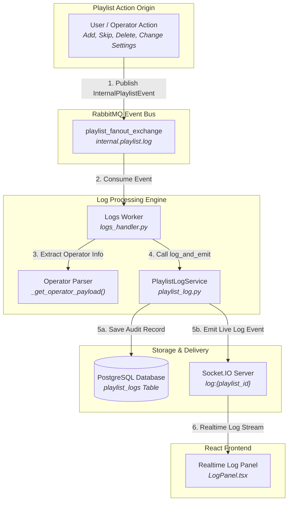
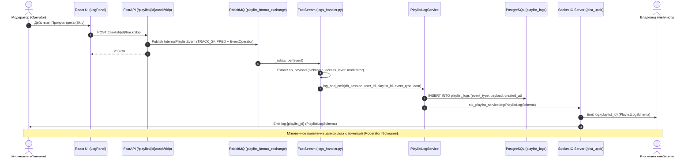
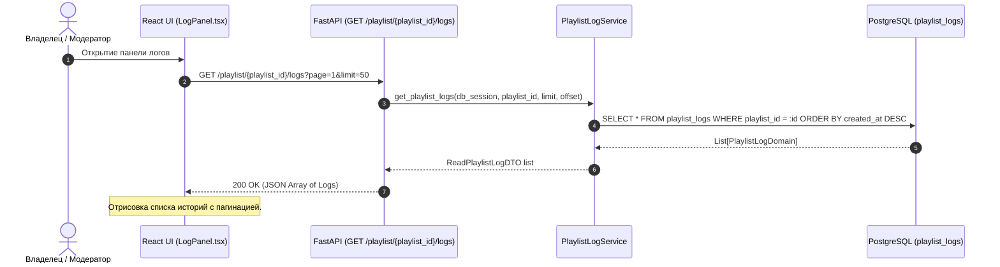
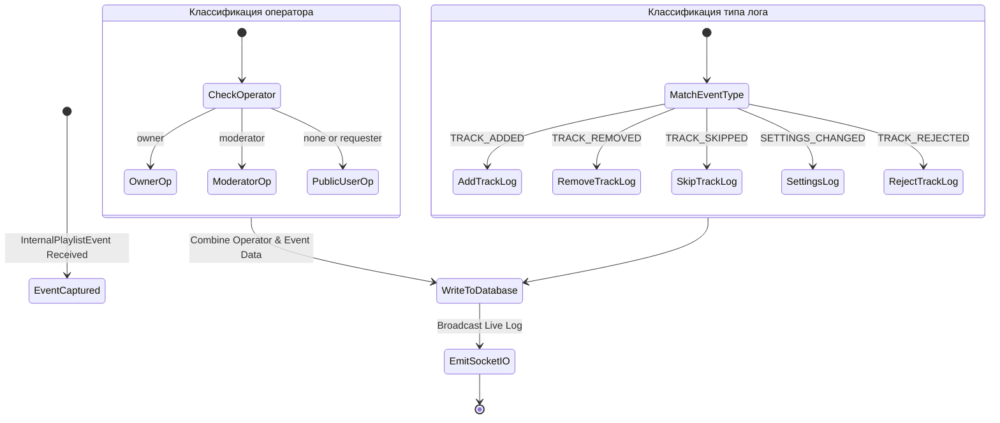

# Подсистема логов и аудита плейлистов (Playlist Logs & Audit System)

Документация описывает архитектуру системы логирования событий плейлиста, фиксации действий операторов/модераторов, хранения аудита и трансляции в режиме реального времени в **OpenPlaylist**.

---

## 1. Архитектурный обзор (Architecture Overview)

Подсистема аудит-логов обеспечивает прозрачность управления плейлистом и позволяет владельцу и модераторам отслеживать все операционные действия в реальном времени.

1. **Асинхронный перехват событий (`logs_handler.py`)**:
   - Воркер FastStream подписывается на доменную шину `playlist_fanout_exchange` (очередь `internal.playlist.log`).
   - Перехватывает все доменные события (`TRACK_ADDED`, `TRACK_REJECTED`, `TRACK_REMOVED`, `TRACK_PLAY`, `TRACK_SKIPPED`, `SETTINGS_CHANGED` и др.).
   - Извлекает метаданные оператора (`_get_operator_payload`): имя, ID и уровень прав (`owner`, `moderator`, `none`).

2. **Сервис логов и двойная доставка (`playlist_log_service.py`)**:
   - Метод `log_and_emit()` выполняет две последовательные операции:
     1. **Персистентность**: Запись структуры `PlaylistLogSchema` в таблицу `playlist_logs` (PostgreSQL).
     2. **Realtime-вещание**: Вызов `sio_playlist_service.log()`, который отправляет Socket.IO эвент `log:{playlist_id}` на клиенты владельца и модераторов.

3. **Интерфейс аудита на фронтенде (`LogPanel.tsx`)**:
   - Панель логов в `new_ui` подписывается на события `log:{playlist_id}` и подгружает исторический журнал через REST API `GET /playlist/{playlist_id}/logs`.

---

## 2. Графики и диаграммы взаимодействия (System Diagrams)

### 2.1. Компонентный график логирования и вещания (Data Flow Diagram)



---

### 2.2. Диаграмма последовательности: Фиксация и отображение лога (Audit Log Flow)



---

### 2.3. Диаграмма последовательности: Загрузка исторического журнала (History Query Sequence)



---

### 2.4. Типы событий и классификация операторов (Log Event Classification)



---

## 3. Детальная спецификация моделей логов

### 3.1. Структура таблицы `playlist_logs`
- `id`: UUID (Primary Key).
- `user_id`: UUID (ID владельца плейлиста).
- `playlist_id`: UUID (Foreign Key -> `playlist.id`).
- `event_type`: Enum (`ADD_TRACK`, `DELETE_TRACK`, `SKIP_TRACK`, `REJECT_TRACK`, `CHANGE_SETTINGS`, `BULK_DELETE_TRACKS`, `PLAY_NOW`).
- `payload`: JSONB Объект:
  ```json
  {
    "title": "Song Title",
    "id": "yt_video_id",
    "platform": "youtube",
    "operator": {
      "nickname": "ModNickname",
      "access_level": "moderator",
      "user_id": "uuid-mod-id"
    }
  }
  ```
- `created_at`: Timestamp.

### 3.2. Права доступа к логам
- Получать исторические логи (`GET /playlist/{id}/logs`) могут только **Владелец** и **Модераторы** с соответствующим уровнем доступа.
- Живой поток `log:{playlist_id}` транслируется в Socket.IO только авторизованным администраторам плейлиста.
