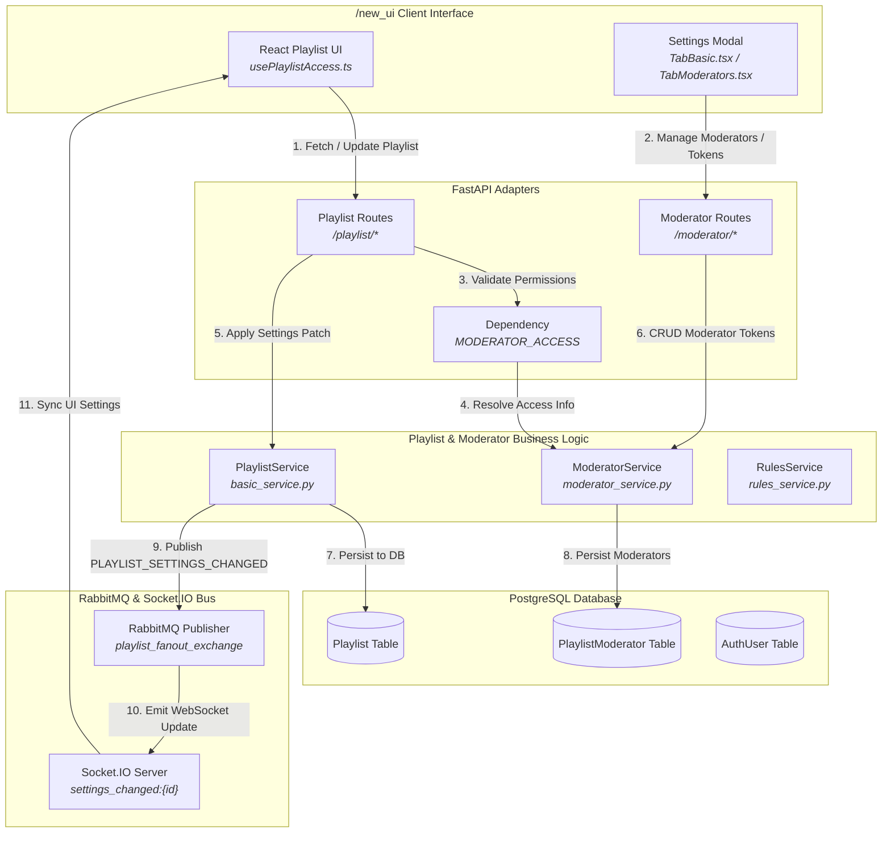
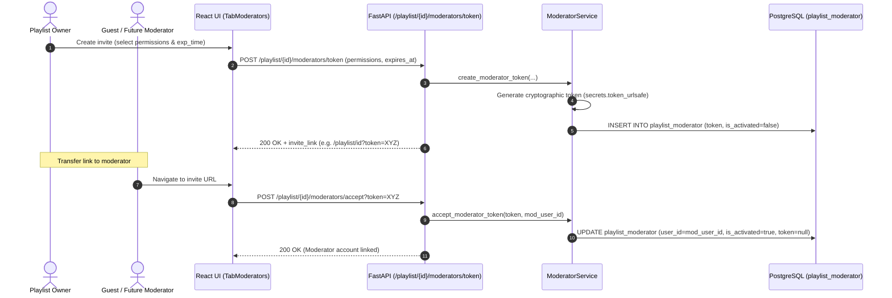
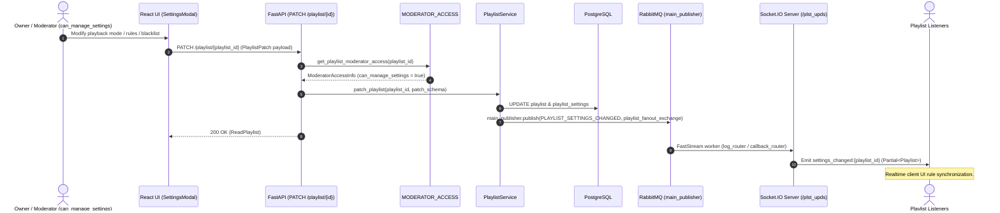
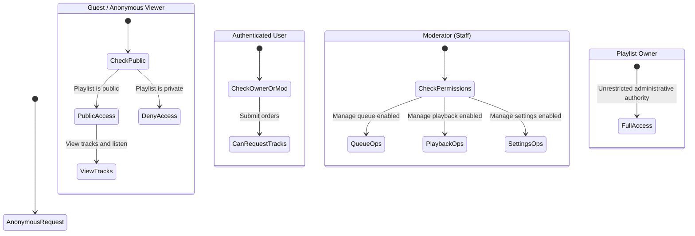

# Playlist & Permissions System Architecture

This document describes the playlist lifecycle architecture, configurable playback modes, moderator role-based access control (RBAC), and invite token mechanics in the **OpenPlaylist** platform.

---

## 1. Architecture Overview

The playlist subsystem encompasses custom queue construction, playback constraints, and granular access delegation:

1. **Playlist Configuration & Operating Modes (Playlist Settings):**
   - **Playback Modes (`mode`):**
     - `stream`: Dynamic user donation/order stream with blacklist validation and background track failovers (`background_track_ids`).
     - `static`: Fixed, predefined ordered track list.
   - **Order Cost Calculation (`cost_mode`):** `add` (cumulative sum) or `max` (highest bid selection).
   - **Source Restrictions (`allow_sources`):** Allowed media providers (YouTube, VK, Web, etc.).
   - **Blacklists and Background Music:** `track_black_list` and `background_track_ids`.

2. **Moderation System & RBAC:**
   - **Single Owner:** Retains absolute administrative control over settings, moderators, queues, and playback streams.
   - **Moderators:** Authenticated users granted granular permissions:
     - `can_manage_queue`: Add, reorder, delete, and approve queued tracks.
     - `can_manage_playback`: Remote playback control (pause, resume, seek, Remote Control mode).
     - `can_manage_settings`: Modify playlist parameters (modes, sources, filters).
   - **Invitation Links (Moderator Tokens):** Cryptographic single-use or reusable invite tokens with expiration limits (`expires_at`).

3. **FastAPI Authorization Guard (`MODERATOR_ACCESS`):**
   - Dependency `get_playlist_moderator_access`: extracts tokens from `X-Moderator-Token` header or query parameter `token`, verifies session identity, and calculates active capabilities (`ModeratorAccessInfo`).

---

## 2. System Diagrams

### 2.1. Component Architecture (Data Flow Diagram)



---

### 2.2. Sequence Diagram: Moderator Token Creation & Activation



---

### 2.3. Sequence Diagram: Playlist Patch & Realtime Sync



---

### 2.4. Access Control Hierarchy



---

## 3. Data Model Specifications

### 3.1. Entity Schema `playlist_moderator`

- `id`: UUID primary key.
- `playlist_id`: UUID (Foreign Key -> `playlist.id`).
- `user_id`: UUID | None (Populated upon token acceptance).
- `token`: String | None (Cryptographic single-use/multi-use string).
- `permissions`: JSONB Object:

  ```json
  {
    "can_manage_queue": true,
    "can_manage_playback": true,
    "can_manage_settings": false
  }
  ```

- `is_activated`: Boolean.
- `expires_at`: Timestamp | None.

### 3.2. Authorization Enforcement in API Routes

- **Owner Resolution**: `is_owner = True` $\rightarrow$ sets all permissions in `ModeratorAccessInfo` to `True`.
- **Route Guard Example**:

  ```python
  if not access.permissions.get("can_manage_settings", False):
      raise HTTPException(status_code=403, detail="Moderator missing required permissions")
  ```

---

## 4. Playlist Tags & Discovery

Playlists support normalized tags (`ARRAY(String)` in PostgreSQL) for indexing and discovery:

### 4.1. Validation & Normalization Rules
- Leading `#` symbols and surrounding whitespace are stripped automatically.
- Tags are lowercased for case-insensitive search.
- Max tag length: 30 characters.
- Max tags per playlist: 10 tags.
- Duplicate tags are eliminated while preserving original order.

### 4.2. Endpoints
- `GET /playlist?query={query}&tag={tag}`: Search public playlists with substring filtering across name, description, author, and tags. Returns `ReadPlaylistPreview` with `tags`.
- `GET /playlist/tags/popular?limit=20`: Retrieves the most frequent tags among public playlists with usage counters (`tag`, `count`).
- `POST /playlist`: Create a new playlist including `tags: list[str]`.
- `PATCH /playlist/{id}`: Update playlist tags via `tags: list[str]`.
