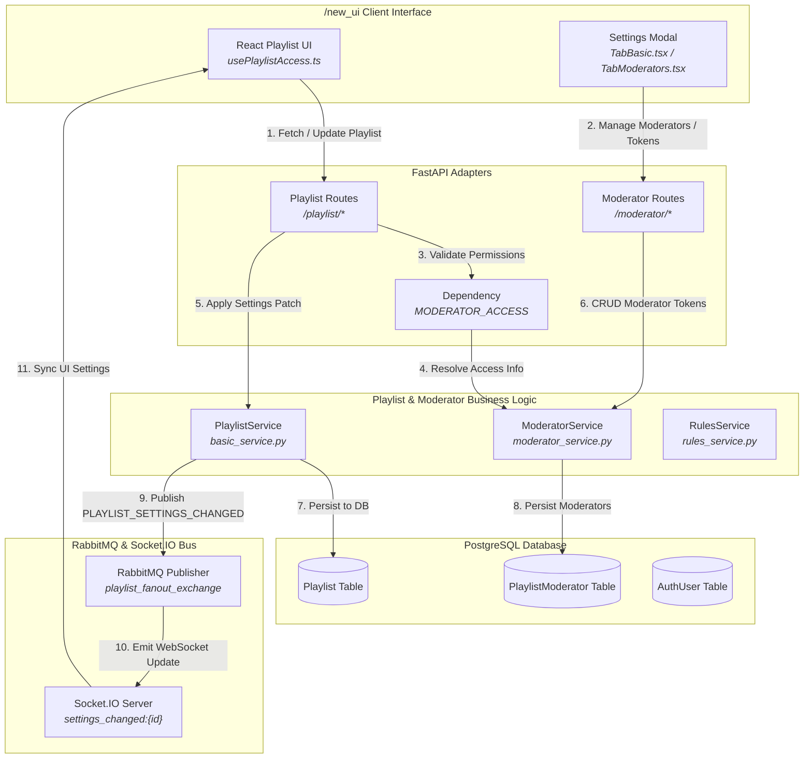
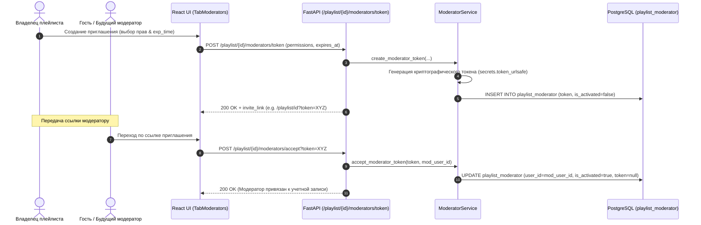
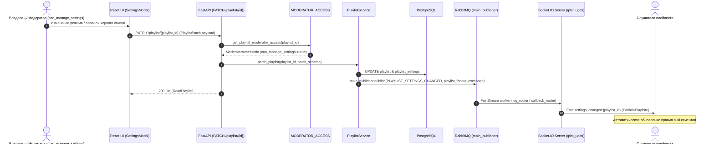
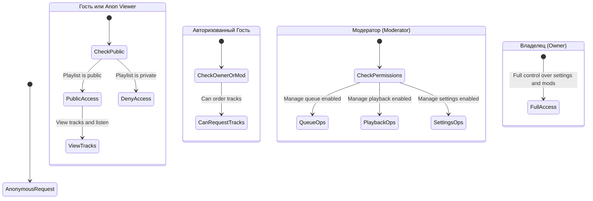

# Подсистема управления плейлистами и модерации (Playlist & Permissions System)

Документация описывает архитектуру управления плейлистами, гибкую конфигурацию режимов воспроизведения, систему разграничения прав модераторов и генерацию токенов приглашения в проекте **OpenPlaylist**.

---

## 1. Архитектурный обзор (Architecture Overview)

Подсистема включает в себя функционал конструирования плейлистов и разграничения доступа:

1. **Конфигуратор плейлиста и режимы работы (Playlist Settings)**:
   - **Режимы воспроизведения (`mode`)**:
     - `stream`:  Динамический поток заказов пользователей с черным списком и правилами с поддержкой фоновых треков (`background_track_ids`).
     - `static`: Статический зафиксированный список воспроизведения.
   - **Режимы стоимости заказов (`cost_mode`)**: `add` (суммирование стоимости) или `max` (выбор максимальной ставки).
   - **Фильтры источников (`allow_sources`)**: Ограничения источников (YouTube, VK, Web, etc.).
   - **Черные списки и фоновые треки**: `track_black_list` и `background_track_ids`.

2. **Система модерации и прав доступа (Moderation & RBAC)**:
   - **Единственный Владелец (Owner)**: Имеет абсолютные права над плейлистом (управление настройками, модераторами, очередью и плейбеком).
   - **Модераторы (Moderators)**: Авторизованные пользователи с гранулярным набором прав:
     - `can_manage_queue`: Добавление, удаление, перемещение треков в очереди.
     - `can_manage_playback`: Управление воспроизведением (пауза, резюм, перемотка, Remote Control).
     - `can_manage_settings`: Изменение настроек плейлиста (режимы, источники, правила).
   - **Ссылки-приглашения (Moderator Tokens)**: Генерация одноразовых или многоразовых токенов доступа с ограниченным сроком действия (`expires_at`).

3. **Защита доступа в FastAPI (`MODERATOR_ACCESS`)**:
   - Внедрение зависимости `get_playlist_moderator_access`: извлечение токена из заголовока `X-Moderator-Token` или Query-параметра `token`, сопоставление с ролями пользователя и вычисление текущих прав (`ModeratorAccessInfo`).

---

## 2. Графики и диаграммы взаимодействия (System Diagrams)

### 2.1. Компонентная архитектура управления плейлистами (Data Flow Diagram)



---

### 2.2. Диаграмма последовательности: Создание и активация токена модератора (Moderator Token Activation)



---

### 2.3. Диаграмма последовательности: Изменение настроек плейлиста (Playlist Patch & Realtime Sync)



---

### 2.4. Матрица уровней доступа и прав (Access Control Hierarchy)



---

## 3. Детальная спецификация моделей и пермишенов

### 3.1. Структура сущности `playlist_moderator`

- `id`: UUID.
- `playlist_id`: UUID (Foreign Key -> `playlist.id`).
- `user_id`: UUID | None (Заполняется при активации токена).
- `token`: String | None (Уникальный одноразовый/многоразовый токен).
- `permissions`: JSONB Объект:

  ```json
  {
    "can_manage_queue": true,
    "can_manage_playback": true,
    "can_manage_settings": false
  }
  ```

- `is_activated`: Boolean.
- `expires_at`: Timestamp | None.

### 3.2. Права и проверки в API

- **Владелец**: `is_owner = True` $\rightarrow$ все права в `ModeratorAccessInfo` устанавливаются в `True`.
- **Проверка пермишенов в роутах**:

  ```python
  if not access.permissions.get("can_manage_settings", False):
      raise HTTPException(status_code=403, detail="Moderator missing permissions")
  ```
