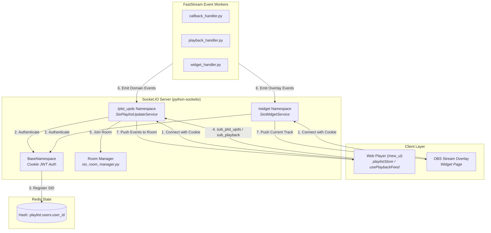
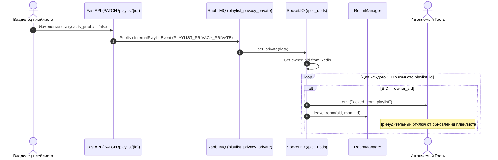
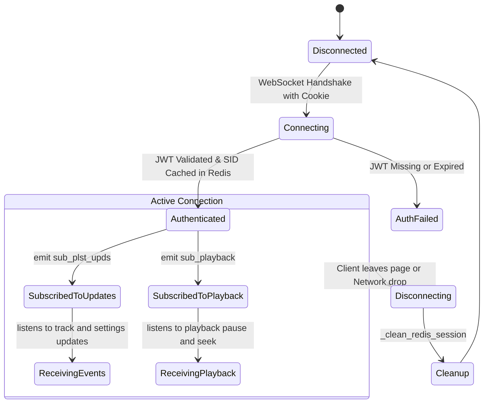

# Подсистема реального времени и Socket.IO (Realtime & Socket.IO Engine)

Документация описывает архитектуру мультинеймспейсного Socket.IO сервера, авторизацию соединений по JWT-кукам, управление комнатами и доставку событий в проекте **OpenPlaylist**.

---

## 1. Архитектурный обзор (Architecture Overview)

Подсистема обеспечивают двусторонний обмен данными между бекендом, веб-клиентом и стрим-оверлеями.

1. **Иерархия Неймспейсов (Namespaces)**:
   - **`/plst_upds` (`SioPlaylistUpdateService`)**: Основной канал работы приложения. Отвечает за трансляцию добавлений, удалений, переходов треков, изменения настроек плейлиста и синхронизацию плейбека (`playback_pause`, `playback_seek`).
   - **`/widget` (`SioWidgetService`)**: Канал оверлеев стриминга (OBS, Twitch). Транслирует текущий трек `current_track`, паузу и перемотку.
   - **`/` (Root Namespace)**: Системный неймспейс для подтверждения интеграций ботов (`ack_bot_connected`).

2. **Авторизация соединений по JWT**:
   - Каждое соединение наследовано от `BaseNamespace`.
   - Извлечение JWT-токена происходит из HTTP-кук (`HTTP_COOKIE`).
   - При успешном декодировании сессия сохраняется в Socket.IO session, а связь `user_id <-> SID` кэшируется в Redis (`playlist:users:{user_id}` или `widget:users:{user_id}`).

3. **Управление комнатами (`sio_room_manager.py`)**:
   - Комнаты плейлистов: `str(playlist_id)` — подписка на очереди и настройки.
   - Комнаты плейбека: `playback:{playlist_id}` — подписка на синхронизацию плеера.
   - Комнаты виджетов: `widget:users:{user_id}` — подписка виджетов владельца.

---

## 2. Графики и диаграммы взаимодействия (System Diagrams)

### 2.1. Компонентный график неймспейсов и комнат (Data Flow Diagram)

---

### 2.2. Диаграмма последовательности: Подключение и подписка на комнату (Connect & Subscribe)

---

### 2.3. Диаграмма последовательности: Перевод в приватный режим и изгнание слушателей (Kicking & Privacy)

---

### 2.4. Жизненный цикл Socket.IO сессии (Session Lifecycle)

---

## 3. Спецификация событий Socket.IO

### 3.1. События Неймспейса `/plst_upds`
- **Входящие (Client $\rightarrow$ Server)**:
  - `sub_plst_upds`: Вход в комнату обновлений очереди плейлиста.
  - `unsub_plst_upds`: Выход из комнаты обновлений.
  - `sub_playback`: Вход в комнату синхронизации воспроизведения.
  - `unsub_playback`: Выход из комнаты синхронизации.
- **Исходящие (Server $\rightarrow$ Client)**:
  - `subscribe_success` / `subscribe_denied`
  - `playback_subscribe_success` / `playback_subscribe_denied`
  - `add_track:{playlist_id}`: Добавление нового трека в очередь.
  - `delete_track:{playlist_id}`: Удаление трека.
  - `bulk_delete_tracks:{playlist_id}`: Массовое удаление.
  - `playnow:{playlist_id}`: Переключение активного трека.
  - `playback_pause:{playlist_id}`: Событие паузы/резюма.
  - `playback_seek:{playlist_id}`: Событие перемотки.
  - `settings_changed:{playlist_id}`: Изменение настроек.
  - `kicked_from_playlist`: Изгнание при приватизации.

### 3.2. События Неймспейса `/widget`
- `current_track`: Данные о текущем треке для оверлея стрима (title, yt_video_id, platform, by_owner).
- `pause`: Статус паузы для виджета.
- `seek`: Позиция перемотки для виджета.
