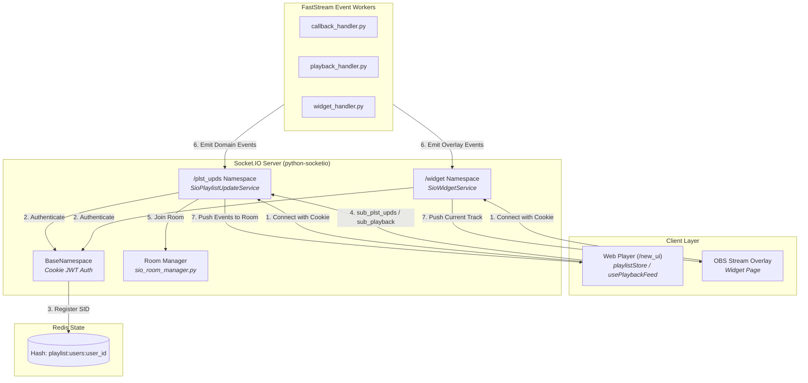
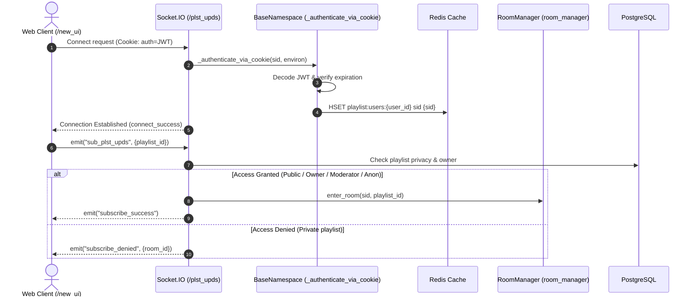
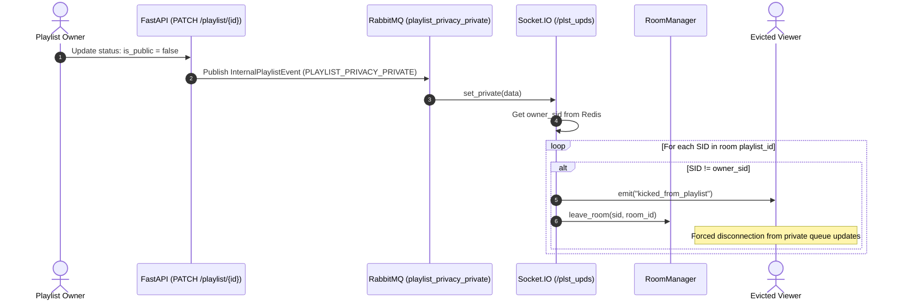
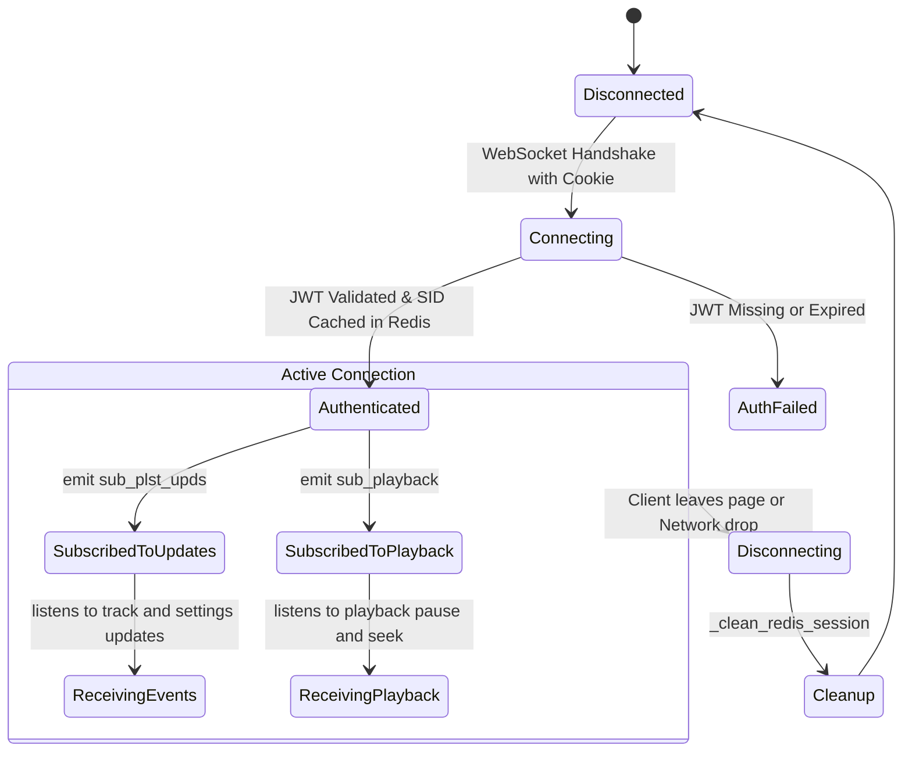

# Realtime Engine & Socket.IO Architecture

This document describes the multi-namespace Socket.IO server architecture, cookie-based JWT authentication, dynamic room routing, and event distribution in the **OpenPlaylist** platform.

---

## 1. Architecture Overview

The realtime engine powers low-latency, bidirectional communication between the backend, client single-page applications, and streaming broadcast overlays.

1. **Namespace Hierarchy:**
   - **`/plst_upds` (`SioPlaylistUpdateService`):** Primary operational channel. Broadcasts queue additions, deletions, track advances, playlist configuration mutations, and playback synchronization (`playback_pause`, `playback_seek`).
   - **`/widget` (`SioWidgetService`):** Dedicated stream overlay channel (OBS Studio, Twitch widgets). Dispatches `current_track`, pause toggles, and seek adjustments.
   - **`/` (Root Namespace):** System signaling for bot integration acknowledgments (`ack_bot_connected`).

2. **Cookie-Based JWT Session Authentication:**
   - Every namespace inherits from `BaseNamespace`.
   - Extracts and verifies JWT session tokens from HTTP cookies (`HTTP_COOKIE`).
   - On successful handshake, the session is registered in the Socket.IO session store, and the `user_id <-> SID` mapping is indexed in Redis (`playlist:users:{user_id}` or `widget:users:{user_id}`).

3. **Dynamic Room Management (`sio_room_manager.py`):**
   - Playlist Rooms: `str(playlist_id)` — Queue mutations and settings subscriptions.
   - Playback Rooms: `playback:{playlist_id}` — Audio/video synchronization subscriptions.
   - Widget Rooms: `widget:users:{user_id}` — Streamer overlay broadcast targets.

---

## 2. System Diagrams

### 2.1. Namespace & Room Topology Diagram

---

### 2.2. Sequence Diagram: Connection & Room Subscription

---

### 2.3. Sequence Diagram: Playlist Privatization & Listener Eviction

---

### 2.4. Socket.IO Session Lifecycle

---

## 3. Socket.IO Event Specifications

### 3.1. `/plst_upds` Namespace Events
- **Client $\rightarrow$ Server**:
  - `sub_plst_upds`: Join playlist queue mutation room.
  - `unsub_plst_upds`: Leave queue mutation room.
  - `sub_playback`: Join playback sync room.
  - `unsub_playback`: Leave playback sync room.
- **Server $\rightarrow$ Client**:
  - `subscribe_success` / `subscribe_denied`
  - `playback_subscribe_success` / `playback_subscribe_denied`
  - `add_track:{playlist_id}`: Track added to queue.
  - `delete_track:{playlist_id}`: Track removed from queue.
  - `bulk_delete_tracks:{playlist_id}`: Bulk deletion event.
  - `playnow:{playlist_id}`: Active playing track transition.
  - `playback_pause:{playlist_id}`: Play/pause state change.
  - `playback_seek:{playlist_id}`: Timeline seek event.
  - `settings_changed:{playlist_id}`: Playlist rule modifications.
  - `kicked_from_playlist`: Eviction notification when playlist goes private.

### 3.2. `/widget` Namespace Events
- `current_track`: Active track payload for stream overlay (title, yt_video_id, platform, by_owner).
- `pause`: Stream widget pause indicator.
- `seek`: Stream widget seek synchronization.
