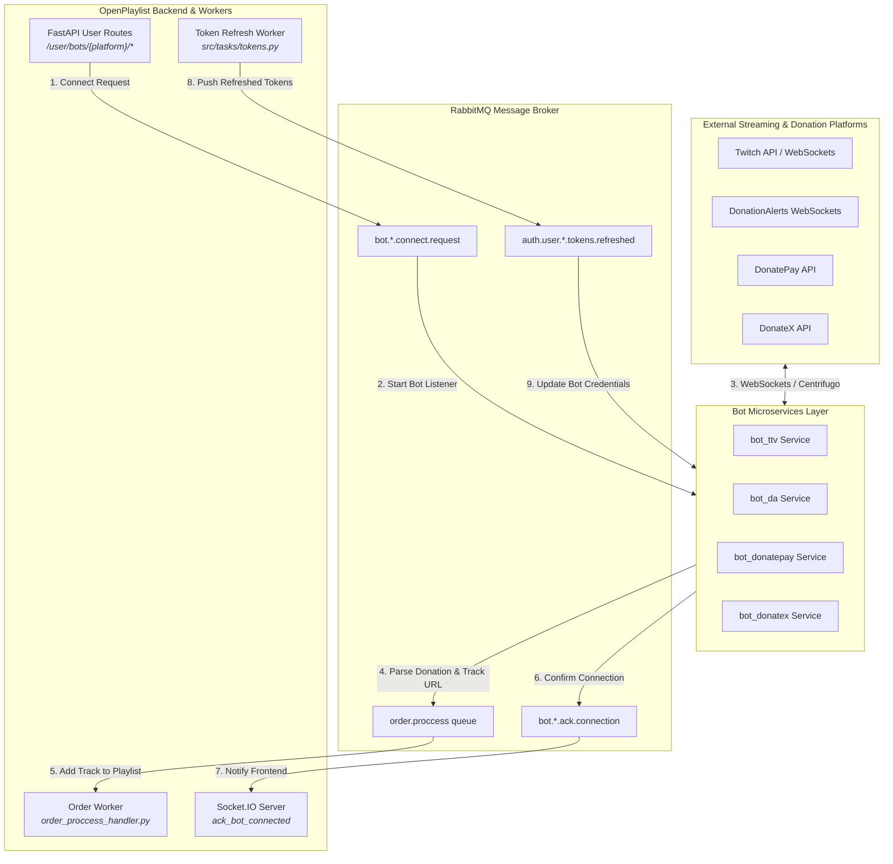
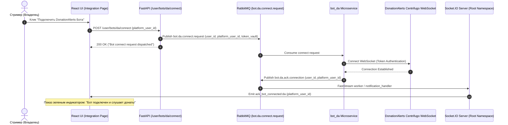
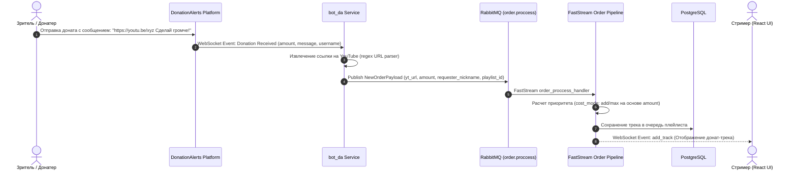
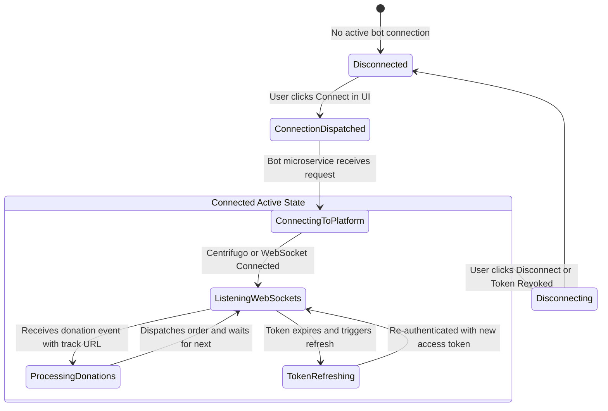

# Подсистема интеграций и ботов (External Integrations & Bots System)

Документация описывает микросервисную архитектуру сторонних ботов (Twitch, DonationAlerts, DonatePay, DonateX), механизмы автообновления токенов и трансфер заказов из донат-сервисов в **OpenPlaylist**.

---

## 1. Архитектурный обзор (Architecture Overview)

Подсистема интеграций представляет собой совокупность микросервисов-ботов, взаимодействующих с бэкэндом через асинхронный брокер **RabbitMQ**.

1. **Экосистема Ботов (Bot Microservices)**:
   - **`bot_da`**: Бот платформы **DonationAlerts** (слушает донат-алерты, алерты сообщений).
   - **`bot_twitch` (`bot_ttv`)**: Бот платформы **Twitch** (чат-команды, баллы канала / Channel Points, модерация).
   - **`bot_donatepay`**: Бот платформы **DonatePay**.
   - **`bot_donatex`**: Бот платформы **DonateX**.

2. **Очереди взаимодействия в RabbitMQ (`queues.py`)**:
   - `bot.{platform}.connect.request`: Запрос на подключение бота к платформе пользователя.
   - `bot.{platform}.connect.response`: Ответ бота о статусе подключения.
   - `bot.{platform}.order.new`: Новый заказ трека из сообщения доната/чата.
   - `bot.{platform}.ack.connection`: Подтверждение активной связи с ботом.
   - `bot.{platform}.disconnect`: Запрос на отключение бота.

3. **Автообновление токенов интеграций**:
   - Очереди `auth.user.{platform}.tokens.refreshed` транслируют новые пары Access/Refresh токенов после автоматического обновления истекших сессий.

---

## 2. Графики и диаграммы взаимодействия (System Diagrams)

### 2.1. Компонентная архитектура интеграций (Data Flow Diagram)

---

### 2.2. Диаграмма последовательности: Подключение донат-бота (Bot Connection Sequence)

---

### 2.3. Диаграмма последовательности: Заказ трека через донат (Donation Track Order Flow)

---

### 2.4. Состояния соединения бота (Bot Connection State Machine)

---

## 3. Детальная спецификация очередей ботов

### 3.1. Структура сообщений `bot.{platform}.connect.request`
- `user_id`: UUID пользователя в OpenPlaylist.
- `platform`: Enum (`da`, `twitch`, `donatepay`, `donatex`).
- `platform_user_id`: Идентификатор аккаунта стримера на платформе.
- `access_token`: Зашифрованный токен авторизации из `TokenVault`.
- `refresh_token`: Токен обновления.

### 3.2. Автоматическое обновление токенов
- Фоновая задача `src/tasks/tokens.py` регулярно проверяет время жизни токенов в `TokenVault`.
- Если `expires_at < now()`, выполняются OAuth-запросы на refresh и результат публикуется в очередей `auth.user.{platform}.tokens.refreshed`.
- Боты перехватывают новые токены на лету без разрыва соединения WebSocket.
