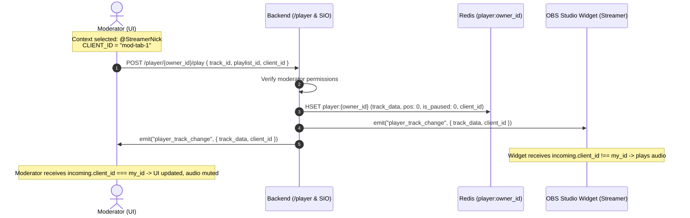
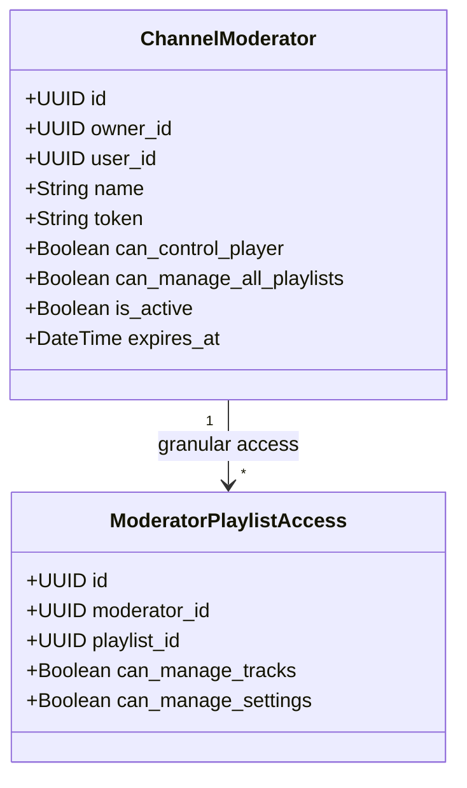

# Architecture Concept: Dedicated User Player & Channel Moderation V2 (Revision V3)

> **Document Status:** Final Architecture Specification (RFC V3)  
> **Target Subsystems:** `back-end`, `new_ui`, `docs`, `adapters (_sio, _rabbit, _fastapi)`, `bot_ttv`

---

## 1. Introduction & Core Principles (V2)

1. **UserPlayer — Pure Redis State (1:1 per Streamer):**
   * All volatile operational playback state (`player:{owner_id}`) resides exclusively in **Redis Hash** (with TTL).
   * **Simple Bootstrapping:** If the player key in Redis is empty, the server returns `None` (or `{ status: "idle" }`). No hidden side effects or auto-selection of arbitrary database tracks.
2. **Deprecation of `show_in_widget` in Playlist Model:**
   * Because playback is associated 1:1 with the streamer user, the stream overlay widget (`/widget`) directly mirrors the streamer's `UserPlayer`.
   * The `show_in_widget` column in the `playlists` table, DTOs, and playlist settings UI **is obsolete and removed**.
3. **Source Identification via `CLIENT_ID`:**
   * Every client action (Play, Pause, Seek, Volume, Mute) carries a unique `client_id`.
   * Upon receiving WebSocket events, clients check `incoming.client_id !== CLIENT_ID`, eliminating infinite feedback loops, redundant re-renders, and cross-tab race conditions.
4. **Client-Driven Track Transitions (Client-Driven Skip):**
   * The backend does not compute queue order or expose an ambiguous `/skip` endpoint.
   * The client-side store (aware of sorting, playlist mode, and active filters) calculates the next `track_id` and dispatches `play_track({ track_id, playlist_id, client_id })`.
5. **Playlist = Queue:**
   * The playlist itself acts as the queue. Order is determined by playlist sort rules (`cost_mode`, `priority`, `created_at`).
6. **Playback Mode (`stream`, `flow`, `static`) Belongs to the Playlist:**
   * The player renders the track adhering to the constraints of the playlist that owns that track (`track.playlist_id`).

---

## 2. State Architecture: Redis DAL & Simple Fetch

### 2.1. Redis Key Schema `player:{owner_id}`
```text
Redis Hash: player:{owner_id} (TTL: 7 days with sliding refresh on activity)
├── owner_id              : UUID (Streamer / Player owner)
├── active_playlist_id    : UUID (Playlist containing active track)
├── current_track_id      : UUID (Active playing track UUID)
├── current_track_data    : JSON { id, title, duration, yt_video_id, requester_nickname, note, ... }
├── position              : float (Playback offset in seconds, e.g. 42.5)
├── is_paused             : "1" | "0"
├── volume                : int (0-100, widget master volume)
├── broadcast_to_widget   : "1" | "0" (Whether output is broadcast to OBS overlay)
├── last_client_id        : string (client_id of last modifier)
└── updated_at            : ISO timestamp
```

### 2.2. State Fetch Flow
* **Request:** `GET /player/{owner_id}/state` or Socket.IO `on_connect / player_subscribe`.
* **Flow:**
  1. Server issues `HGETALL player:{owner_id}` in Redis.
  2. If key exists $\rightarrow$ returns active `PlayerState` object.
  3. If key is empty $\rightarrow$ returns `None` (player is in `idle` standby).

---

## 3. Moderation & Remote Control Flow

### 3.1. Target Context Selection
In the header and player bar, users can switch the active management context:
* **`Context:`** `[ 👤 My Channel ▼ ]` / `[ 🎮 Streamer @GwinGlade (Moderator) ▼ ]`.

### 3.2. Scenario: Moderator Launches a Track
1. Moderator chooses context: **`@GwinGlade`**.
2. Interface displays playlists owned by `@GwinGlade` where the moderator holds `can_manage_tracks`.
3. Moderator clicks **Play** on a track:
   * Client sends: `POST /player/{owner_id}/play`  
     `{ track_id: "...", playlist_id: "...", client_id: "abc-123" }`.
   * Server validates permissions: caller is owner or active moderator with `can_control_player`.
   * Server updates Redis `player:@GwinGlade` and broadcasts Socket.IO event `player_track_change`.
   * **Streamer OBS Widget:** Starts playing audio in the broadcast stream.
   * **Moderator UI:** Updates progress bar and track metadata. Local browser audio in the moderator tab remains **Muted**.



---

## 4. Moderation Model & Permissions (RBAC V2)

### 4.1. Permission Hierarchy: Account vs Playlist



### 4.2. Playlist-Level Granularity
1. `can_manage_tracks` (queue management):
   * Add tracks, delete tracks, reorder / change priority.
2. `can_manage_settings` (playlist rules & validation):
   * Edit duration limits, order pricing, author/word blacklists for the specific playlist.
3. `can_delete_playlist`:
   * **Restricted to Owner only.** Moderators cannot delete playlists.

### 4.3. Security & Isolation of `allow_sources`
* **Rule:** The `allow_sources` configuration (streamer OAuth integrations: Spotify, Twitch, DonationAlerts) is rendered in strict **Read-Only** mode or hidden from moderators, preventing unauthorized token modification.

---

## 5. Ergonomic PlayerBar & `useUpNextFeed`

### 5.1. PlayerBar Layout
```text
+-------------------------------------------------------------------------------------------------------------------------+
| [▶/❚❚] [⏮] [⏭]  01:24 ━━━━●────────── 03:45  [🔊 80%]  |  [🎵 Track Title - Artist]         | [👤 @StreamerNick ▼]     |
| [🔁] [🔀]                                              |  Ordered by: @ViewerNick (150★ DA) | [📡 Broadcast OBS: ON 🟢]|
|                                                         |  "Play this for good vibes!"      | [📋 Up Next (3) ▼]       |
+-------------------------------------------------------------------------------------------------------------------------+
```

### 5.2. `useUpNextFeed` Hook (Up Next Preview)
* Dedicated hook `useUpNextFeed` for the compact "Up Next" dropdown:
  * Tracks `active_playlist_id` and `current_track_id` in the store.
  * Calculates the next $N$ upcoming tracks based on playlist sort mode.
  * Exposes one-click inline actions: `skipToTrack(trackId)`, `removeTrack(trackId)` directly inside the popover.

---

## 6. API Specification with `client_id` Support

### 6.1. REST API (`/player`)
* `GET /player/{owner_id}/state` $\rightarrow$ `PlayerState | null`
* `POST /player/{owner_id}/play` $\rightarrow$ `{ track_id, playlist_id, client_id }`
* `POST /player/{owner_id}/pause` $\rightarrow$ `{ is_paused: bool, client_id }`
* `POST /player/{owner_id}/seek` $\rightarrow$ `{ position: float, client_id }`
* `POST /player/{owner_id}/volume` $\rightarrow$ `{ volume: int, client_id }`
* `POST /player/{owner_id}/broadcast_widget` $\rightarrow$ `{ enabled: bool, client_id }`

### 6.2. Socket.IO Events
* **Room:** `player:{owner_id}`.
* **Emits:**
  * `player_state`: `{ state: PlayerState | null, client_id: string }`
  * `player_track_change`: `{ track: Track, playlist_id: string, client_id: string }`
  * `player_pause`: `{ is_paused: boolean, position: float, client_id: string }`
  * `player_seek`: `{ position: float, client_id: string }`
  * `player_volume`: `{ volume: number, client_id: string }`

---

## 7. Architecture Decisions Matrix

| Topic | Decision |
| :--- | :--- |
| **Initial State Bootstrapping** | If `player:{owner_id}` in Redis is missing, return `None` / `idle`. No DB side-effects. |
| **`show_in_widget` Removal** | **Removed** from database, DTOs, and UI. Widget directly tracks streamer's `UserPlayer`. |
| **Deduplication & `client_id`** | Every command and event includes `client_id`. Clients ignore self-originated echo events. |
| **Skip Logic** | Client-side calculation of next track $\rightarrow$ invoke `/play` with target `track_id`. |
| **Up Next Feed** | Hook `useUpNextFeed` in UI powering compact 3-track Up Next dropdown. |
| **Player State Storage** | Fully in **Redis** (`player:{owner_id}`). |
| **Security for `allow_sources`** | Streamer personal OAuth integrations hidden or Read-Only for moderators. |
