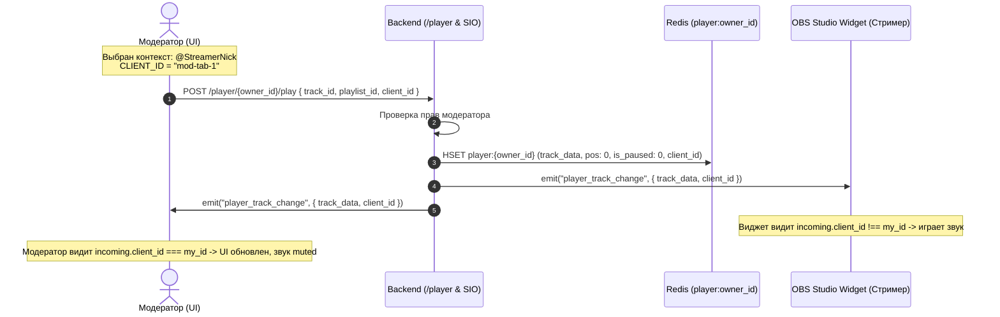
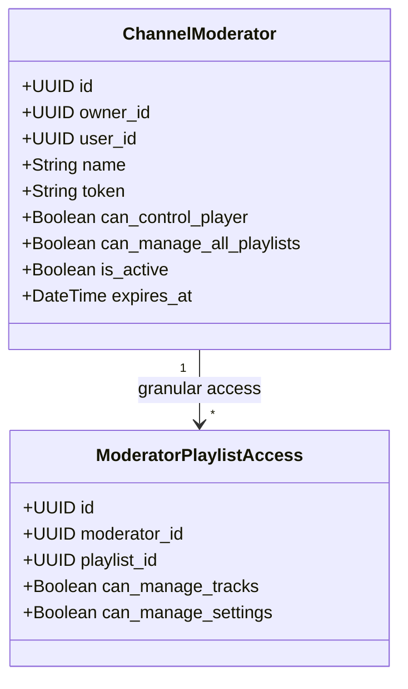

# Концепция: Выделенный User Player и Модерация Канала V2 (Редакция V3)

> **Статус документа:** Финальная архитектурная спецификация (RFC V3)  
> **Дата обновления:** 18 августа 2026 г.  
> **Область изменений:** `back-end`, `new_ui`, `docs`, `adapters (_sio, _rabbit, _fastapi)`, `bot_ttv`

---

## 1. Введение и Ключевые Принципы V2

По результатам детального обсуждения фиксируем согласованные архитектурные постулаты:

1. **UserPlayer — чистый Redis State (1:1 к стримеру):**
   * Все оперативное состояние (`player:{owner_id}`) хранится исключительно в **Redis Hash** (с TTL).
   * **Простой бутстрап:** Если плеер в Redis пуст, сервер просто возвращает `None` (или `{ status: "idle" }`). Никаких скрытых сайд-эффектов или авто-выборов треков из базы.
2. **Отказ от `show_in_widget` в модели плейлиста:**
   * Так как плеер теперь привязан 1:1 к пользователю, виджет стрима (`/widget`) транслирует состояние `UserPlayer` стримера.
   * Поле `show_in_widget` в таблице `playlists`, DTO и интерфейсе настроек плейлиста **становится избыточным и удаляется**.
3. **Идентификация источников через `CLIENT_ID`:**
   * Каждое действие клиента (Play, Pause, Seek, Volume, Mute) обязательно сопровождается заголовком / полем `client_id`.
   * При получении событий по WebSocket клиент сравнивает `incoming.client_id !== CLIENT_ID`, что исключает зацикливание, лишние ре-рендеры и конфликты между вкладками.
4. **Клиентская логика переключения треков (Client-Driven Skip):**
   * Сервер не считает очереди и не содержит отдельного эндпоинта `/skip`.
   * Клиентский стор (знающий сортировку, режим плейлиста и текущие фильтры) сам вычисляет следующий `track_id` и отправляет команду `play_track({ track_id, playlist_id, client_id })`.
5. **Плейлист = Очередь (Queue):**
   * Плейлист сам по себе является очередью. Порядок воспроизведения задается сортировкой (`cost_mode`, `priority`, `created_at`).
6. **Режим воспроизведения (`stream`, `flow`, `static`) принадлежит Плейлисту:**
   * Плеер воспроизводит трек по правилам того плейлиста, которому принадлежит этот трек (`track.playlist_id`).

---

## 2. Архитектура Состояния: Redis DAL & Простое Чтение

### 2.1. Структура Ключа `player:{owner_id}` в Redis
```
Redis Hash: player:{owner_id} (TTL: 7 дней с авто-продлением при активности)
├── owner_id              : UUID (владелец плеера / стример)
├── active_playlist_id    : UUID (плейлист текущего трека)
├── current_track_id      : UUID (ID играющего трека)
├── current_track_data    : JSON { id, title, duration, yt_video_id, requester_nickname, note, ... }
├── position              : float (секунда воспроизведения, например 42.5)
├── is_paused             : "1" | "0"
├── volume                : int (0-100, громкость в виджете)
├── broadcast_to_widget   : "1" | "0" (транслировать ли в OBS-виджет)
├── last_client_id        : string (client_id последнего инициатора)
└── updated_at            : ISO timestamp
```

### 2.2. Простое получение состояния (State Fetch)
* **Запрос:** `GET /player/{owner_id}/state` или Socket.IO `on_connect / player_subscribe`.
* **Логика:**
  1. Сервер делает `HGETALL player:{owner_id}` в Redis.
  2. Если ключ существует $\rightarrow$ возвращает актуальный объект `PlayerState`.
  3. Если ключ пуст $\rightarrow$ возвращает `None` (плеер в режиме ожидания `idle`, ничего не играет).

---

## 3. Флоу Управления и Роли Модератора (UX & Client Flow)

### 3.1. Выбор Контекста Управления (Target Context)
В шапке и плеере пользователь выбирает целевой канал:
* **`Контекст:`** `[ 👤 Мой канал ▼ ]` / `[ 🎮 Стример @GwinGlade (Модератор) ▼ ]`.

### 3.2. Сценарий: Запуск трека модератором
1. Модератор выбирает контекст: **`@GwinGlade`**.
2. В интерфейсе отображаются плейлисты стримера `@GwinGlade`, на которые у модератора есть права `can_manage_tracks`.
3. Модератор кликает **Play** на треке:
   * Клиент отправляет: `POST /player/{owner_id}/play`  
     `{ track_id: "...", playlist_id: "...", client_id: "abc-123" }`.
   * Сервер проверяет права: пользователь — владелец или активный модератор с `can_control_player`.
   * Сервер сохраняет состояние в `player:@GwinGlade` и рассылает Socket.IO событие `player_track_change`.
   * **OBS-виджет стримера:** запускает проигрывание аудио.
   * **UI модератора:** обновляет прогресс-бар и информацию о треке. Локальный звук в браузере модератора **заглушен (Muted)**.



---

## 4. Модель Модерации и Безопасность (RBAC V2)

### 4.1. Разделение Прав: Аккаунт vs Плейлист



### 4.2. Гранулярность прав на Плейлист
1. `can_manage_tracks` (управление треками в очереди):
   * Добавление треков, удаление треков, изменение приоритетов / сортировки.
2. `can_manage_settings` (настройки валидации плейлиста):
   * Редактирование лимитов длительности трека, цены заказа, черных списков авторов/слов для этого конкретного плейлиста.
3. `can_delete_playlist`:
   * **Заблокировано для модераторов.** Удаление плейлиста доступно **только владельцу (Owner)**.

### 4.3. Безопасность и Изоляция `allow_sources`
* **Правило:** Вкладка `allow_sources` (OAuth интеграции стримера: Spotify, Twitch, DA) для модератора **отображается в режиме строгого Read-Only или скрывается**, предотвращая утечку и модификацию личных привязок стримера.

---

## 5. Компактный PlayerBar и новый фид `useUpNextFeed`

### 5.1. Макет нового PlayerBar V2
```
+-------------------------------------------------------------------------------------------------------------------------+
| [▶/❚❚] [⏮] [⏭]  01:24 ━━━━●────────── 03:45  [🔊 80%]  |  [🎵 Track Title - Artist]         | [👤 @StreamerNick ▼]     |
| [🔁] [🔀]                                              |  Заказ: @ViewerNick (150★ DA)      | [📡 В виджет: ВКЛ 🟢]    |
|                                                         |  "Поставь для хорошего настроения"| [📋 След. треки (3) ▼]   |
+-------------------------------------------------------------------------------------------------------------------------+
```

### 5.2. Новый фид `useUpNextFeed` (Превью следующих треков)
* Для реализации компактного выпадающего списка «Следующие треки» создается специализированный хук `useUpNextFeed`:
  * Отслеживает `active_playlist_id` и `current_track_id` в сторе.
  * Вычисляет следующие $N$ треков очереди с учетом текущего режима плейлиста и сортировки.
  * Предоставляет быстрые экшены: `skipToTrack(trackId)`, `removeTrack(trackId)` прямо из поповера в один клик.

---

## 6. Спецификация API с поддержкой `client_id`

### 6.1. HTTP / REST API (`/player`)
Все команды передают `client_id` для предотвращения эхо-лупов:
* `GET /player/{owner_id}/state` $\rightarrow$ `PlayerState | null`
* `POST /player/{owner_id}/play` $\rightarrow$ `{ track_id, playlist_id, client_id }`
* `POST /player/{owner_id}/pause` $\rightarrow$ `{ is_paused: bool, client_id }`
* `POST /player/{owner_id}/seek` $\rightarrow$ `{ position: float, client_id }`
* `POST /player/{owner_id}/volume` $\rightarrow$ `{ volume: int, client_id }`
* `POST /player/{owner_id}/broadcast_widget` $\rightarrow$ `{ enabled: bool, client_id }`

*(Примечание: эндпоинт `/skip` исключен — клиент сам вызывает `/play` со следующим вычисленным `track_id`)*

### 6.2. Socket.IO События
* **Комната:** `player:{owner_id}`.
* **Эмиты:**
  * `player_state`: `{ state: PlayerState | null, client_id: string }`
  * `player_track_change`: `{ track: Track, playlist_id: string, client_id: string }`
  * `player_pause`: `{ is_paused: boolean, position: float, client_id: string }`
  * `player_seek`: `{ position: float, client_id: string }`
  * `player_volume`: `{ volume: number, client_id: string }`

---

## 7. Удаление устаревших элементов (Cleanup & Deprecation)

1. **База данных PostgreSQL:**
   * Удаление столбца `show_in_widget` из таблицы `playlists` (миграция Alembic).
2. **DTO & Backend:**
   * Удаление `show_in_widget` из `PlaylistSchema`, `PlaylistCreate`, `PlaylistPatch`.
   * Удаление логики поиска стрим-плейлиста по флагу `show_in_widget` в `stream_service.py` / `widget_handler.py`.
3. **Frontend `new_ui`:**
   * Удаление чекбокса «Показывать в виджете» из `tabBasic.tsx` в настройках плейлиста.
   * Удаление `show_in_widget` из типов TypeScript `Playlist`.

---

## 8. Сводная Матрица Решений

| Тема / Вопрос | Принятое решение |
| :--- | :--- |
| **Бутстрап первого состояния** | Если `player:{owner_id}` в Redis отсутствует, возвращаем `None` / `idle`. Без побочных запросов в БД. |
| **`show_in_widget`** | **Удаляется** из БД, моделей и UI. Виджет напрямую слушает `UserPlayer` стримера. |
| **Дедупликация и `client_id`** | Все команды и события снабжаются `client_id`. Клиенты игнорируют собственные эхо-события. |
| **Логика Skip** | Клиентский расчет следующего трека $\rightarrow$ вызов `/play` с конкретным `track_id`. |
| **Фид следующих треков** | Хук `useUpNextFeed` в UI для компактного дропдауна Up Next (3 трека). |
| **Хранилище плеера** | Полностью в **Redis** (`player:{owner_id}`). |
| **Безопасность `allow_sources`** | Личные OAuth интеграции стримера скрыты от модератора или доступны в Read-Only. |
| **Редизайн PlayerBar** | Компактная эргономичная плашка, детали заказа (ник, донат, записка), превью 3 следующих треков. |

---
*Документ актуализирован в редакции V3.*
